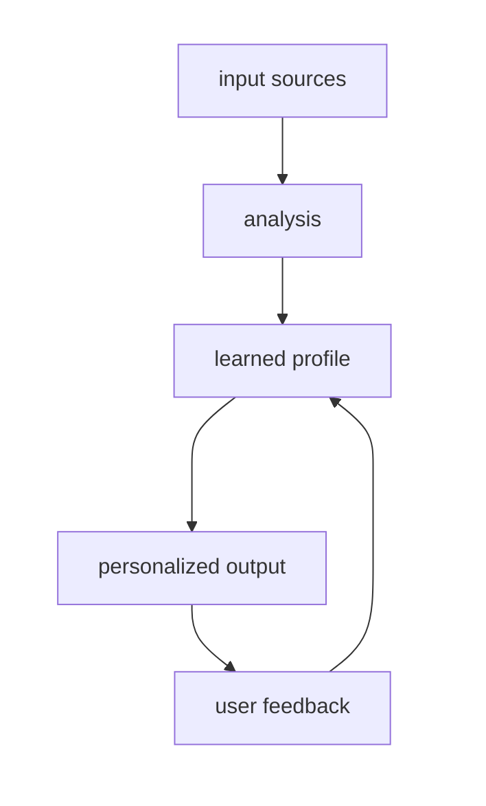
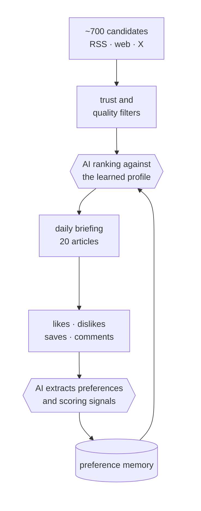
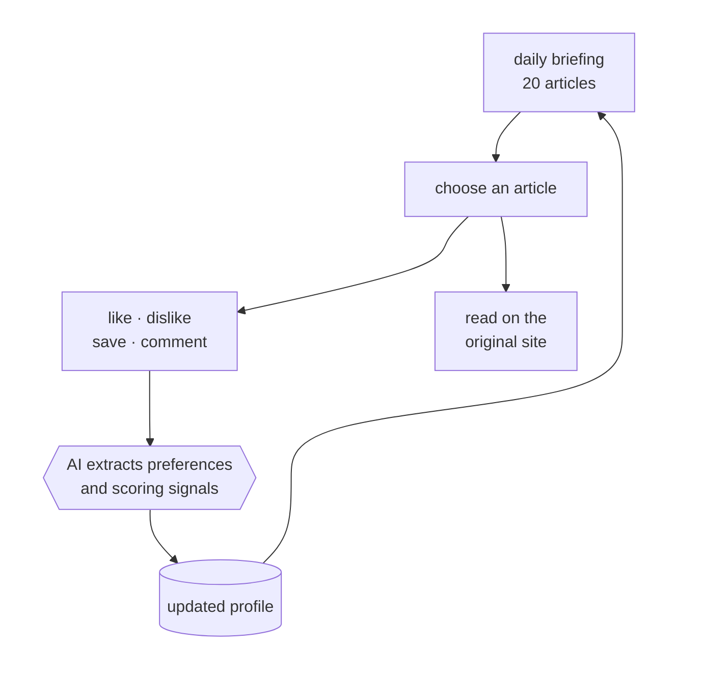
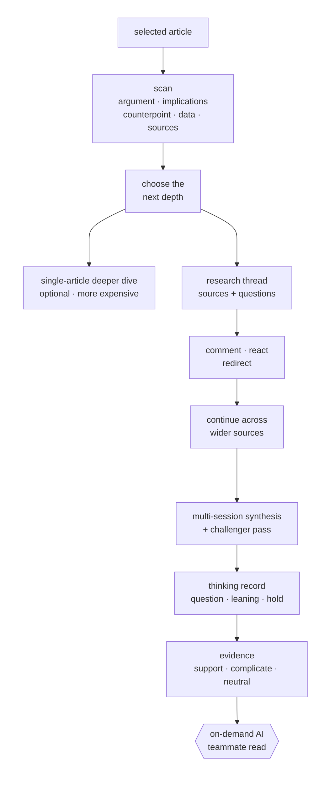
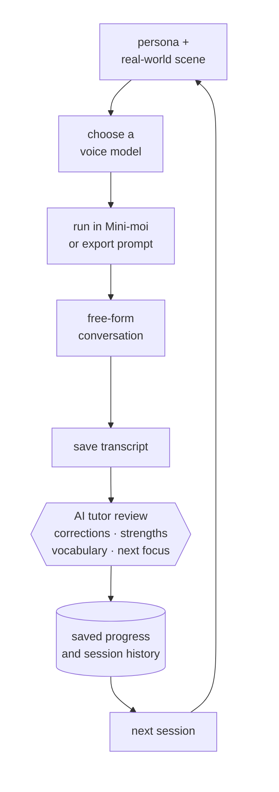
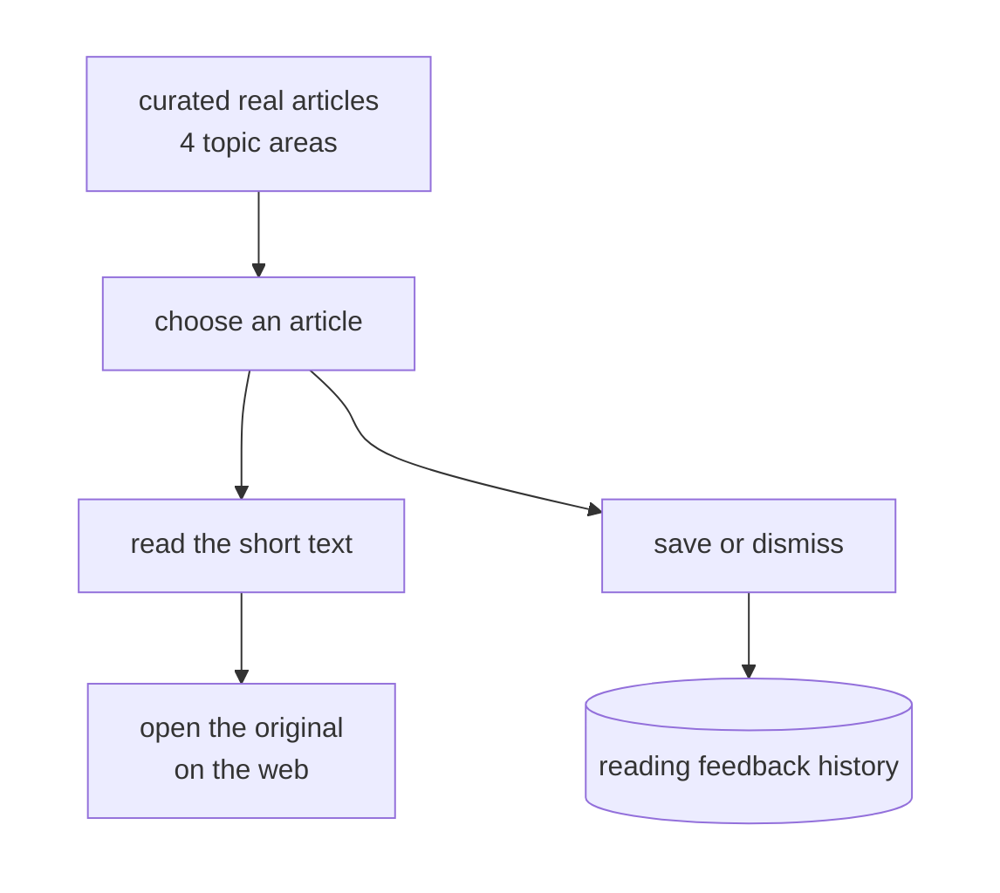
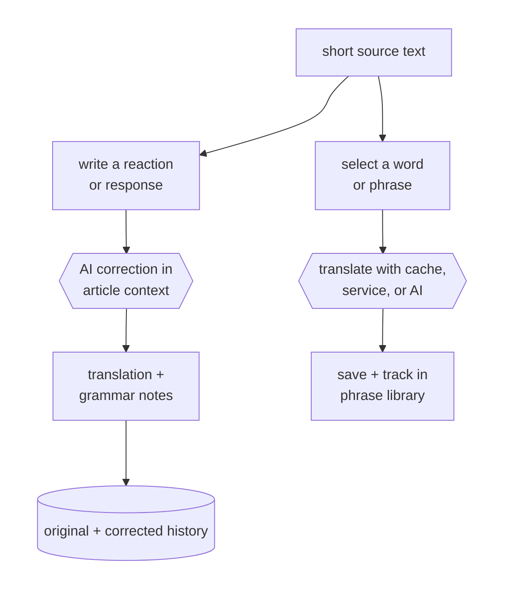
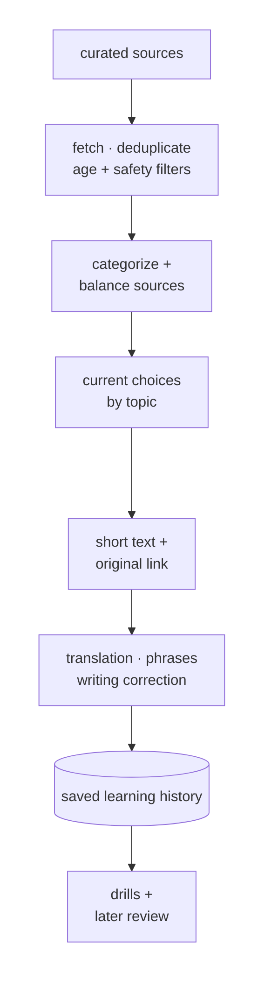
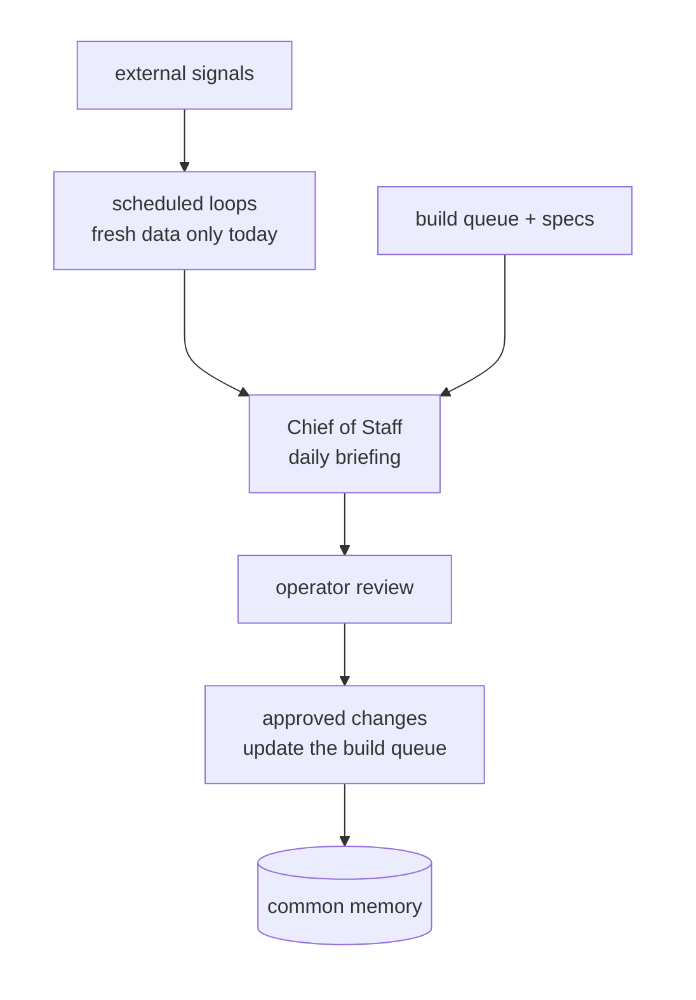

# Architecture: Mini-moi

*Maintained baseline, reviewed through 2026-07-21. This document separates the
design principles that have held since inception from the current implementation.
It identifies where real growth has caused drift and ties each gap to follow-up work.*

---

## What This Is

Mini-moi is a personal AI agent platform made up of purpose-built domains. Each
domain addresses a different part of daily life while following the same basic
pattern: take in signals, use models suited to the task, build a profile of what
matters, produce something personalized, and learn from the response. The domain
content changes. The architecture remains consistent.

The deeper design goal is longitudinal. The platform does more than process
content; it captures *thinking about* content. That includes reactions,
curiosities, areas marked for deeper investigation, and responses to what the
system itself notices. Those signals become a growing record. Nine to twelve
months from now, the accumulated asset should not be an archive of articles or
transcripts. It should be an evolving map of what one person thought, what they
returned to, and how their emphasis shifted as the world changed. This is the
standard against which the architecture should be reviewed: does the design
still serve that goal?

The pattern also applies beyond these domains. Input, analysis, a persistent and
updating profile, personalized output, a closed feedback loop, and a thinking
record that compounds are the same elements an organization would need to build
an AI system that improves at its job over time. The domain content is
interchangeable. The architecture is the durable asset.

The platform began in 2025 as a one-day experiment. A small Python and LLM system
used two personal data sources, email and bank statements, to produce an expense
management dashboard. It ran entirely on a local Ollama model. The local design
served two purposes: protecting private financial data and testing what local
models could actually do. Both reasons still apply. Local capability is also
likely to matter more as open models and local hardware improve, including in
physical AI. The platform grew from that experiment without abandoning its
original privacy and independence commitments.

The system has been in daily production use since February 2026 and currently
runs five domains.

---

## The Five Domains

**Curator.** Curator is the oldest domain and the one with the longest record of
daily production use. Each morning it pulls roughly 700 candidates from
international RSS feeds, enriched X bookmarks, and targeted web search. The
topics are focused, but the sources are deliberately broad. An untargeted
serendipity pool adds "friction" by surfacing material the learned profile might
otherwise suppress. This reduces the risk that previous choices turn into a
self-reinforcing filter.

The top 20 articles arrive each morning, but delivery is only the start of the
loop. Reactions, saved articles, Deep Dive requests with stated motivations, and
responses to the system's own observations are also captured. Together they
form a record of reading and thinking over time. The mobile site is the primary
interface. The laptop site supports more comfortable reading and commentary.
Telegram, the original pre-UI channel, remains available for notifications and
as an alternate path.

**Mein Deutsch.** The German domain is built around simulated immersion rather
than a course or coaching program. Unlike real-world immersion, its practice can
be repeated and modified freely. It addresses three practical gaps: too few
opportunities to speak; authentic reading that can become burdensome without
well-placed support; and too few reasons to write something interesting in
context and receive useful correction. Live voice conversation with AI personas
(Gespräche) remains the central feature. Reading with contextual hints and
translation (Lesen), writing with correction (Schreiben), vocabulary drills
(Wörter), and the session archive (Archiv) reinforce one another around it.
Human tutoring is supported alongside the AI practice. The domain also proved
useful in real travel: difficult interactions could be recreated later as
practice scenarios and repeated before the next encounter.

**Meu Português.** Portuguese was built as an intentional extension of the
language architecture, with a third language already in view. Family members
brought varied levels of fluency, exposure, and formal practice, along with a
shared desire to maintain and develop their existing abilities. Each
authenticated user has separate data, progress, and custom conversation
personas.

The first release deliberately emphasized the frontend, multi-user separation,
and low-friction access. Features that require more setup or subscriptions, such
as Anki generation and some mobile voice paths, were outside that initial scope.
The implementation moved quickly so it could enter real family use and extend
the broader mini-moi pattern beyond one language. The remaining differences
from German reflect staged validation and intentionally different scope, not a
failure to follow the German design. Convergence is still important before a
third language is added.

**Guild.** Guild is the platform's workshop. Its three areas are **Build ·
Operate · Improve**, and its working cycle is *spec → build → operate → improve*.
Specifications become build items, status remains visible, and operations are
controlled here. This shared view helps the operator follow continuous planning
and development, a need that becomes more important as multiple coding agents
contribute. Guild's scope is expanding toward stronger operations control and a
more explicit learning function. Differences revealed by staged builds, along
with lessons from operation and new techniques, feed the next specification.
The planned **Master Craftsman** will coordinate build quality and standards
inside Guild, with local access and a role kept separate from CoS.

**Chief of Staff (CoS).** CoS is the newest domain. It was separated from Guild
once their different purposes became clear. CoS is designed as a working partner,
not an executive assistant or secretary. It should retain the reasoning behind
decisions, not only the task list; act within defined limits; watch across
domains; surface unrequested but relevant information; and disagree when the
evidence points away from the easy answer. Its current functions include a daily
executive briefing, conversation, note-taking, and decision and action logs.
Carrying intent with bounded authority is the longer-term role, and that work is
still at an early stage.

**All five domains emerged from actual use.** Each exists because it met a real
need, and daily usefulness continues to drive focus and priority. This creates a
deliberate rhythm. Some phases move quickly because use demands a capability;
others step back to rationalize what was built. The drift documented below is a
visible result of that rhythm, and the follow-up work is how it is corrected.

### Current State at a Glance

| Domain(s)           | Maturity                                                                   | Key current gaps                                                                                                                                    |
| ------------------- | -------------------------------------------------------------------------- | --------------------------------------------------------------------------------------------------------------------------------------------------- |
| Curator             | Mature; daily production since Feb 2026                                    | Model override ignored (intended fallback still used); Deep Dive script consolidation; AI Observations automatic daily and weekly runs awaiting production verification |
| German / Portuguese | Active twins; identical from the user's perspective, converging underneath | Bidirectional normalization before French; translation model choice not yet backend-configured; production Lesen refresh safe but not yet scheduled |
| Guild / CoS         | Recently split; both in active redesign                                    | CoS partner layer just starting (Python-only today, bounded OpenClaw shortly); accumulate-then-synthesize pattern not yet extended here             |

---

## Design Principles

Most of these principles were established in the March 2026 production document,
before the platform reached its current scope. Real growth has tested them since.
The final two were added after that growth exposed new requirements.

**1. Local-first data.** Learned state lives in application-owned files. The
files are structured so they can migrate to a relational store when volume or
query complexity justifies the additional infrastructure. Preferences and
history remain with the person rather than any one model, provider, or machine.

**2. Model-agnostic and multi-model.** Personalization is injected at the
dispatcher level, above the individual model call. A model can therefore change
without rewriting what makes the output personal. This is an operating
discipline with three practical benefits.

**Cost:** model choice is the platform's main cost lever. A model with better
capability at lower cost can be added, evaluated against the current option, and
adopted if it performs better. This add-evaluate-switch cycle is normal operation.

**Capability:** different jobs need different strengths. Fluent spoken German
and bulk article filtering are not the same problem, and no provider is best at
every task.

**Independence:** the system is designed to retain a fully local path. It ran on
local Ollama before any cloud model was used and should fall back to local
operation at zero marginal cost if cloud providers become unavailable. As open
models and local hardware improve, local inference is expected to handle more of
the platform's work, including coding. Some call sites remain hard-coded; those
gaps are documented below.

**3. Swappable architecture, not merely swappable configuration.** Components
should be replaceable without breaking the rest of the system. This is a
structural goal, not a claim that every call site has already reached it.
Principle 7 and the current-state notes identify where implementation still
falls short.

**4. Quiet paths over noise.** If there is nothing meaningful to say, nothing is
sent. No domain pads its output to appear active. This applies to Telegram,
logs, and the rest of the platform.

**5. The operator stays in control.** The build workflow follows a fixed path:
design, human review, build, human confirmation, and ship. It does not currently
allow autonomous agent-to-agent execution. A July security remediation followed
this process while finding and closing real cross-user data exposure risks.

The principle can evolve without weakening. The planned next step is bounded
agent-to-agent handoff, starting with CoS coordinating with Guild's
Master Craftsman agent. CoS should notify the operator and gather information
across agents, while the operator remains the final decision point. The goal is
a single point of contact, not reduced control.

**6. Extract shared code only after duplication has proved the pattern.** A new
domain may begin by copying an existing implementation. Shared code should be
extracted only after two domains have demonstrated the same approach and started
to converge. Abstracting earlier is premature.

Lesen and Leitura are a concrete example. Their reading flows reused proven
Curator patterns by copying and adapting them for language practice. Curator was
not turned into a general-purpose, multi-domain reading component. Shared code
becomes appropriate only after the German and Portuguese implementations have
both proved the pattern and begun to converge.

**7. Verify production reality.** Documented intent and running behavior are
different claims. Recent checks found a directory that appeared committed but
was not, a volume mount with no sync step, an incomplete backup script,
inconsistent identity labels, and a configured model override that was ignored
while the intended fallback model still ran. Every case looked correct in code
or documentation.
Outputs and logs exposed the difference. Production behavior must be verified,
not inferred.

---

## The Domain-Agnostic Pattern

Every domain is an instance of the same loop. The March 2026 platform document
described this pattern before German, Portuguese, or CoS existed:

**Curator:** RSS and X bookmarks → AI scoring → learned preferences → daily
briefing → reactions, Deep Dive requests, and observation responses.

**German and Portuguese:** sessions and transcripts → correction and analysis →
per-user progress → next practice material → corrections accepted or revised.

**Guild and CoS:** specifications, build status, and external signals → triage
and synthesis → build queue and decision log → briefings and recommendations →
approved, revised, or rejected.

The same shape appears five times. The full accumulate-and-synthesize loop is
proven end to end in Curator (see Learning Loop below). Repetition across five
different domains is the evidence for "platform over product."

---

## AI Usage Across the Platform

Two capabilities are the clearest current examples of AI use: Curator's path
from daily reading into deeper research, and live voice conversation in the
language domains. Guild and CoS serve broader platform operation and coordination
and are less mature as AI loops. Each domain uses AI differently because the
model architecture is fitted to the job, not imposed uniformly. Multi-level
model use appears in both Curator and the language domains, but for different
reasons.

### Curator: the mature, flagship pattern

The production ranking path is deliberately single-stage today: one model pass
over the full filtered pool. A two-stage mode, using a lower-cost pre-filter
followed by a higher-capability ranking model, is available per run but is not
the production default.

The closed selection loop is implemented: article feedback updates learned
patterns, and those patterns are injected into later scoring. From the daily
briefing, Curator also opens a longer research path:

**Reading and feedback**

**Research and the thinking record**

Not every stored response closes an automatic loop yet:

| Response | Current path |
|---|---|
| Article reaction or comment | AI preference extraction → learned profile → future briefing scores |
| Research-thread direction shift | The next research session changes direction |
| Research-thread reaction or observation | Stored in thread history |
| Research-thread wrap-up | Thread closes with a conclusion |
| Response to an AI Observation | Stored in response memory; not automatically acted on yet |

Tiered, purpose-fit model use, with real costs:

| Stage | Model | Cost | Config-driven? |
|---|---|---|---|
| Daily ranking (production, single-stage) | `grok-4-1-fast-reasoning` | ~$0.314/run | Override ignored; intended fallback still used (see below) |
| Two-stage alternate (pre-filter → rank) | Claude Haiku → Sonnet | ~$0.001 pre-filter | Selectable per run; not the live path |
| Deep Dives | Claude Sonnet, on-demand | ~$0.25/session | No; hard-coded |
| AI Observations (daily) | Claude Haiku | ~$0.005–0.01/run | No; hard-coded |
| AI Observations (weekly) | Claude Sonnet, Sunday only | ~$0.07/week | No; hard-coded |

These costs are current evaluation points, not fixed targets. Model choices are
reviewed continuously for both cost and output quality. The intent is to move
work to lower-cost models when they meet the required quality threshold, while
leaving current choices in place long enough to evaluate them reliably.

**Local capability is real, proven, and deliberately retained.** The original
architecture ran local-model calls in production. German's translation fallback
still uses a live local provider as its final no-dependency option. Curator moved
to cloud scoring after the per-run cost of a suitable cloud model became
negligible. That was a convenience choice made possible by a quick backend swap,
not a departure from the architecture.

One historical label remains from that change. The scoring script's free-tier
mode is still called "ollama," although it currently uses keyword scoring rather
than a live model. The label is imprecise; the behavior is intentional. The
operational commitment remains that the system can return to local operation at
zero marginal cost if cloud models become unavailable or too expensive. Re-verifying
that swap end to end on the current EC2 environment is part of the planned model
configuration work. It is a check on a proven capability, not a replacement for
a missing one.

**AI Observations** is the platform's clearest working example of accumulating
first and synthesizing later. Five observation types use model tiers matched to
their cost and complexity. They work across a rolling 30-day baseline instead
of reacting to a single day. The weekly higher-capability pass reads the
accumulated history and asks, in effect, *what has been thought about this
before?* No other domain can answer that question about itself yet.

This is also where the thinking-record goal becomes concrete. Observation
responses, Deep Dive motivations, and reactions are the raw material of that
record. The capability shipped and is proven historically, but it is not
currently scheduled on EC2. Nothing invokes it in the EC2 cron, the Docker
configuration, or the CoS scheduler. Restoring the schedule is an operations
follow-up under Principle 7.

**Current model-override gap.** Curator's `--model=` flag works for values it
recognizes. Both production cron scripts currently pass an unrecognized value,
so the override is ignored and the script uses its fallback default. That
fallback still selects the intended production model, so there is no known
impact on current Curator output. The gap is that the configured override cannot
be relied on until the value is corrected. The defect is tracked and remains a
clear example of Principle 7.

**Multi-model challenge capability.** Curator's Deep Dive pipeline supports one
model drafting, other models cross-checking, and the first model reconciling the
result. Live since June, it may overlap with Research Intelligence's
Synthesizer+Challenger framework and Guild's `ChallengerService`. Direct
confirmation is still needed. If they are the same underlying mechanism, the
platform should give the capability one name and one home.

**Known Deep Dive regression.** Several generation scripts coexist while the
frontend offers Scans, Deep Dive, and Deeper Dive as related but distinct options.
At least four candidate scripts existed at the last count. Some may represent
real duplication; others may support genuinely different features. The frontend
grew faster than the backend was consolidated. The paths need to be traced before
cleanup begins. This is regression refactoring, not a redesign.

### German and Portuguese: one experience, converging implementations

German and Portuguese present the same core experience: the same navigation and
interaction model over deliberately different first-stage implementations.
Portuguese extended the language domain through a practical copy-and-adapt
approach rather than a redesign. Its narrower initial scope emphasized the
frontend, in-website voice, multi-user separation, and
quick evaluation by real users. German retained the more setup-intensive
automated review, Anki, lesson-plan, and mobile voice paths.

The two implementations are now converging around whichever approach proved
stronger. Portuguese has a Postgres-backed translation cache, while German has a
three-tier translation fallback (fast model → capable model → local model with
no external dependency) and a stronger transcript-review tier. A third language
will inherit the resulting shared pattern rather than either first implementation
unchanged.

**Voice conversation has delivered the greatest practical value in the language
domains.** Unscripted exchanges preserve the parts that scripted exercises
remove: hesitation, getting stuck, using filler sounds, recovering, and
continuing the interaction. This supports practice in conversational repair and
recovery phrases, not only vocabulary and grammar. Real interactions can also be
recreated afterward as scenarios, turning a difficult exchange into preparation
for the next one.

Live persona conversation requires a model that understands the prompt and
speaks the language fluently. That combination remains difficult, and quality
from one provider can vary even within a single day, most plausibly under load.
The reviewer model choice is therefore surfaced in the UI, with one default and
other providers one click away. The learner is the first to notice a drop in
fluency and is best placed to switch.

The current access paths involve a tradeoff. Exporting a persona prompt to a
mobile model can provide the strongest voice experience, but copying, pasting,
setup, and subscription requirements may confuse a new user. The in-browser path
is easier to start but does not yet provide the same voice quality. Voice models,
browser audio, and provider APIs are improving quickly, so this layer should
remain adaptable and be revisited through the roadmap.

The transcript pipeline separates concerns differently. Deterministic parsing
normalizes the transcript first. A strong model then analyzes it and produces
feedback. On German's automated path, the analysis has concrete downstream
effects: Anki card generation, the next lesson plan, and progress tracking.

**Model choice is split between the interface and the backend.** Voice and review
model choice are personal and visible at the point of use. Translation is not.
The translation provider should be selected quietly on the backend through
configuration. Both language domains still hard-code parts of that choice.
Moving it to configuration is planned after the implementations converge.

**Language reading should be engaging, varied, and contemporary.** It combines
language practice with cultural exposure rather than following a textbook
sequence. Current material from everyday life, culture, news, and local sources
provides a reason to read beyond the exercise itself. The goal is language plus
culture. Contextual hints, translation, audio, and shorter excerpts are intended
to preserve reading momentum when unfamiliar language would otherwise make the
experience burdensome. They support authentic reading rather than replace it.

This requires freshness, variety, and source balance, but not Curator's full
ranking apparatus. Curator is designed to make complex, nuanced, and sometimes
conflicting information manageable across many sources. The language domains use
a simpler source-variety cap because it better fits their purpose. Language
learning is closer to learning an instrument than solving a decision problem;
progress is felt through practice.

Writing is also anchored in current material so the learner has something worth
responding to. Correction preserves both the original attempt and a more natural
version, turning mistakes into material for later practice. Reading and writing
therefore form a second, slower practice loop around current material:

**Reading and article feedback**

**Vocabulary and writing**

The material pipeline supports fresh, varied, and culturally relevant reading:

### CoS and Guild: separate roles, active redesign

The common memory is not yet read by the scheduled loops. A revision returns to
the briefing for another review; that return is stated here rather than drawn as
a wide backward edge.

The separation clarified what each domain is for; neither was broken. The
description below is current direction rather than settled architecture. Guild
owns visibility into specifications, build work, quality, and operations. CoS
owns cross-domain coordination and judgment. Keeping the planned Master
Craftsman inside Guild preserves that role boundary. It provides local access to
build context without expanding CoS access or mixing build coordination into
its broader responsibilities.

**Current CoS implementation.** The chat backend and scheduled loops are ordinary
Python code. No agent framework sits behind them yet. A bounded OpenClaw instance
is planned as the Phase 1 agent layer. "Bounded" means restricted to mini-moi
domains and the permission model below, not a general-purpose agent with
unrestricted credentials. OpenClaw is intended to remain a swappable backend
choice that is invisible to the user. Making that swap real is acknowledged
integration work.

The first partner tasks are deliberately practical: operations escalations, ad
hoc questions, and notes about areas of the application. The partner role should
be earned through real daily work before it expands. CoS already has a common
memory repository with episodic, semantic, and procedural tiers. That memory is
independent of the agent placed above it, so changing the agent should not reset
the accumulated record.

**The partner contract.** CoS follows a defined permission model: *propose freely,
act within defined bounds, execute only with approval.* It may write to decision
and action logs as part of normal operation, flag issues across domains, propose
handoffs, retrieve documents, and file issues for identified defects. Writing to
domain data, changing infrastructure, deploying, or executing a proposed handoff
requires approval. Acting is bounded; informing is not.

**The voice layer is designed for useful disagreement.** The standing identity
is short and already live in production: direct, curious before certain,
comfortable saying "I don't know," and willing to disagree. It is not a
cheerleader and not a search engine with manners. That identity applies to
conversation and judgment tasks such as chat, cross-domain health assessment,
fit narratives, and novel suggestions. Mechanical operations and raw scoring
remain accuracy-first. Partner is a mode, not a global override.

**Current validation status.** The founding identity document defines explicit
success criteria, a two-to-three-week measurement period, and a subjective but
decisive question: does the interaction feel like a working partner or a
sophisticated tool? It also states the failure condition. If the result is
indistinguishable from a well-prompted neutral agent, robotic agents are the
better choice. The measurement has not run because the partner build is only
starting. The design is ahead of the implementation, and this document treats
it that way.

CoS is the first place planned bounded handoffs will be tested. The initial path
is coordination with Guild's Master Craftsman agent. The operator should be able
to ask CoS a question and let it gather information across agents instead of
acting as the message bus personally. CoS is designed to inspect and communicate
with any domain. It may instruct a domain only where that domain exposes an
approved capability.

Four scheduled loops currently run: a twice-daily career scan and
weekly-to-biweekly watches on language tooling, Curator's topic space, and
competitive signals. Each loop evaluates only the external data fetched during
that run. None reads the platform's accumulated memory before calling a model.
Extending Curator's accumulate-and-synthesize pattern here is the next logical
step because design queues, build status, and decisions need periodic
reconciliation.

---

## Learning Loop & Memory

Curator is the only fully proven instance of the learning loop today. Reactions
update a learned profile, the dispatcher injects that profile into the next
scoring run, and a weekly higher-capability pass reads 30 days of accumulated
observations to identify what changed. The argument for the pattern is not only
cost. Cheaper models with accumulated context can outperform more expensive
models that lack it.

The idea predates the current memory work. The March 2026 production roadmap,
written four months earlier, proposed a vector-indexed store so "every LLM call
retrieves relevant personal context." It framed the work around the same question
Curator's weekly pass asks today: *what has been thought about this before?* The
current memory and intelligence roadmap is a more mature version of that idea,
informed by production use.

CoS and Guild are the next places to apply the pattern. Their scheduled loops
should read the decision log, action log, prior briefings, and build-queue history
before calling a model, rather than scoring only fresh external data. A periodic
higher-capability pass can then reconcile the record and ask what changed, what
was decided but not completed, and what pattern no single day reveals. Design
queues, build status, and decisions can degrade silently without that review.
The language domains are the deliberate exception. Practice is not a decision
problem, and adding this analytical machinery would work against their purpose.

---

## Identity, Security & the Multi-Agent Working Model

Every domain sits behind a single portal. The portal owns session authentication
and forwards identity to the appropriate backend. Domains never trust identity
sent directly by the client. A July 2026 security review found and closed cases
where a missing identity was treated as "match everything" rather than "match
nothing." Details of the exposure remain outside this public document. The
architectural lesson belongs here: nothing shipped without review, including the
fix.

The multi-agent working model also separates roles. A decision authority approves
every deployment. Other roles handle design and specification, implementation
and deployment, memory and coordination, and independent review. The agent in
any role may change over time. The roles are the durable structure.

Codex was introduced as a second coding agent alongside Claude Code. Both now
perform build tasks within the same specification, review, and approval workflow.
Adding a second coding agent changes who can perform implementation; it does not
change the authority or review requirements attached to the role.

---

## Open Design Questions

Stated plainly rather than resolved by default:

**Does the platform depend on its current orchestration agent, or does the agent
depend on the platform?** The March 2026 platform document states the latter.
The current agent's self-description leans toward the former. This requires an
explicit decision as bounded handoffs place the orchestration layer at the center
of more workflows.

**Is the multi-model challenge pattern in Curator's Deep Dive pipeline the same
mechanism as Research Intelligence's Synthesizer+Challenger framework and Guild's
`ChallengerService`?** If so, one real capability deserves one name and one home.

---

## Ongoing and Planned Follow-Up

1. **Instrumented live session.** Run a real end-to-end session with monitoring
   and document which code paths execute, what they do, and which paths never
   fire. Static audits show what exists; this shows what is actually used. The
   session must explicitly verify local-model operation in Curator. Confirm the
   `--dry-run` local path and restore or verify the local-model fallback in
   production scoring. Fully local operation at zero marginal cost is a founding
   commitment, not an optional tier.
2. **Confirm or rule out** whether Curator's Deep Dive pipeline, Research
   Intelligence's `generate_dive.py`, and Guild's `ChallengerService` are the
   same underlying capability.
3. **Re-verify** the purpose of Curator's three coexisting Deep Dive-family
   scripts (Scans, Deep Dive, and Deeper Dive) before writing a cleanup spec.
4. **Correct the Curator model override.** Production currently reaches the
   intended model through the fallback default, but the configured override is
   not recognized and should be corrected.
5. **Correct `LLM_REGISTRY.md`.** The current registry is silent on CoS, Guild,
   and Portuguese; undercounts German; omits TTS; and overstates which model
   handles German's user-selectable review path.
6. **Converge German and Portuguese.** Normalize both implementations in both
   directions before building French on the same template.
7. **Move translation model choice into backend configuration.** Apply the
   change across both language domains after item 6.
8. **Resolve the OpenClaw dependency direction.** Include the bounded
   agent-to-agent handoff design, starting with CoS and the Guild build agent.
9. **Build and measure the CoS partner layer.** The first work should remain
   operations escalations, ad hoc tasks, questions, and notes, with a bounded
   OpenClaw instance as the planned agent layer. Once the partner is in daily
   use, run the founding two-to-three-week measurement. Compare before and after,
   track novel suggestions, and make the explicit "partner or tool" judgment.
   That process turns the design from documented intent into a validated or
   rejected approach.
10. **Keep the per-domain flow diagrams current** as implementation changes. The
    durable user and operational flows belong here; detailed call graphs should
    remain separate so they can update on their own schedule.
