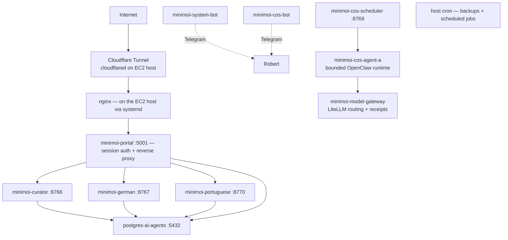

# Operations — Mini-moi

[Download the formatted PDF](OPERATIONS.pdf)

*Maintained baseline — reviewed through 2026-08-16. The production topology,
containers, host services, schedules, memory pressure, storage, backup inputs,
and recent job outcomes were rechecked against the running system on 2026-08-16.
Automatic daily and Sunday AI Observations completed successfully that day.
COS Agent A, its model gateway, authenticated round trip, platform note path,
and real-microphone voice path were also verified in production. Companion evidence file:
`CURRENT_STATE_OPERATIONS_2026-07-18.md`. System design and the reasoning behind it:
[`ARCHITECTURE.md`](ARCHITECTURE.md) — this document is about keeping that system
running.*

---

## Topology — what is actually running

Mini-moi runs across two nodes with distinct roles (see ARCHITECTURE.md for the design
rationale; this is the operational view):

| Node | Role | URL | Compose file |
|---|---|---|---|
| AWS EC2 (t3a.medium, us-east-1, `i-0d13db821169627e2`) | **Production** — live traffic, all bots, scheduled jobs | minimoi.ai | `docker-compose.prod.yml` |
| Mac (local, Colima) | **Dev / standby** — development, private-repo sync, DNS-switchable fallback | dev.minimoi.ai | `docker-compose.yml` |

### Production: 10 containers + 3 host-level services



| Container | Port (localhost) | Purpose |
|---|---|---|
| `postgres-ai-agents` | 5432 | PostgreSQL (`personal_agents`) — auth, guild, portuguese, research, pipeline, jobs schemas |
| `minimoi-portal` | 5001 | Session auth + reverse proxy — single entry point; forwards identity headers, domains never trust client-supplied identity |
| `minimoi-curator` | 8766 | Curator Flask service |
| `minimoi-german` | 8767 | Mein Deutsch Flask service |
| `minimoi-portuguese` | 8770 | Meu Português Flask service |
| `minimoi-system-bot` | — | Telegram polling bot — inbound system/German commands only; the Curator briefing is sent by `telegram_bot.py --send` inside `minimoi-curator`, via cron, on the separate outbound token |
| `minimoi-cos-bot` | — | CoS chat bot |
| `minimoi-cos-scheduler` | 8769 | CoS scheduled-loop agent |
| `minimoi-cos-agent-a` | internal only | Isolated COS Agent A runtime; OpenClaw is the current swappable shell |
| `minimoi-model-gateway` | internal only | LiteLLM provider routing, fallback policy, health, receipts, and cost records |

**Three things run on the host, outside Docker:**

1. **nginx** — native systemd service (active since 2026-06-20), reverse proxy in front
   of the portal container. `systemctl status nginx` to check; config under
   `/etc/nginx/`.
2. **cloudflared** — the Cloudflare Tunnel process that carries public traffic to
   host nginx. `systemctl status cloudflared` to check it. A stopped tunnel produces
   Cloudflare 1033 even when the containers themselves are healthy.
3. **cron** — backup and pipeline jobs split across root and `ec2-user`. Inspect both
   crontabs; a container-only mental model misses this entire host layer.

All container ports bind to `127.0.0.1`. Public traffic follows Cloudflare Tunnel →
host nginx → portal; no application container is directly internet-exposed.

---

## Deploy & Rollback

### Deploy

**Current production path:** a push to `main` runs the full test/build/deploy
workflow and promotes immutable commit-tagged application images. Shared and
domain-specific changes currently use that same full application path.

**Prepared for review, not yet live:** a scoped release change exists in the
isolated review worktree. After its diff is reviewed, approved, committed, and
deployed, it will add three classified paths:

- **Domain-scoped release:** map changed paths to their owning services, build
  only those immutable images, synchronize served documents, recreate only the
  selected services with `--no-deps`, verify their identity and health, then
  prune unused images. Known coupling is explicit—for example, German also
  selects the system bot, while a COS change does not restart German.
- **Full application release:** shared core/topology changes and unknown paths
  use every application service. Ambiguity fails safely toward the full stack.
- **Document-only release:** synchronize `docs/design/`, `docs/specs/`, and the
  build queue through SSM. No image build, Docker Compose command, prune, or
  container restart occurs. The maintained root documents and generated PDFs
  publish in GitHub.

Operational facts worth stating plainly:

- **Classification is fail-safe toward application deployment.** Mixed known
  domains use the union of their service mappings; any unrecognized runtime path
  uses the full path. A manual workflow dispatch is also always a full deployment.
  The PostgreSQL container remains host-stateful and outside the image build matrix.
- **Pull before prune.** The deploy that introduced COS Agent A exhausted the old
  ten-minute workflow poll while the EC2 SSM command continued. During recovery,
  the SSM agent also temporarily lost usable instance credentials and the site
  returned Cloudflare 530 until a graceful EC2 stop/start restored the agent. The
  application itself was healthy once the command finished. The proposed scoped
  path pulls first, validates the running immutable image set and health endpoints,
  then prunes unused images. Its longer poll and terminal-error behavior remain
  pending until the reviewed change is shipped.
- **There is no staging gate in the deploy pipeline.** A push to `main` goes
  straight to production. `dev.minimoi.ai` routes via Cloudflare Tunnel to the Mac
  dev environment (verified in the tunnel config) — a genuinely separate origin,
  useful for development, but not a gate the pipeline passes through on the way to
  prod. A real AWS staging environment is committed work (see ROADMAP). Until then:
  the standing rule is that nothing is pushed without explicit approval of the
  reviewed diff.

### Recovery options

**Normal access channels:** SSH (security-group allowlisted), AWS SSM Session
Manager, and EC2 Instance Connect. They are independent paths for many network or
credential failures, but they are not guaranteed during host exhaustion. On
2026-08-16 the instance status check failed and neither SSH nor an EC2 command-line
session was usable; the AWS console reboot was the working break-glass path.

**Rollback actions**, typical order:

1. **`git revert` + push** — rides the same CI/CD pipeline; previous state live in
   ~4–5 minutes. The default for any bad deploy.
2. **Manual container recreate on the host** — can be faster than a revert when only
   one service is affected:

```bash
cd /opt/minimoi
# Verify which Compose form this host actually has before an incident, not during:
#   which docker-compose   |   docker compose version
sudo docker-compose -f docker-compose.prod.yml up -d --force-recreate <service-name>
# Use the Compose SERVICE name (e.g. curator), not the container name.
```

Production containers currently run immutable commit tags. Pulling and recreating
an exact prior tag from ECR is therefore possible, but the tested command sequence
still needs to be written as a formal rollback runbook.

### Manual health check (EC2)

```bash
sudo docker ps --format "table {{.Names}}\t{{.Status}}"
df -h /                                   # 30GB volume; alert threshold 80%
free -m
curl -s http://localhost:8766/health      # curator
curl -s http://localhost:8767/health      # german
curl -s http://localhost:8770/health      # portuguese
curl -s http://localhost:5001/health      # portal
sudo docker inspect --format '{{.State.Health.Status}}' minimoi-model-gateway
sudo docker inspect --format '{{.State.Health.Status}}' minimoi-cos-agent-a
systemctl status nginx                    # host nginx — not in docker ps
systemctl status cloudflared              # public tunnel — not in docker ps
sudo docker logs minimoi-portal --tail 30 # when something looks wrong
```

Automated version: CoS's Loop H runs every 30 minutes — checks seven legacy
expected containers, disk < 80%, memory < 85%, and four `/health` endpoints —
alerting via the **CoS bot token**. Its expected set does not yet include
`minimoi-cos-agent-a` or `minimoi-model-gateway`, and it checks neither nginx nor
cloudflared. It also did not prevent the 2026-08-16 OOM incident. CoS detects and
escalates within those current limits; **Robert decides the action.**

---

## Scheduled Jobs

Host cron is split across two users and works alongside the COS scheduler container.
Both crontabs and recent job logs were rechecked on 2026-08-16. Checking only one
user—or only host cron—misses part of the production schedule.

| User | Time (UTC) | Job | What it does |
|---|---|---|---|
| root | 02:00 daily | `backup_local.sh` | Tier 1 — selected persistent paths to `/opt/minimoi/backups/YYYY-MM-DD/` |
| root | 03:00 daily | `backup_s3.sh` | Tier 2 — S3 sync |
| root | 04:00 Sunday | `backup_dropbox.sh` | Tier 3 — weekly Dropbox sync — **BROKEN: rclone not installed; fails silently every run** |
| root | 5 minutes past each hour | `lesen_refresh_cli.py` in `minimoi-german` | Refreshes German reading material; recent runs complete partially because two configured sources return HTTP 404 |
| ec2-user | hourly | `run_curator_cron_ec2.sh` | Curator pipeline — fires at most once/day, gated below |
| ec2-user | 15 minutes past each hour | `run_intelligence_cron_ec2.sh` | AI Observations — waits for the daily briefing, runs at most once/day, and adds the weekly synthesis on Sunday; automatic daily and weekly outputs verified 2026-08-16 |

German's Lesen refresh is scheduled hourly. It currently tolerates partial source
failure and continues adding material, but two sources (ORF Kultur and Heute)
repeatedly return HTTP 404. That is a source-maintenance defect, not a missing
schedule.

The pipeline wrapper runs hourly but only actually fires once a day, gated in order:
**role guard** (exits silently unless `MINIMOI_ROLE=production` inside the container —
safe on a standby node), **time gate** (12:00–20:00 UTC only), **idempotency check**
(reads `briefing_date` from `curator_latest.json`; skips if today already ran). When it
fires: pulls new X bookmarks (non-fatal on failure), runs the scoring pipeline, sends
the Telegram briefing, stamps the date. One known wart, documented in ARCHITECTURE.md
and tracked separately: the `--model=grok-4.3` value the script passes isn't valid and
silently falls through to the hardcoded default — the model that runs is right by
coincidence, not by configuration.

### In-container scheduling (APScheduler) — the second scheduling layer

Host cron is not the whole story. `minimoi-cos-scheduler` runs its own in-process
scheduler with **seven jobs** (confirmed in `domains/cos/chief_of_staff.py`):

| Job | Schedule |
|---|---|
| Loop A — career focus scout | 06:00 and 18:00 daily |
| Loop B — German watch | Sunday 09:00 |
| Loop C — Curator watch | Sunday 10:00 |
| Loop D — novelty watch | 1st and 15th, 08:00 |
| Loop F — build-discipline check | daily 07:30 |
| Loop G — guest-access staleness nudge | hourly |
| Loop H — EC2 health check | every 30 min |

The scheduler's timezone has not been explicitly confirmed — verify before relying
on these clock times. Checking only `crontab -l` misses this entire layer; the full
scheduling inventory is host cron (both users) **plus** this container scheduler.

---

## Data Persistence & Backups

### Persistence

All three domain containers mount their data directories to the host — confirmed in
`docker-compose.prod.yml`. Container restarts and redeploys do not touch domain data.
This closed the ephemeral-storage defect that cost the June 22–July 13 curator
briefings (lost before the mounts existed — a mounts problem, historical and
unrecoverable, not an ongoing risk).

Also host-mounted: `guests.json`, `build_queue.json`, `cos_memory.md`,
`cos_context.json`, `docs/design/`, `docs/specs/`, and `/opt/minimoi/agent_logs/`.
COS Agent A also uses named Docker volumes for runtime state and authentication;
the model gateway writes receipts to `/opt/minimoi/data/model_gateway_receipts.jsonl`.

### Backups — Tiers 1–2 live, Tier 3 broken

- **Tier 1 (local, 02:00 daily):** confirmed working — dated folders in
  `/opt/minimoi/backups/` through today. The live script captures selected Curator,
  interests, research-intelligence, German, Portuguese, and auth paths, then applies
  14-day retention. It is not a full `/opt/minimoi/data` copy.
- **Tier 2 (S3, 03:00 daily):** confirmed working — real objects in
  `s3://minimoi-backups/`, logs show clean completion on consecutive recent days.
- **Tier 3 (Dropbox, 04:00 Sunday): broken, never ran successfully.** `rclone` was
  never installed on EC2 — the job's single log entry (its first scheduled Sunday)
  is `rclone: command not found`, and it has failed silently every week since. It
  remains scheduled and will keep failing until fixed. Tier 2 has an error trap;
  Tier 3 has no working failure alert.

**Status corrections, both on the record:** defect #136's framing of Tier 1 as
"never built" was wrong — `scripts/backup_local.sh` exists and its cron runs; that
half of #136 should be formally closed with a correcting comment. And the first
version of *this* document claimed all three tiers verified — that verification
checked cron entries and folder structure but not log output, which is exactly how
a silently failing Tier 3 passed it. Verified means logs and outcomes, not
schedules and folders.

**Known gaps that remain true:** the live backup set does not include
`/opt/minimoi/cos_memory.md`, `model_gateway_receipts.jsonl`, or the
`minimoi_cos-agent-a-state` and `minimoi_cos-agent-a-auth` Docker volumes. Their
first production data now exists, so this is a concrete recovery gap. Tier 3 also
needs `rclone` and working failure alerting. No restore test has been run; the
restore test remains the planned acceptance test for staging.

---

## Monitoring

| Layer | Status | Detail |
|---|---|---|
| Sentry | **Live** | Wired into curator, german, portuguese servers and the portal (shipped 2026-06-23) |
| CoS health loop | **Live, incomplete** | Every 30 min: seven legacy containers, disk, memory, four endpoints → Telegram; excludes Agent A, model gateway, nginx, and cloudflared |
| CloudWatch | **Live (basic)** | EBS disk cross-check used by the health loop |
| Prometheus / Grafana | **Proposed, never built** | Exists only in spec documents. Do not treat any historical monitoring-stack spec as describing production. |

**Capacity incident, 2026-08-16.** The former 2 GB `t3.small` host, with no swap, failed
its EC2 instance status check after an out-of-memory event. LiteLLM was killed at
roughly 631 MB and OpenClaw was using roughly 291 MB around the incident. Public
traffic returned Cloudflare 1033 and SSH/EC2 command-line access failed until an
AWS console reboot. Three hours after recovery, only about 146 MB remained
available; the gateway used about 605 MiB and Agent A about 267 MiB. The 30 GB gp3
volume remained healthy with roughly 19 GB free. Immediate hardening is to resize
memory, add a bounded swap file, set/observe container resource budgets, and add
host reachability and memory alarms. The same day, production was resized to
`t3a.medium` (4 GiB), its gp3 root volume was expanded from 30 to 50 GiB, and a
2 GiB swap file with swappiness 10 was added. Both EC2 checks, all ten containers,
host services, and public routing passed afterward. Resource budgets and alarms
remain open hardening work.

Other tracked monitoring gaps: silent Postgres failure during login `auth_id`
lookup (#84), no break-glass admin account (#87), and no alert on cloudflared or
Tier 3 backup failure.

---

## Credentials & Third Parties

Production credentials are authoritative in AWS SSM Parameter Store under
`/minimoi/production/*` and never enter git. Deployment renders the required
values into the host runtime environment file for Docker Compose; that file is
operational material on EC2, not a source artifact. Mac/dev uses local `.env` or
Keychain-backed values and keeps them gitignored. The live parameter set is the
authoritative third-party inventory:

| Category | Parameters |
|---|---|
| LLM APIs | `xai_api_key`, `anthropic_api_key`, `openai_api_key` |
| COS agent/model gateway | `cos_agent_a_gateway_token`, `model_gateway_key`, `model_gateway_receipt_key` |
| Search / retrieval | `brave_api_key`, `tavily_api_key` |
| Translation | `deepl_api_key` |
| Messaging (Telegram) | `telegram_bot_token`, `telegram_cos_bot_token`, `telegram_system_bot_token`, `telegram_polling_bot_token`, `telegram_agent_bot_token` |
| Email | `zoho_smtp_password` (live — portal email), `gmail_app_password` (**orphaned — zero code references; resolve: delete or wire up**) |
| App / DB | `flask_secret_key`, `postgres_password`, `minimoi_password`, `minimoi_agent_password`, `robert_sql_password` |

**Telegram token → bot mapping** (traced to consuming code, 2026-07-18):

| SSM parameter | Consumed by | Runs where |
|---|---|---|
| `telegram_bot_token` | `telegram_bot.py` — outbound briefing sender | `minimoi-curator` (invoked by hourly cron) |
| `telegram_polling_bot_token` | `telegram_bot.py` — inline-button/callback handling | `minimoi-curator` |
| `telegram_system_bot_token` | `telegram_system_bot.py` — own polling loop | `minimoi-system-bot` |
| `telegram_cos_bot_token` | `telegram_cos_bot.py` | `minimoi-cos-bot` |
| `telegram_agent_bot_token` | `utils/telegram.py` — OpenClaw gateway | **Mac only** — per its own code comment |

One placement note: `telegram_agent_bot_token` is scoped in code to the Mac-only
OpenClaw gateway, yet it sits in the `/minimoi/production/` SSM namespace alongside
the four that actually run in production. Not broken — misfiled. Cleanup candidate.
One residual thread: whether `telegram_polling_bot_token` is actively exercised in
production today (vs. a webhook-testing leftover) was not verified in this pass.

**One real exception to the SSM pattern:** Curator's production xAI scorer reads its
key directly from `~/.openclaw/agents/main/agent/auth-profiles.json` — an
OpenClaw-managed file at a fixed path — rather than the shared SSM helper every other
service uses (German, Portuguese, CoS all resolve `xai_api_key` via the helper). This
is fragile and undocumented anywhere else: the Curator container depends on that file
existing. Related naming wrinkle to reconcile: the SSM inventory lists
`grok_api_key` while the shared helper resolves `xai_api_key` — verify how the live
container actually obtains the key, then document one authoritative name.

DB roles are separated (`robert_sql`, `minimoi_agent`) and rotated off the old weak
password — confirmed as distinct SSM parameters.

---

## COS Agent A Beta Operations

The production beta was accepted on 2026-08-16 at commit `b5bdda0`:

- both `minimoi-cos-agent-a` and `minimoi-model-gateway` reported healthy;
- an authenticated typed turn returned from COS Agent A through LiteLLM, served
  by xAI `grok-4` at fallback position 0;
- the platform-owned note path persisted a receipt-backed milestone note; and
- Robert completed a production microphone conversation and note save using the
  selectable OpenAI realtime voice path.

The browser never receives the long-lived Agent A or model-gateway tokens. Voice
gets short-lived provider credentials and may call only the allow-listed Agent A
consult and note-save tools. Production intentionally has no Ollama fallback on
the current CPU host. Local Ollama remains a development/testing option.

Useful checks:

```bash
sudo docker ps --filter name=minimoi-cos-agent-a --filter name=minimoi-model-gateway
sudo docker logs minimoi-cos-agent-a --tail 50
sudo docker logs minimoi-model-gateway --tail 50
```

Do not print SecureString values while diagnosing. Confirm parameter names and
versions in SSM, then run the repository's COS secret-sync script. Root console
access was used for the August recovery; replacing that routine path with a
least-privilege operator role remains a security follow-up.

## Docs Sync

The existing `scripts/sync_docs.sh` can copy committed `docs/design/*`,
`docs/specs/*`, and `data/guild/build_queue.json` to the host through SSM; root
documents remain GitHub-only unless separately published. The proposed
document-only CI path automates this without rebuilding or restarting containers,
but that classifier/workflow is still an uncommitted review-worktree change. Do
not rely on document-only deployment until its diff is approved and shipped.

---

## Dev / Standby Environment (Mac)

The Mac runs substantially more than a mirror of the prod compose stack — this section
is the fully verified picture (live `launchctl`/`docker`/`crontab`/`lsof` inspection,
2026-07-18), and most of it was previously documented nowhere.

### Application layer actually running on the Mac

| Service | Port | Runs as | Notes |
|---|---|---|---|
| Guild Operations agent | 8768 | launchd `com.user.operations` | **Guild's agents appear only here** — absent from the prod container list entirely |
| Guild Dev agent | 8771 | launchd `com.user.devagent` | Same |
| CoS (bare) | 8769 | launchd `com.user.cos` | Runs **simultaneously** with the containerized dev CoS below — dual-instance |
| CoS (containerized dev) | 18769 | Docker `minimoi-cos-dev` | |
| Portuguese | 8770 | launchd `com.user.portuguese` | Plus scheduled `com.user.portuguese-leitura` |
| German | 8767 | launchd `com.vanstedum.german-html-server` | Plus hourly time-gated `com.vanstedum.lesen-refresh` |
| System bot (Mac-local standby) | — | launchd `com.vanstedum.system-bot` | **Distinct from the EC2 system-bot container** — code implements a deliberate standby/production token switch so the two never collide on the same Telegram token |
| cloudflared, Colima | — | launchd | Tunnel + Docker runtime |
| Usage report | cron 08:00 + 10:00 | `scripts/track_usage_wrapper.sh` | No matching crontab entry was present on the Mac when checked 2026-07-26; restore deliberately if this report is still wanted |

Dev-only by current design: Ollama (local models, `gemma3:1b`) and the nightly
private-repo sync (`scripts/sync_private_repo.sh`, 02:00 local). The original
personal OpenClaw remains Mac-local, while COS Agent A is a separate production
container. Keychain-based credentials are the dev flow; production uses SSM.

**Legacy automation still loaded:** five launchd jobs from the pre-AWS era remain
loaded but idle (`com.vanstedum.curator`, `curator-intelligence`,
`curator-priority-feed`, `portal-boot-restart`, `minimoi-portal`). Not flagged for
removal here — flagged so nobody is surprised that the Mac has more loaded automation
than the active-service list suggests.

**Open item — port 8766 ambiguity:** a native launchd process
(`com.user.curator-server`, running `curator_server.py` via the project venv) holds
host port 8766 per `lsof`, while the local `minimoi-curator` container claims to
publish the same port and `docker port` reports the mapping as active. The OS-level
listener answering `curl localhost:8766/health` is the *native* process. Which one
Docker-bound traffic actually reaches was not resolved — tracked in Known Gaps, stated
here as an ambiguity rather than a conclusion.

After a Mac reboot: `colima status` → `docker ps` → start what's missing. Dev being
down never affects production.

---

## Known Gaps & Open Items

| Item | Tracked | Status |
|---|---|---|
| Curator cron wrapper masks failed scoring runs — `STATUS=$?` captures Telegram's exit code, not curator's; a failed run + successful stale send stamps `briefing_date` as success | — | **High — idempotency guarantee weaker than documented; found by Codex review 2026-07-18** |
| Tier 3 Dropbox backup broken — rclone never installed; fails silently weekly | — | **High — fix before the restore test; found by review 2026-07-18** |
| Curator xAI key read from an OpenClaw file path, outside the SSM pattern; SSM naming (`grok_api_key` vs `xai_api_key`) unreconciled | — | Open — verify live retrieval path, then standardize |
| OOM recovery follow-up after resize to 4 GiB + 2 GiB swap | — | Resize complete 2026-08-16; resource budgets and memory/reachability alarms remain open |
| COS memory, model-gateway receipts, and Agent A state/auth volumes absent from backup set | — | **High — add to Tier 1 and verify restore before relying on them as durable memory** |
| Health loop omits Agent A, model gateway, nginx, and cloudflared | — | Open — extend expected services and external reachability checks |
| German Lesen cron runs but ORF Kultur and Heute sources return HTTP 404 | #96 follow-up | Open — replace or correct sources and verify a clean scheduled run |
| APScheduler timezone unconfirmed for the 7 in-container jobs | — | Open — verify before relying on clock times |
| Tier 3 backup failure does not alert | — | Open — same silent-failure family as #84 |
| No break-glass admin account | #87 | Open |
| Silent Postgres failure on login lookup (no logging) | #84 | Open — next after current work per standing decision |
| No isolated AWS staging gate (Mac dev is separate but not part of promotion) | — | Acknowledged; future AWS staging |
| Backup restore test never run | — | Open — instrumented follow-up |
| `telegram_agent_bot_token` in production SSM namespace but Mac-only in code | — | Misfiled, not broken — naming/placement cleanup |
| `telegram_polling_bot_token` — confirm actively used in prod vs. leftover | — | Open — one residual from token mapping |
| Mac port 8766: native `curator_server.py` vs. Docker container both claim it | — | Open — resolve which one traffic actually reaches |
| Root/manual AWS access used for incident recovery | — | Replace routine production work with a least-privilege operator role; retain separately governed break-glass access |
| Orphaned `gmail_app_password` SSM parameter | — | Delete or wire up |
| #136 formally close with correcting comment | #136 | Robert/OpenClaw action |

---

*Production topology, capacity, schedules, and backup inputs re-verified for the
COS Agent A beta on 2026-08-16. When this document and the running system disagree,
the system is right—fix the document, and say so in the commit.*
