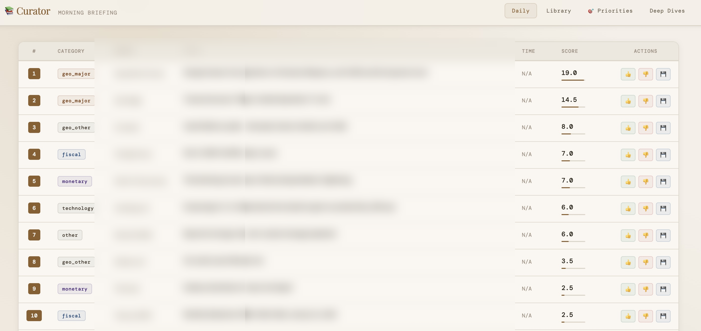
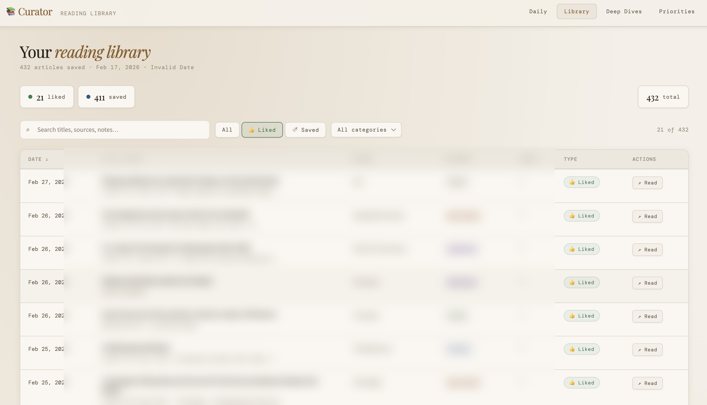
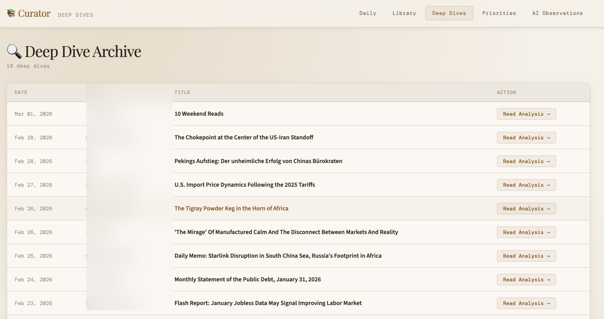
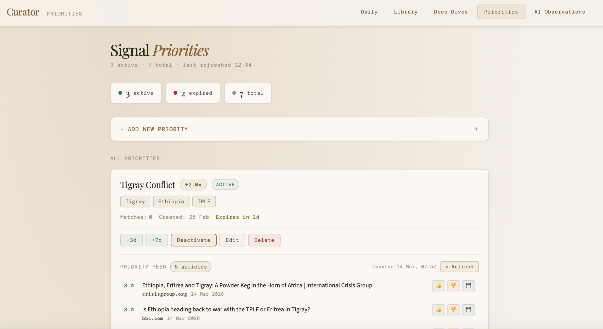

# Personal AI Briefing System
### *Mini-moi — not a general intelligence, but a specific one. Yours.*

A personal intelligence system. The first domain: the intersection of finance and geopolitics. Health, language learning, and others to follow.

Learns from your history and preferences, with deliberate friction built in. The goal isn't a curated feed — it's better thinking.

> Production system, daily use since Feb 2026. Designed to expand across domains — see [Roadmap](#roadmap).

---

## What This Is Really About

The cloud LLMs have the world's knowledge. That problem is largely solved.

The hard part — the part that actually matters for real decisions — is acting in your specific situation. Your history. Your goals. Your risk tolerance. Your team's context and motivation. General intelligence is widely available now. Specific intelligence, the kind that knows you and acts for you, isn't.

That's what this builds toward.

I started with myself: a daily briefing on geopolitics and finance, shaped by how I actually think, learning from what I actually read and save. But the vision is bigger. If I had a team at work — people and agents together — I'd want this same local context and motivation at the center of it. Not a generic assistant that knows everything about the world but nothing about us. A specific capability, grounded in our history, our goals, our way of making decisions under uncertainty.

That's what *Mini-moi* means. Not a mini version of a large language model. A system that carries your particular point of view and acts on your behalf — in your real world, for you, now.

The cloud LLMs are tools this system reaches out to when it needs them. Your memory, your preferences, your reasoning — those stay with you. The agents are your team members, not the cloud's.

---

## Why I Built This

The best way to understand something is to build it.

I've believed for a while that the future of AI isn't just larger models with more world knowledge — it's systems that carry specific context: your history, your goals, your way of reasoning through uncertainty. The cloud LLMs are remarkable, but they don't know you. They can't act for you in any meaningful sense without that layer.

I wanted to build that layer. Not as a prototype or a tutorial exercise, but as something I actually use and depend on every day. Geopolitics and finance were the natural first domain — areas I follow closely, where I have a real point of view that a generic feed can't capture.

The approach — local context, model-agnostic, flat files structured for future migration — was designed to scale beyond one person and one domain. Health, language learning, team environments at work. The architecture anticipates that. The first domain just had to be one I cared enough about to build it right.

---

## Build History

### January 2026 — Architecture Before Code

The system was designed before it was built. Key decisions made here:

**Local-first data layer:**
- Flat files first (JSON), schema designed to be Postgres-ready — one `COPY` command when volume demands migration, not a rewrite
- Context graph design (Neo4j) for relationship mapping: *why did I save this? what connects these ideas?*
- All learned state portable by design — move machines, switch providers, go offline — preferences travel with you

**Model-agnostic from day one:**
- User profile injection at the dispatcher level, not inside any model's prompt
- Mechanical mode built first — the system runs on local Ollama with no external API dependency
- Swap any model at any layer without touching personalization logic

The system ran standalone from the start. No cloud dependencies required.

**OpenClaw integration (late January / early February)**

When OpenClaw launched (early adopter — spent a weekend installing and debugging it), added it as an optional delivery and interface layer. The personal-ai-agent pipeline was preserved standalone; OpenClaw adds Telegram delivery and a conversational interface but is not required.

**February 2026 — Intelligence Layer**

With the local foundation solid, built the AI layer on top:
- Replaced keyword scoring with two-stage AI scoring (Haiku pre-filter → grok-3-mini final ranking)
- Built the learning feedback loop: Like/Dislike/Save → updates local learned profile → influences tomorrow's run
- Bootstrapped 415 learning signals from 398 hand-saved X bookmarks (cold start solved in one session)
- Optimized cost from $100+/month → $35–45/month through model selection and batching
- Unified cost tracking across chat and curator runs

---

## What It Does

This is not a smarter news feed. The daily briefing is the front door. Behind it:

**Daily Briefing**

Every morning, the system fetches hundreds of articles from RSS feeds across geopolitics, finance, and institutional sources. A two-stage scoring pipeline — cheap pre-filter, then a final ranking model with your injected learned profile — surfaces the top 20 most relevant articles for you specifically. Delivered to Telegram at 7 AM with like/dislike/save buttons. Your reactions feed tomorrow's scoring.

**Deep Dives**

When an article or topic warrants more than a headline, Deep Dive produces a structured brief using a higher-capability model: analysis, counter-arguments, and a bibliography of references for further reading. The archive grows daily — a personal research library of topics you decided were worth understanding deeply.

**Signal Priorities**

You inject current focus areas directly — a conflict escalating, a policy shift, an earnings season — with keywords and a time-bounded expiry. The system boosts those signals for that window, then returns to baseline. The world changes. Your attention shifts. This is the mechanism for keeping the system aligned with where you actually are, not where you were three months ago.

**Reading Library**

Every saved article is stored, searchable, and categorized. A personal knowledge base that accumulates alongside the daily work.

**This is not YouTube.** YouTube optimizes for your attention. This system optimizes for your thinking. You inject direction. It surfaces material. You decide what goes deeper.

---

## Screenshots

**Morning Briefing** — ranked top 20, scored and categorized, with like/dislike/save actions



**Reading Library** — everything you've ever liked or saved, searchable and filterable



**Deep Dive Archive** — AI analysis on flagged articles, by date



**Signal Priorities** — short-term focus injections that boost scoring for a set window



---

## Interface

The system has two production interfaces designed for different contexts:

**Web Portal** — full-featured local interface for browsing, research, and curation. Four views:
- **Daily** — ranked briefing with article scores and feedback controls
- **Reading Library** — searchable archive of all saved articles, filterable by category, type, and date
- **Deep Dives** — archive of structured research briefs with analysis, counter-arguments, and references
- **Signal Priorities** — inject and manage time-bounded focus areas with keyword boosting

**Telegram** — mobile interface for daily delivery and on-the-go feedback. Briefing arrives at 7 AM with inline like/dislike/save buttons. Voice notes supported for quick capture.

Both interfaces write to the same local data layer. Feedback from either surface influences tomorrow's scoring.

---

## How the Learning Loop Works

```
Daily Briefing (7 AM)
      ↓
You react on Telegram (👍 Like · 👎 Dislike · 🔖 Save)
  or inject a Signal Priority ("Tigray Conflict +2.0x, expires in 3 days")
      ↓
curator_feedback.py records signals locally
      ↓
Tomorrow's scorer gets your updated profile:
  "prefer institutional_debates, monetary_policy / avoid ceremonial_reporting"
  + active priority boosts applied
      ↓
Better briefing — shaped by your reasoning, not an algorithm's engagement model
```

**Model-agnostic by design:** The user profile is injected at the dispatcher level, not inside any model's prompt. When xAI goes down and Haiku takes over, it runs with the same learned profile. Swap models — preferences persist.

**Bootstrapped cold start:** Rather than waiting months for enough feedback, 398 hand-saved X bookmarks were ingested as `Save` signals. The learning loop went from 17 signals to **415 scored signals in one session**.

---

## What It Has Learned

```bash
python show_profile.py
```

```
========================================================
  CURATOR LEARNED PROFILE
========================================================
  Interactions : 415 scored signals from 406 feedback events
  Last updated : 2026-02-28
  Feedback     : 8 liked  |  1 disliked  |  397 saved
========================================================

  SOURCES
  -------
  ████████████████  +17  X/@[geopolitics_account]
  ██████████████░░  +16  X/@[geopolitics_account]
  █████████████░░░  +14  X/@[macro_economist]
  ████████████░░░░  +12  X/@[macro_economist]
  ███████████░░░░░  +11  [independent_media]
  ███████████░░░░░  +11  X/@[economic_historian]

  THEMES
  ------
  ████████████████  +17  institutional_debates
  ████████████████  +17  market_analysis
  █████████░░░░░░░  +8   monetary_policy
  ███████░░░░░░░░░  +6   geopolitical_analysis

  AVOID PATTERNS
  --------------
  ▪▪▪  (3x)  ceremonial_reporting
  ▪    (1x)  event_coverage_not_analysis
```

Learned from actual reading behavior — nothing hard-coded. The system knows to up-rank institutional critique, monetary theory, and geopolitical analysis. It knows to skip ceremonial news coverage.

---

## Architecture

```
RSS Feeds (10+ sources, ~400 articles)
          ↓
  curator_rss_v2.py
          ↓
  [mechanical mode: keyword scoring, Ollama local LLM — no external dependency]
          ↓  OR
  Stage 1: Haiku pre-filter (400 → ~50, cheap pass)
          ↓
  Stage 2: grok-3-mini scorer + injected user profile
          ↓  [fallback: Haiku with same user profile]
  Top 20 ranked articles
          ↓
  Telegram delivery (7 AM via launchd)   OR   stdout/file
          ↓
  User reacts (Like / Dislike / Save)
          ↓
  curator_feedback.py → updates local curator_preferences.json
          ↓
  Tomorrow's run loads updated profile → repeat
```

**Model roles:**

| Model | Role | Cost profile |
|---|---|---|
| Ollama (local) | Mechanical mode scoring | Free, no external calls |
| Claude Haiku | Bulk pre-filter, fallback scorer | Low cost, high volume |
| xAI grok-3-mini | Final daily ranking | Balanced quality/cost |
| Claude Sonnet | Deep Dives, OpenClaw conversational layer | Higher capability, used selectively |

All swappable. Profile injection at dispatcher level means switching models doesn't affect personalization.

---

**Key files:**

| File | Purpose |
|---|---|
| `curator_rss_v2.py` | Main pipeline: fetch, score, deliver |
| `curator_feedback.py` | Process reactions → update local learned profile |
| `show_profile.py` | Human-readable view of what the system has learned |
| `cost_report.py` | Unified cost tracking (chat + curator runs) |
| `x_bootstrap.py` | One-time ingestion of X bookmarks as learning signals |
| `x_auth.py` | X API OAuth credential management |

---

## Cost Story

Two categories of cost, both tracked:

**Operational costs** — daily curator runs (Haiku pre-filter + grok-3-mini scoring):

| Period | Approach | Monthly Cost |
|---|---|---|
| January | Mechanical mode + Ollama | Free |
| Early February | Claude Sonnet for all scoring | $100+/month |
| Current | Haiku pre-filter + grok-3-mini final | $35–45/month |

**Build costs** — design, strategy, and debugging sessions. Originally running Claude Sonnet via API for all development conversations. Migrated to Claude Code (runs on Pro subscription), which eliminated per-token build costs for implementation work. Both categories tracked separately in `daily_usage.json`.

The insight: profile injection makes cheaper models smarter. Most of the cost reduction came not from switching models but from injecting context that let lower-cost models perform at the level previously requiring expensive ones.

```bash
python cost_report.py          # today's breakdown by category
python cost_report.py week     # last 7 days, day by day
python cost_report.py month    # this calendar month
python cost_report.py year     # this calendar year, month by month
```

---

## How to Run

**Prerequisites:** Python 3.9+, API keys in macOS keyring

```bash
# Clone and install
git clone https://github.com/robertvanstedum/personal-ai-agents.git
cd personal-ai-agents
python3 -m venv venv && source venv/bin/activate
pip install -r requirements.txt

# Keyword scoring mode — no LLM, no API key required (see issue #1 for Ollama restore)
python curator_rss_v2.py --model=ollama

# AI mode (dry-run first)
python curator_rss_v2.py --mode=ai --dry-run

# See what the system has learned
python show_profile.py

# Check costs
python cost_report.py
```

**Credentials:** All API keys stored in macOS keyring, never in files. See `CREDENTIALS_SETUP.md`.

**OpenClaw (optional):** Adds Telegram delivery and conversational interface. The curator runs standalone without it.

**Scheduling:** launchd plist triggers at 2–3 AM (fetch/score), delivers at 7 AM.

---

## Development Process

Built through structured human-AI collaboration:

- **Multi-agent coordination:** Human architect bridges between specialized AI agents (Claude Code for implementation, OpenClaw assistant for planning/memory)
- **Incremental testing:** Formalized checklist (imports → usage → dry-run → integration) catches bugs before production
- **Zero regressions:** 7 major feature phases shipped (Feb-Mar 2026) with no production outages

**Example:** During Phase 3C development, the test sequence caught a string mismatch bug before it reached the preferences file — preventing a silent scoring system failure.

See [DEVELOPMENT.md](DEVELOPMENT.md) for detailed workflow and testing protocol.

---

## Roadmap

**v0.9 (current — Feb 2026):**
Full learning loop across all scoring paths, X bookmark bootstrap, cost tracking, Telegram feedback delivery, model-agnostic profile injection.

**v1.0 (active development):**
- Phase 3C: Domain-scoped content signals — X bookmark folders map to knowledge domains (Finance/Geo, Health, Tech, etc.)
- Phase 3D: User-driven domain tagging — tag articles across domains from web UI and Telegram
- Phase 4: Wider sources — Substack, academic (BIS, Fed, arXiv), Reddit
- Phase 5: Synthesis — pattern detection, contradiction highlighting, proactive research
- Postgres migration — `curator_costs.json` already row-structured, `COPY` ready

Active development continues after v0.9 launch.

---

## Technical Notes

- **Anti-echo-chamber:** 20% serendipity reserve surfaces articles outside learned patterns
- **Decay gate:** Signals older than 30 days get half-weight — prevents preference lock-in
- **Signal normalization:** X bookmarks weighted to avoid volume bias vs. direct feedback
- **Model-agnostic design:** Profile injection at dispatcher level — model swaps don't break personalization
- **Local-first:** All learned state is flat files on your machine, structured for easy DB migration

---

**Status:** Production (daily use since Feb 9, 2026)
**Current milestone:** v0.9-beta — learning loop complete across all scoring paths
**Author:** Robert van Stedum
