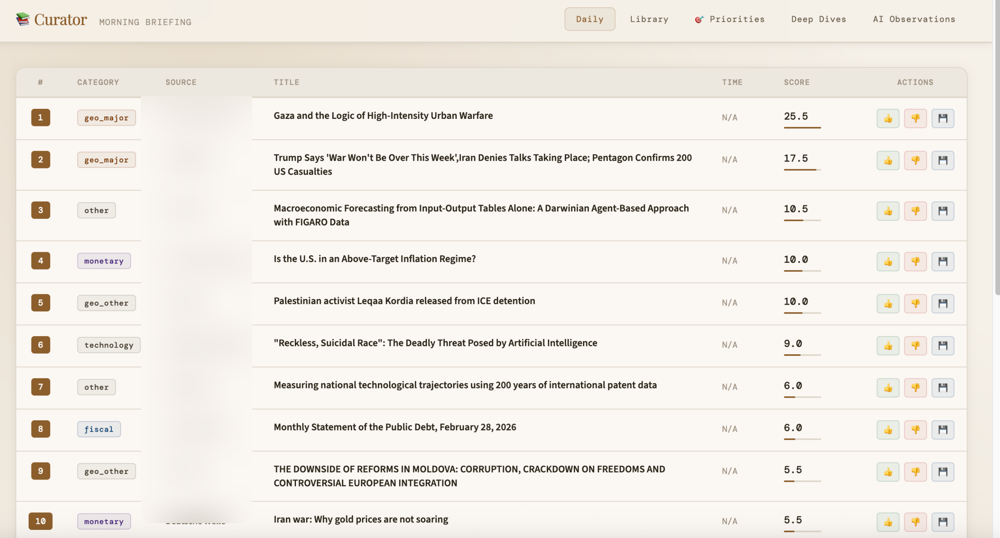
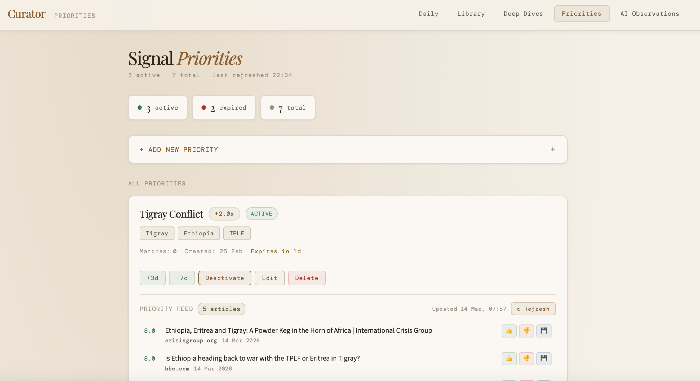
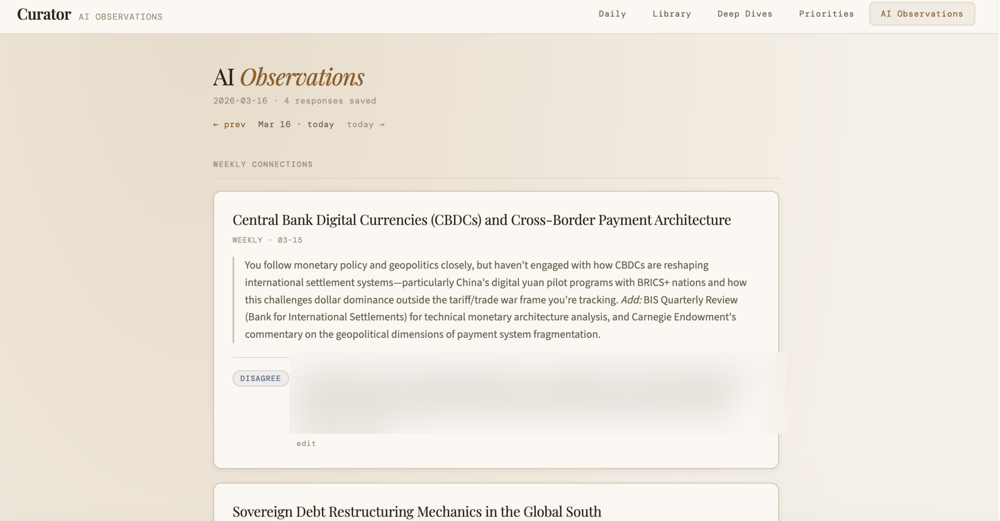
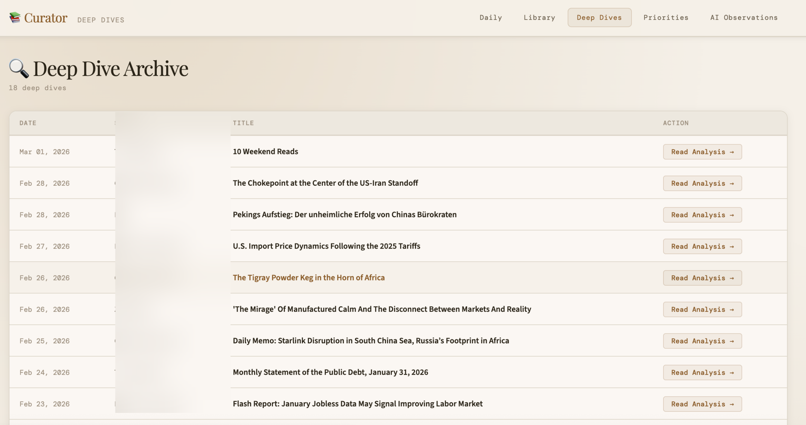
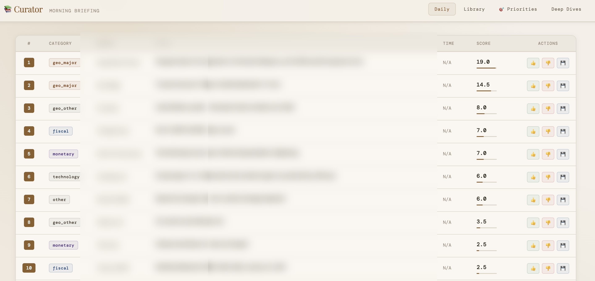

# Mini-moi — Personal AI Agent

### *Mini-moi — not a general intelligence, but a specific one. Yours.*

A personal AI agent system. Local memory, local model, swappable LLMs
when you need them — not the other way around. The goal is an agent that
knows you, challenges you, and gets better with you over time.

The first domain: geopolitics and finance. Health, language learning,
and others to follow. The architecture is designed to reuse across all of them.

Learns from your history and preferences, with deliberate friction built
in. Not a curated feed that confirms what you already think — an agent
that surfaces what you should be seeing, including content that cuts
against the grain.

> Production system, daily use since Feb 2026. Local-first, model-agnostic,
> designed to expand across domains — see [Where It Goes Next](#where-it-goes-next).

---

## What This Is Really About

The cloud LLMs have the world's knowledge. That problem is largely solved.

The hard part — the part that actually matters for real decisions — is
acting in your specific situation. Your history. Your goals. Your risk
tolerance. Your team's context and motivation. General intelligence is
widely available now. Specific intelligence, the kind that knows you and
acts for you, isn't.

That's what this builds toward.

Local memory and a local model are the foundation — context, preferences,
and learned behavior stay with you. Cloud LLMs are central to how this
works — they bring the world's knowledge, reasoning, and current events
into the picture. But memory, context, and what the agent has learned
about you stay local. That's what maintains autonomy. Switch models,
switch providers, go offline — the agent still knows you.

The vision is bigger than a personal project or one domain. If I had a
team at work — people and agents together — I'd want this same local
context and motivation at the center of it. Not a generic assistant that
knows everything about the world but nothing about us. A specific
capability, grounded in our history, our goals, our way of making
decisions under uncertainty.

That's what Mini-moi — mini-me — is about. Not a mini version of a large
language model. A system that carries your particular point of view and
acts on your behalf — in your real world, for you, now.

And it gets better as you use it. Not because someone updated a model —
because you and the agent are learning together.

---

## Why I Built This

The best way to understand something is to build it. This project started
as exactly that — learning by doing, with a real problem and a real use
case, not a tutorial exercise.

The future of AI isn't just larger models with more world knowledge — it's
systems that carry specific context: your history, your goals, your way of
reasoning through uncertainty. The cloud LLMs are powerful — but they don't
know your personal context. And if they did, you'd risk being locked into
one provider, with your history and preferences held somewhere you don't
control.

I wanted to build that layer. Not as a prototype or a tutorial exercise,
but as something I actually use. Geopolitics and finance were the natural
first domain — areas I follow closely, where I have a real point of view
that a generic feed can't capture.

The approach — local context, model-agnostic, flat files structured for
future migration — was designed to scale beyond one person and one domain.
Health, language learning, team environments at work. The architecture
anticipates that. The first domain just had to be one I cared enough about
to build it right.

---

## How It Was Built

I set out to build this the right way — production quality, not a hack.
AI lowers the barrier to building, but it can also take over if you let it.
The discipline here was to use it as a genuine collaborator: coach,
reviewer, and implementer — but never the one driving.

Not designed up front then implemented. The vision was fixed. The path
was iterative — a working slice first, production feedback, then
refinement. Each phase complete before the next one started.

### The Foundation

The intent of the project kept the foundation disciplined.

From day one: a structured database for content, history, and memory, and
a graph database for learned relationships. Both installed, both in use
early. But the tension surfaced quickly — too much time on infrastructure,
not enough on functionality. The breakthrough came from an unexpected
direction. The LLM suggested structuring the JSON files to match a database
schema — write local first, load later. I knew immediately that was the
answer. One migration command when the time comes, no rewrite.

We undid some early work and rebuilt around that principle. The result:
a system that is database-independent today, just as it is LLM-independent.
The data is ready. The databases are waiting. The functionality came first.

The same principle applied to models. User profile injection at the
dispatcher level, not inside any model's prompt. Swap any model at any
layer without touching the personalization logic. Database-independent.
LLM-independent. The pattern held throughout.

A side benefit emerged later: a dry-run mode that validates code against
the local model instantly, at no cost. The architecture rewarded the
approach in ways that weren't fully anticipated at the start.

---

## What It Does

### The Daily Briefing

Every morning, a three-stage pipeline runs automatically:

- **Gather & enrich** — RSS feeds and X bookmarks are pulled and merged;
  destination content is fetched from source URLs, giving the scorer full
  article context, not just headlines
- **Score** — a reasoning model ranks ~700 candidates with your learned
  profile injected
- **Deliver** — top 20 to the web portal, top 10 to the mobile messaging
  channel

Each stage uses a swappable model, tuned for cost and quality. The
architecture supports a bulk pre-filter between gather and score — ready
to activate as the candidate pool grows.

Later in the day, **AI Observations** arrives: the system's own read on
what it surfaced — what's surging, what's missing, where the story is.
You respond. Those responses feed the learning loop.

### On Demand

- **React & learn** — like, dislike, or save any article on either surface.
  Every signal feeds the learning loop and shapes future scoring — including
  the friction reserve, where the system surfaces content that cuts against
  the grain of your usual reading, keeping the feed from becoming a
  confirmation loop.
- **Deep Dive** — flag any article from the web portal for a structured AI
  brief. Add your own notes first — what caught your attention, what you
  want explored — and the deep dive is shaped by that context, not generic.
- **Signal Priorities** — inject a focus area directly into the scoring
  pipeline, with a boost level and expiry.

---

## Where It Goes Next

The geopolitics and finance domain is 1.0. Active development continues —
expanding sources, deepening the learning loop, and refining the pipeline
within this domain. The architecture is designed to extend to others:
health, language learning, team environments at work.

See [ROADMAP.md](ROADMAP.md) for what's next.

---

## Screenshots

| Daily Briefing | Signal Priorities |
|---|---|
|  |  |

| AI Observations | Deep Dives | Morning Briefing |
|---|---|---|
|  |  |  |

---

**Status:** v1.0 feature complete — March 2026
**Author:** Robert van Stedum
