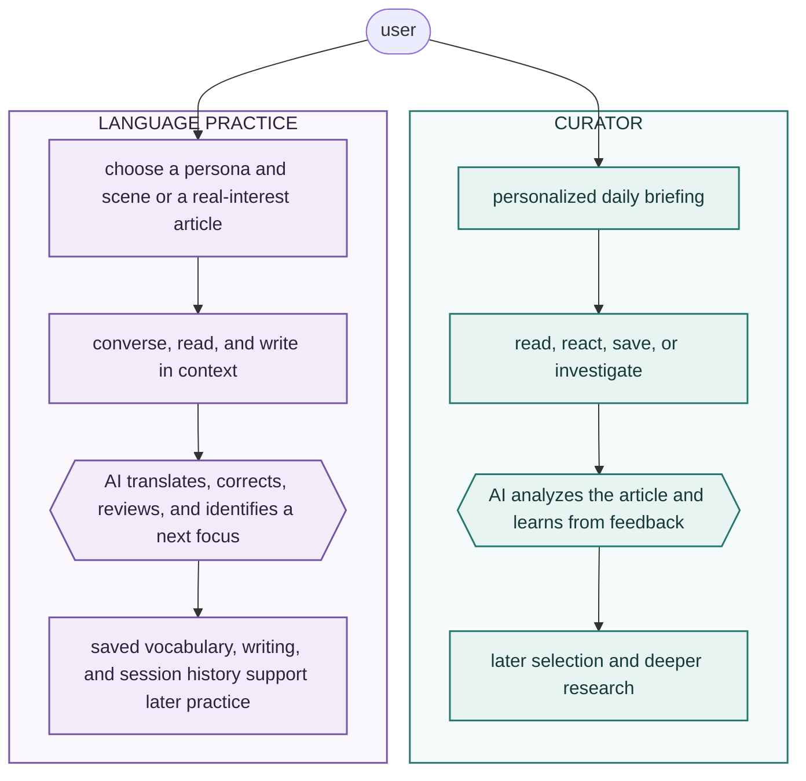
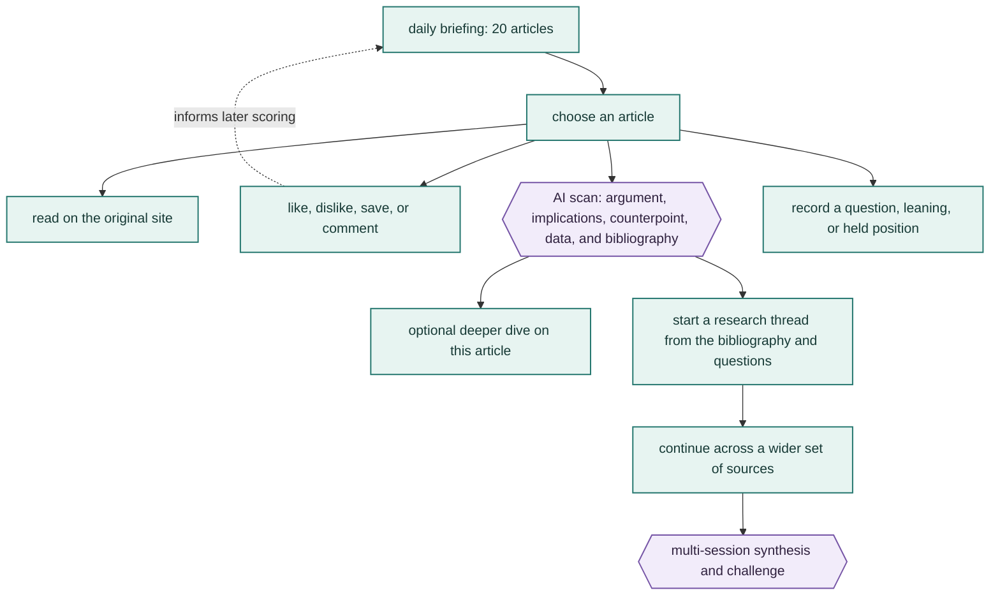
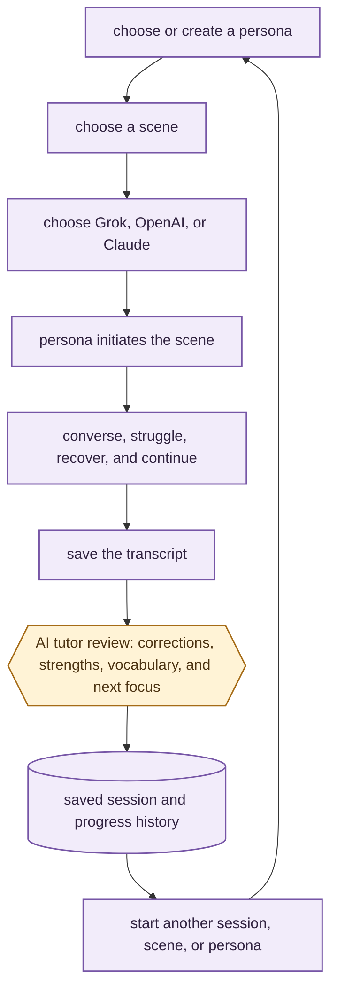
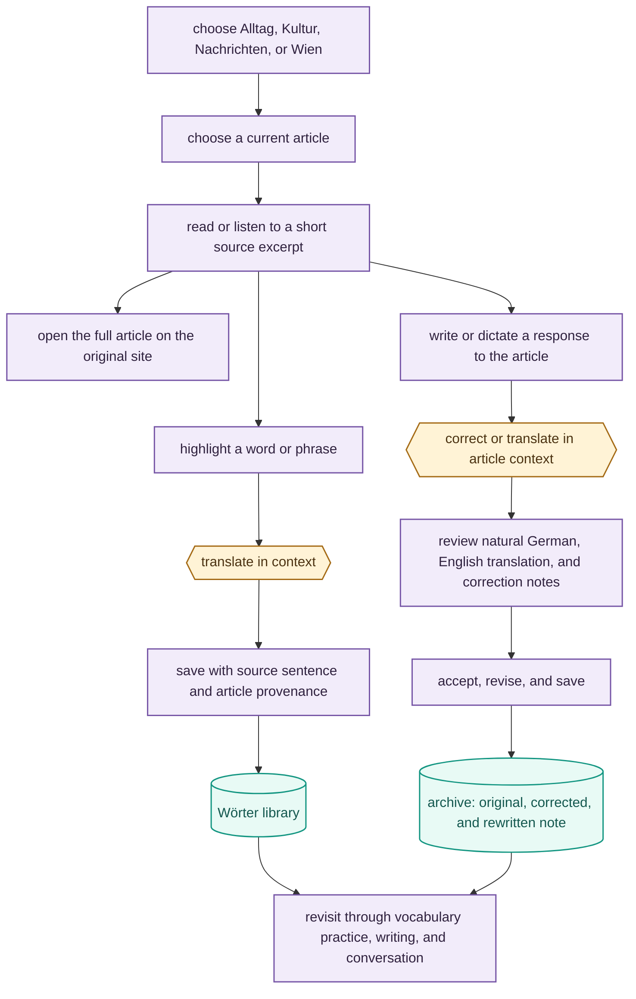

# mini-moi

mini-moi is a personal AI system that carries context across reading, research,
language learning, engineering work, and cross-domain coordination. It is built
for daily use first; the repository also records the architecture, operation,
and evolution of the system.

The name reflects its purpose: mini-moi becomes more useful by retaining the
user's goals, working patterns, learning history, and prior activity. It has
been in daily use since February 2026 and has run on AWS since June 2026. This
README provides an overview of the current system. The architecture, operations,
and roadmap documents carry the detail and distinguish what is running from
what is still being developed.

---

## Current state (July 2026)

| Domain | Current role |
|---|---|
| **Curator** | Supports daily reading and longer research in geopolitics and finance. Each morning it reduces roughly 700 candidates from international RSS feeds, X bookmarks, and theme-driven web search to 20 items on the web and 10 in Telegram. Reactions, saved items, comments, and investigations provide context for later selection. A separate serendipity pool helps prevent the learned profile from becoming a closed loop. Curator can also produce article scans, research threads, deeper-dive briefs, AI observations, and a weekly synthesis. |
| **Mein Deutsch** | Combines simulated German immersion with interest-led reading and writing. Gespräche provides unscripted voice conversations with AI personas and user-chosen scenes. Lesen presents current German-language articles across everyday life, culture, news, and Vienna; each selection includes a short source excerpt and a link to the full original. Words and phrases can be translated and saved with context. Article-related notes can be typed or dictated, corrected and explained by AI, then retained with their original and corrected forms. Vocabulary, writing records, conversation reviews, and the archive provide material for repeated use across the different forms of practice. |
| **Meu Português** | Followed German as a family-use version for a mixed English-Portuguese household. Both parents use both languages, but each has a different stronger language; the children have different levels of fluency, exposure, and formal practice. It was built quickly on the German base and introduced a more polished front end, multi-user separation, and per-user data boundaries. The backend is still converging with German, especially in adaptive memory. |
| **Guild** | Holds the platform's build queue, specifications, and operations view. Its Build, Operate, and Improve sections remain in use while the domain is refocused after Chief of Staff moved out. A queued change will repurpose the former embedded Chief of Staff role as **Master Craftsman**, focused on build quality, code review, domain standards, and consistency between specifications and implementation. |
| **Chief of Staff** | Became a standalone domain in July 2026. It provides chat with a defined voice, its own working memory and agenda, scheduled watch loops, and health checks. It remains in use while its remaining dependencies on Guild are removed and its access across the other domains is expanded. The separation gives both Chief of Staff and Guild clearer boundaries for further development. |

Production runs on AWS EC2, with a Mac development standby. The deployment
consists of eight containers plus host-level nginx and cron. CI/CD normally
moves a pushed change to production in about five minutes. Error tracking and
scheduled health checks monitor the running system.

The maintained reference documents are:

- [ARCHITECTURE.md](ARCHITECTURE.md) - system design and rationale
- [OPERATIONS.md](OPERATIONS.md) - how the production system runs
- [ROADMAP.md](ROADMAP.md) - current plans and the record of what shipped

---

## Two learning loops

Curator and the language domains show the use of retained context most clearly.
Curator uses reading behavior to improve later selection and research. The
language domains connect conversation, reading, writing, correction, and review
so that each form of practice can support the next.

```mermaid
flowchart TB
    U([user])

    subgraph C["CURATOR"]
        C1[personalized daily briefing] --> C2[read, react, save, or investigate]
        C2 --> C3{{AI analyzes the article and learns from feedback}}
        C3 --> C4[later selection and deeper research]
    end

    subgraph L["LANGUAGE PRACTICE"]
        L1[choose a persona and scene or a real-interest article] --> L2[converse, read, and write in context]
        L2 --> L3{{AI translates, corrects, reviews, and identifies a next focus}}
        L3 --> L4[saved vocabulary, writing, and session history support later practice]
    end

    U --> C1
    U --> L1

    classDef curator fill:#E7F4F1,stroke:#25776F,color:#173A36,stroke-width:1.5px
    classDef language fill:#F2ECFA,stroke:#7655A6,color:#30223F,stroke-width:1.5px
    class C1,C2,C3,C4 curator
    class L1,L2,L3,L4 language
    style C fill:#F5FBFA,stroke:#25776F,stroke-width:1.5px,color:#173A36
    style L fill:#FAF7FD,stroke:#7655A6,stroke-width:1.5px,color:#30223F
```

The colors separate the two domains; the double-braced nodes mark the places
where a model interprets activity rather than simply storing or displaying it.

### Curator: from reading to research

A selected article can remain a quick read, contribute feedback to later
selection, or become the starting point for a longer investigation.

```mermaid
flowchart TD
    A["daily briefing: 20 articles"] --> B[choose an article]
    B --> C[read on the original site]
    B --> R[like, dislike, save, or comment]
    R -. informs later scoring .-> A
    B --> S{{"AI scan: argument, implications, counterpoint, data, and bibliography"}}
    S --> D[optional deeper dive on this article]
    S --> T[start a research thread from the bibliography and questions]
    T --> TS[continue across a wider set of sources]
    TS --> DD{{multi-session synthesis and challenge}}
    B --> LN[record a question, leaning, or held position]

    classDef curator fill:#E7F4F1,stroke:#25776F,color:#173A36,stroke-width:1.5px
    classDef ai fill:#F2ECFA,stroke:#7655A6,color:#30223F,stroke-width:1.5px
    class A,B,C,R,D,T,TS,LN curator
    class S,DD ai
```

Feedback operates at two timescales. Immediate actions - likes, dislikes, saves,
and comments - help shape later article scoring. Research threads, deeper dives,
and recorded leanings preserve how an issue develops across sources and
sessions. The second loop is less mature than article selection, so the roadmap
and architecture describe its current limits.

### Language practice: conversation and return

The persona opens the exchange. The conversation is free-form, and difficulty
inside the conversation becomes evidence for later practice rather than a
reason to replace it with a scripted lesson.

```mermaid
flowchart TD
    A[choose or create a persona] --> B[choose a scene]
    B --> M[choose Grok, OpenAI, or Claude]
    M --> C[persona initiates the scene]
    C --> D[converse, struggle, recover, and continue]
    D --> E[save the transcript]
    E --> F{{"AI tutor review: corrections, strengths, vocabulary, and next focus"}}
    F --> G[(saved session and progress history)]
    G --> H[start another session, scene, or persona]
    H --> A

    classDef language fill:#F2ECFA,stroke:#7655A6,color:#30223F,stroke-width:1.5px
    classDef ai fill:#FFF3D6,stroke:#A56B16,color:#4C3312,stroke-width:1.5px
    class A,B,M,C,D,E,G,H language
    class F ai
```

German came first and remains more developed in the backend, including the use
of reviewed conversation context in later persona prompts. Portuguese followed
for family use in a mixed English-Portuguese household. Both parents use both
languages, but each has a different stronger language; the children have different
levels of fluency, exposure, and formal practice. That variation creates useful
design pressure: one system must support different starting points without
splitting into separate products. Portuguese was built quickly on the German
base and, in turn, introduced more front-end polish, multi-user separation, and
per-user data boundaries.

The two domains are intended to converge into the same solution from interface
through stored data and adaptive memory. A third language, new to the whole
family, will test that design directly: the language and content should change;
the solution should not.

### Lesen: reading, writing, and reuse

Lesen uses current German-language articles from subjects with an existing
reason to read: **Alltag** (everyday life), **Kultur** (culture),
**Nachrichten** (news), and **Wien** (Vienna and local life). A selected article
opens with a short excerpt drawn from the beginning of the source. The full article remains
available on its original site.

```mermaid
flowchart TD
    A[choose Alltag, Kultur, Nachrichten, or Wien] --> B[choose a current article]
    B --> C[read or listen to a short source excerpt]
    C --> O[open the full article on the original site]

    C --> V[highlight a word or phrase]
    V --> VT{{translate in context}}
    VT --> W[save with source sentence and article provenance]
    W --> WL[(Wörter library)]

    C --> N[write or dictate a response to the article]
    N --> NC{{correct or translate in article context}}
    NC --> NR[review natural German, English translation, and correction notes]
    NR --> NA[accept, revise, and save]
    NA --> AR[(archive: original, corrected, and rewritten note)]

    WL --> P[revisit through vocabulary practice, writing, and conversation]
    AR --> P

    classDef language fill:#F2ECFA,stroke:#7655A6,color:#30223F,stroke-width:1.5px
    classDef ai fill:#FFF3D6,stroke:#A56B16,color:#4C3312,stroke-width:1.5px
    classDef memory fill:#E8FAF5,stroke:#149682,color:#14584F,stroke-width:1.5px
    class A,B,C,O,V,W,N,NR,NA,P language
    class VT,NC ai
    class WL,AR memory
```

Translation help is available without replacing the reading. A highlighted word
or phrase can be translated and added to the Wörter library with its source
sentence and article title. The excerpt can also be expanded or read aloud.

Writing remains tied to the subject being read. A response can be typed or
dictated, and the correction step returns natural German, an English
translation, and short explanations of the changes. The corrected version can
be accepted or revised before saving. The archive retains the article, the
original response, and the corrected response; a drill record is saved with the
same work.

Lesen supplies the slower layers that real-time conversation cannot: close
reading, contextual translation, time to formulate a response, correction, and
deliberate review. Those layers develop recognition and recall in service of
better real conversation. Speaking exposes gaps; reading and writing provide
material and repetition; later conversation tests whether the language can be
retrieved.

## Continuity while the system changes

mini-moi is intended to keep its history even as the technology changes. Five
years from now, the useful part should be the knowledge gathered, lessons
learned, language practice, decisions, and some continuity of character from
daily interaction - not any particular model, memory system, interface, or
hosting arrangement. Provider memory can be used when it helps, while
application and local records keep that history from depending on one provider.

Domains give the work practical boundaries. Curator, the language domains,
Guild, and Chief of Staff each have a defined purpose and set of guardrails.
This reduces confusion about what a task is trying to accomplish and limits the
effect of mistakes. The boundaries can change: new interests may become
domains, while older areas may need less attention.

Curator and German were useful starting points because they supported real
interests and repeated use while also providing a way to learn AI by building
with it. Parts of the continuity loop already work, including Curator's article
selection, German's reviewed conversation memory, and Lesen's saved vocabulary
and corrected writing. Longer-term measurement and fuller coordination are
still being built. The aim is not to preserve today's components, but to let
mini-moi adapt without losing the history that makes it a more useful
collaborator. [ROADMAP.md](ROADMAP.md) records that boundary as it changes.

---

## Design approach

A few choices explain most of the architecture.

**Keep learned state outside the model.** Personal context lives in files owned
by the application rather than inside one model provider. The files are
structured to match a later database schema, and migration paths have already
been used in the Guild and research layers. Infrastructure is added when the
volume or behavior requires it.

**Use different models for different work.** Model control rests on three
considerations:

- **Cost.** Model costs became significant, then dropped substantially when
  different tasks were routed to different models, including a local option
  with no per-call charge.
- **Quality for the task and evaluation.** Models differ in conversation, translation,
  analysis, review, and coding, and those differences change over time. The
  ability to switch models also supports direct A/B evaluation on the same task.
- **Vendor independence and continuity.** Personal context remains above the
  model layer, so changing providers does not reset the history or require a
  redesign of the personalization logic. Provider-managed memory can supplement
  that record without becoming its only home.

Applying model choice consistently at every call site remains ongoing work; a
July audit found several places where implementation still lagged the intended
configuration.

The production history reflects these tradeoffs. The first version ran on a
local model, and a local model remains the last resort in German's translation
fallback chain. Curator scoring moved to cloud models after the cost and quality
tradeoff was measured. The path back to local execution remains part of the
design and is scheduled for end-to-end verification on the current EC2 setup.

**Use AI agents as contributors, with human direction.** The owner defines the
intent, decides what enters the system, and remains responsible for the result.
Different agents contribute design alternatives, implementation, testing, and
review. The current set includes Claude Code, Claude.ai, OpenClaw, Grok, and
OpenAI Codex. The particular models will change; the separation of roles is
more durable. Important changes receive review from more than one agent before
they are treated as complete.

**Operate while the system is evolving.** Keeping daily use dependable is
important and not trivial, especially while development continues. Drift can
appear between domains, between code and documentation, and between assumed
safeguards and the protection that actually exists during an incident.
Operations is therefore a continuing process: observe production, test
assumptions, learn from failures, reconcile code and documentation, and close
gaps in safeguards as they are found.

---

## Screenshots

A screenshot refresh is in progress. The new set will cover the portal, Curator
briefings and deeper dives, German and Portuguese conversation sessions, Lesen's
article, translation, writing, and archive states, the Guild workspace, and
Chief of Staff. Earlier screenshots remain in the repository as part of the
project's history.

---

## More detail

- [journal/](journal/) contains the public build narrative: sprint notes, plans,
  and records of how the project changed. It is still being populated.
- [docs/releases/](docs/releases/) contains release notes.
- [ARCHITECTURE.md](ARCHITECTURE.md), [OPERATIONS.md](OPERATIONS.md), and
  [ROADMAP.md](ROADMAP.md) are the maintained core documents.

---

**Status:** In daily use since February 2026; running on AWS since June 2026.  
**Author:** Robert van Stedum
