# mini-moi

mini-moi is a personal AI agent platform. It carries
context across reading and research, language learning, and the work of building
and running the system itself. It remembers my interests, what I have already
investigated, how my thinking develops, what I decide to follow up on, and what
I got wrong.

The same pattern applies beyond one person. Persistent context and feedback can
help teams, organizations, and their systems learn and improve over time. This
repository is the personal version.

mini-moi has been in daily use since February 2026, on AWS since June 2026. This
repository documents the system as it works today: architecture, operations,
roadmap, and ongoing development, with current capability kept distinct from
planned work.

---

## Current state (August 2026)

| Domain | Current role |
|---|---|
| **Curator** | Supports daily reading and sustained research in geopolitics and finance. Each morning, it distills roughly 700 candidates from international RSS feeds, X bookmarks, and theme-driven web search into a curated shortlist of 20. Selected articles can become scans, research threads, or deeper dives. Reactions, comments, and recorded leanings shape later selections. A serendipity pool guards against a closed loop, while AI synthesis surfaces patterns across the accumulated record. |
| **Mein Deutsch** | Originally inspired by an upcoming trip to Vienna and a lack of opportunities to speak German, this domain uses AI personas in everyday scenarios for unscripted conversations adapted to the learner’s ability. The intent is immersion, including the tension of following and speaking in a new language. It was road-tested during the trip itself, when unexpected communication challenges could be turned into new scenes and relived later. Reading and writing reinforce the learning loop and preserve locally grounded context. The learner’s activity then shapes future sessions. |
| **Meu Português** | Portuguese was chosen to fill a family need: maintaining a second language used at home across varying levels of proficiency. AI personas, scenes, and reading content are Brazilian-focused. The domain does not put users into fixed proficiency levels. The intent is still immersion. A more advanced learner can choose a more demanding scenario and speak or write in a more complex way. A novice can use simpler scenarios and rely more heavily on targeted drills or traditional vocabulary practice. Usability enhancements were added across the site, including hover translation, tips in English, and the option to speak throughout. |
| **Guild** | Guild was created to bring discipline, visibility, and learning to the development of the platform. Build, Operate, and Improve are its three working areas. Build currently maintains a Kanban view of work in progress, an inventory of specifications, and an evolving roadmap. With more than one coding agent now in use and operational concerns becoming more important, the planned **Master Craftsman** will coordinate build quality, code review, domain standards, and consistency between specifications and implementation. |
| **Chief of Staff** | Chief of Staff is intended to become my personal strategic thinking and cross-domain working partner. It will carry context across mini-moi, notice connections, support decisions, and help direct follow-through. Its scope will also extend to learning and professional priorities beyond the current domains, using the platform’s shared tools and capabilities. The beta supports discussion, investigation, and refinement of possible actions but cannot alter the platform itself. OpenClaw is the current bounded agent, running independently on AWS behind a stable interface so it can be replaced without redesigning the domain. Once proven, the same approach will support **Master Craftsman**, a separate build-focused agent in Guild. |

Production runs on AWS EC2, with a Mac development standby. The deployment
consists of nine application/runtime containers plus PostgreSQL, with host-level
Cloudflare Tunnel, nginx, and cron. Production currently uses a full
immutable-image, health-gated deployment. A reviewed but not yet shipped CI/CD
change adds document-only and domain-scoped releases so documentation can publish
without container restarts and one domain can deploy without interrupting the
others; shared or ambiguous changes continue to select the full path.
Error tracking and scheduled health checks monitor the running system.

The August 16 milestone is deliberately called a **beta**, not 1.0. It proves a
real agentic loop—conversation, bounded research, model routing, verified note
mutation, and realtime voice—while longer-term conversation retention, privacy
controls, natural capture intents, cross-domain reach, and cost governance remain
explicit follow-up work.

The maintained reference documents are:

- [ARCHITECTURE.md](ARCHITECTURE.md) - system design and rationale
- [OPERATIONS.md](OPERATIONS.md) - how the production system runs
- [ROADMAP.md](ROADMAP.md) - current plans and the record of what shipped

The [product tour](#product-tour) shows the current production interface across
all five domains and follows one Curator topic from the daily briefing into
long-form research.

---

## Two product loops

Curator and the language domains are the clearest expressions of the product.
One turns daily reading into a continuing research practice. The other turns an
unscripted conversation into material for the next session.

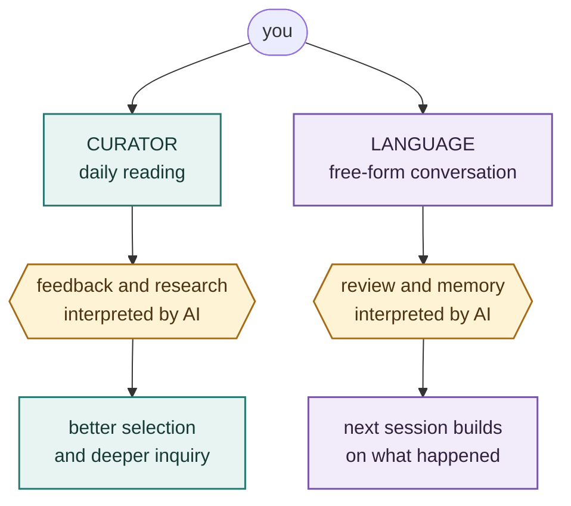
```mermaid
flowchart TB
    U([you])

    U --> C1[CURATOR<br/>daily reading]
    C1 --> C2{{feedback and research<br/>interpreted by AI}}
    C2 --> C3[better selection<br/>and deeper inquiry]

    U --> L1[LANGUAGE<br/>free-form conversation]
    L1 --> L2{{review and memory<br/>interpreted by AI}}
    L2 --> L3[next session builds<br/>on what happened]

    classDef curator fill:#E7F4F1,stroke:#25776F,color:#173A36,stroke-width:1.5px
    classDef language fill:#F2ECFA,stroke:#7655A6,color:#30223F,stroke-width:1.5px
    classDef ai fill:#FFF3D6,stroke:#A56B16,color:#4C3312,stroke-width:1.5px
    class C1,C3 curator
    class L1,L3 language
    class C2,L2 ai
```

The colors separate the two domains; the double-braced nodes mark the places
where a model interprets activity rather than simply storing or displaying it.

### Curator: from reading to research

A selected article can remain a quick read, contribute feedback to later
selection, or become the starting point for a longer investigation.

**Reading and feedback**

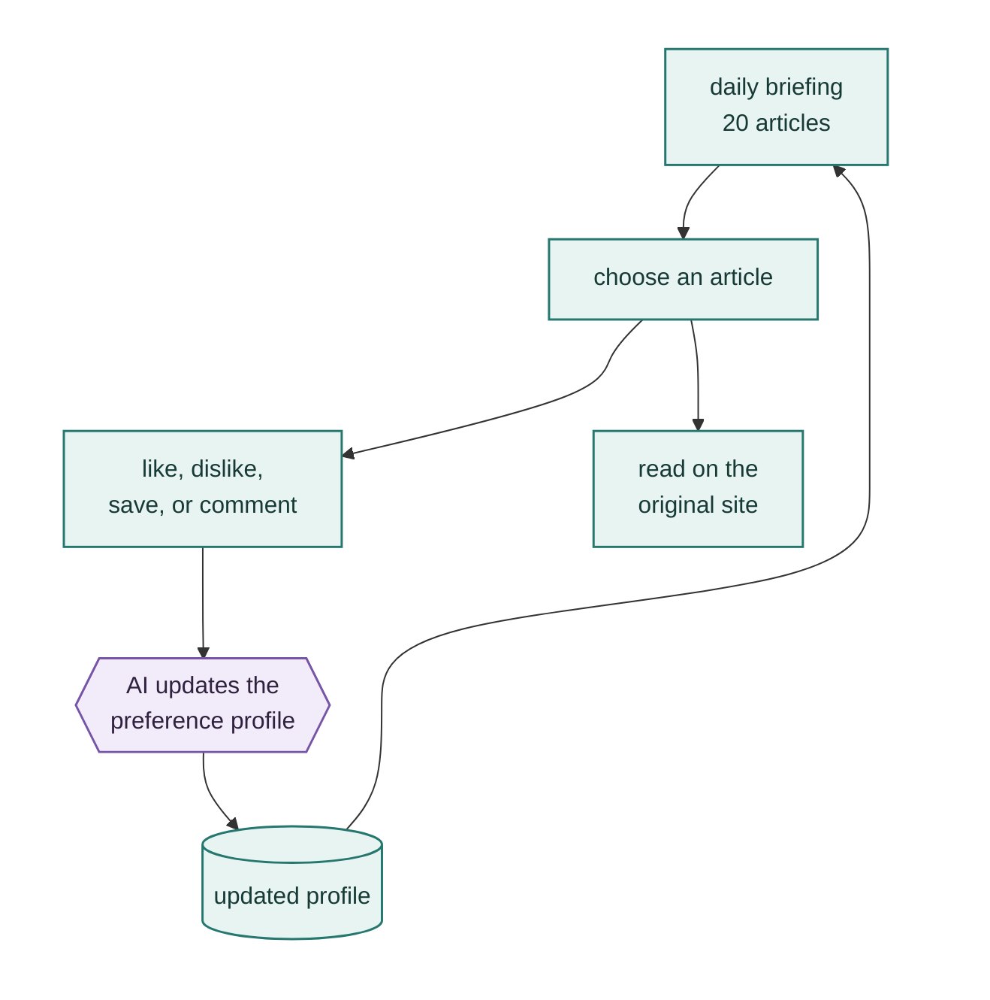
```mermaid
flowchart TB
    subgraph TOP[" "]
        direction LR
        A["daily briefing<br/>20 articles"] --> B[choose an article]
        B --> C[read on the<br/>original site]
    end

    subgraph BOTTOM[" "]
        direction RL
        R[like, dislike,<br/>save, or comment] --> P{{AI updates the<br/>preference profile}}
        P --> F[(updated profile)]
    end

    B --> R
    F --> A

    classDef curator fill:#E7F4F1,stroke:#25776F,color:#173A36,stroke-width:1.5px
    classDef ai fill:#F2ECFA,stroke:#7655A6,color:#30223F,stroke-width:1.5px
    class A,B,C,R,F curator
    class P ai
    style TOP fill:transparent,stroke:transparent
    style BOTTOM fill:transparent,stroke:transparent
```

**Research**

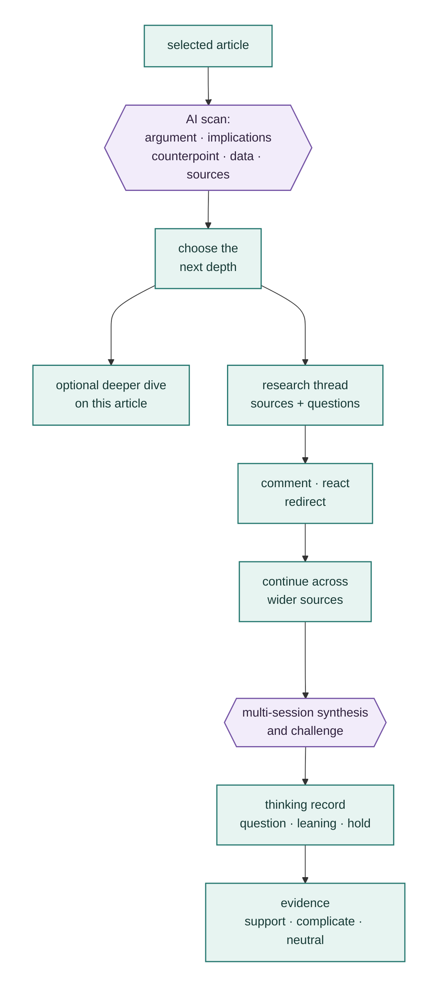
```mermaid
flowchart TB
    subgraph TOP[" "]
        direction LR
        A[selected article] --> S{{AI scan:<br/>argument · implications<br/>counterpoint · data · sources}}
        S --> N[choose the<br/>next depth]
    end

    subgraph PATHS[" "]
        direction LR
        O[optional deeper dive<br/>on this article]
        T[research thread<br/>sources + questions] --> R[comment · react<br/>redirect]
        R --> W[continue across<br/>wider sources]
    end

    subgraph RECORD[" "]
        direction RL
        DD{{multi-session synthesis<br/>and challenge}} --> L[thinking record<br/>question · leaning · hold]
        L --> E[evidence<br/>support · complicate · neutral]
    end

    N --> O
    N --> T
    W --> DD

    classDef curator fill:#E7F4F1,stroke:#25776F,color:#173A36,stroke-width:1.5px
    classDef ai fill:#F2ECFA,stroke:#7655A6,color:#30223F,stroke-width:1.5px
    class A,N,O,T,R,W,L,E curator
    class S,DD ai
    style TOP fill:transparent,stroke:transparent
    style PATHS fill:transparent,stroke:transparent
    style RECORD fill:transparent,stroke:transparent
```

Feedback operates at two timescales. Immediate actions - likes, dislikes, saves,
and comments - help shape later article scoring. Research threads, deeper dives,
and recorded leanings preserve how an issue develops across sources and
sessions. The second loop is less mature than article selection, so the roadmap
and architecture describe its current limits.

### Language practice: conversation and return

German began with an upcoming trip to Vienna and a lack of opportunities to
speak before going. The domain addresses three practical gaps. First, I need
the experience of getting stuck and recovering in a real exchange. Second, I
want to read engaging, current material without the effort becoming burdensome;
contextual hints, translation, audio, and shorter excerpts help me keep moving.
Third, I want reasons to write about something I actually find interesting,
with correction and explanation for the mistakes I make. Gespräche, Lesen, and
Schreiben are complementary responses to those needs rather than separate
exercises.

The persona opens the exchange. The conversation is free-form, and difficulty
inside the conversation becomes evidence for later practice rather than a
reason to replace it with a scripted lesson. The approach was road-tested in
Vienna, where unexpected communication challenges could become new scenes to
relive later.

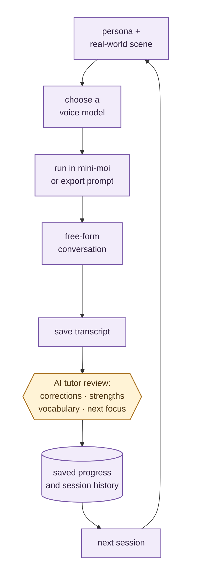
```mermaid
flowchart TB
    subgraph TOP[" "]
        direction LR
        A[persona +<br/>real-world scene] --> B[choose a<br/>voice model]
        B --> C[run in mini-moi<br/>or export prompt]
        C --> D[free-form<br/>conversation]
    end

    subgraph BOTTOM[" "]
        direction RL
        E[save transcript] --> F{{"AI tutor review:<br/>corrections · strengths<br/>vocabulary · next focus"}}
        F --> G[(saved progress<br/>and session history)]
        G --> H[next session]
    end

    D --> E
    H --> A

    classDef language fill:#F2ECFA,stroke:#7655A6,color:#30223F,stroke-width:1.5px
    classDef ai fill:#FFF3D6,stroke:#A56B16,color:#4C3312,stroke-width:1.5px
    class A,B,C,D,E,G,H language
    class F ai
    style TOP fill:transparent,stroke:transparent
    style BOTTOM fill:transparent,stroke:transparent
```

German came first and remains more developed in the backend, including the use
of reviewed conversation context in later persona prompts. Portuguese followed
to meet a family need: maintaining a second language used at home across
varying levels of proficiency. Each person begins with the same experience and
keeps a separate learning record. The domain remains level-agnostic: advanced
learners can choose more demanding scenes and language, while novices can rely
more on simpler scenarios, hover translation, vocabulary practice, and targeted
drills.

The two domains are intended to converge into the same solution from interface
through stored data and adaptive memory. A third language, new to the whole
family, will test that design directly: the language and content should change;
the solution should not.

### Lesen: reading, writing, and reuse

Lesen uses current German-language articles from subjects with an existing
reason to read: **Alltag** (everyday life), **Kultur** (culture),
**Nachrichten** (news), and **Wien** (Vienna and local life). A selected article
opens with a short excerpt drawn from the beginning of the source. The full
article remains available on its original site.

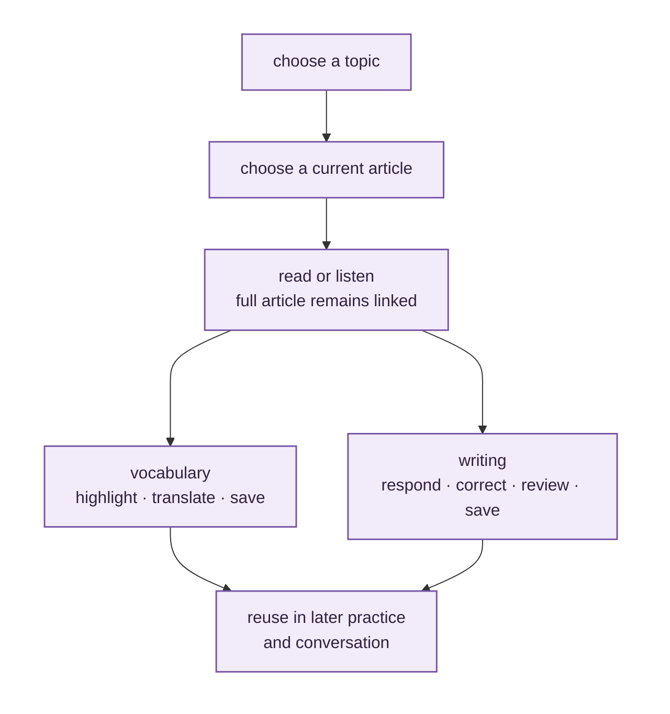
```mermaid
flowchart TB
    subgraph TOP[" "]
        direction LR
        A[choose a topic] --> B[choose a current article]
        B --> C[read or listen<br/>full article remains linked]
    end

    subgraph PRACTICE[" "]
        direction LR
        V["vocabulary<br/>highlight · translate · save"] --> P[reuse in later practice<br/>and conversation]
        N["writing<br/>respond · correct · review · save"] --> P
    end

    C --> V
    C --> N

    classDef language fill:#F2ECFA,stroke:#7655A6,color:#30223F,stroke-width:1.5px
    class A,B,C,V,N,P language
    style TOP fill:transparent,stroke:transparent
    style PRACTICE fill:transparent,stroke:transparent
```

Translation help and other contextual hints are available without replacing the
reading. They keep unfamiliar language from turning an interesting article into
a burdensome decoding exercise. A highlighted word or phrase can be translated
and added to the Wörter library with its source sentence and article title. The
excerpt can also be expanded or read aloud.

Writing remains tied to the subject being read. A response can be typed or
dictated, and the correction step returns natural German, an English
translation, and short explanations of the changes. The corrected version can
be accepted or revised before saving. The archive retains the article, the
original response, and the corrected response; a drill record is saved with the
same work.

Lesen supplies the slower layers that real-time conversation cannot: close
reading, contextual translation, time to formulate a response, correction, and
deliberate review. Those layers develop recognition and recall in service of
better real conversation. Speaking exposes gaps; reading and writing provide
material and repetition; later conversation tests whether the language can be
retrieved.

## Continuity while the system changes

mini-moi is intended to keep its history even as the technology changes. Five
years from now, the useful part should be the knowledge gathered, lessons
learned, language practice, decisions, and some continuity of character from
daily interaction - not any particular model, memory system, interface, or
hosting arrangement. Provider memory can be used when it helps, while
application and local records keep that history from depending on one provider.

Domains give the work practical boundaries. Curator, the language domains,
Guild, and Chief of Staff each have a defined purpose and set of guardrails.
This reduces confusion about what a task is trying to accomplish and limits the
effect of mistakes. The boundaries can change: new interests may become
domains, while older areas may need less attention.

Curator and German were useful starting points because they supported real
interests and repeated use while also providing a way to learn AI by building
with it. Parts of the continuity loop already work, including Curator's article
selection, German's reviewed conversation memory, and Lesen's saved vocabulary
and corrected writing. Longer-term measurement and fuller coordination are
still being built. The aim is not to preserve today's components, but to let
mini-moi adapt without losing the history that makes it a more useful
collaborator. [ROADMAP.md](ROADMAP.md) records that boundary as it changes.

---

## Design approach

A few choices explain most of the architecture.

**Keep learned state outside the model.** Personal context lives in files owned
by the application rather than inside one model provider. The files are
structured to match a later database schema, and migration paths have already
been used in the Guild and research layers. Infrastructure is added when the
volume or behavior requires it.

**Use different models for different work.** Model control rests on three
considerations:

- **Cost.** Model costs became significant, then dropped substantially when
  different tasks were routed to different models, including a local option
  with no per-call charge.
- **Quality for the task and evaluation.** Models differ in conversation, translation,
  analysis, review, and coding, and those differences change over time. The
  ability to switch models also supports direct A/B evaluation on the same task.
- **Vendor independence and continuity.** Personal context remains above the
  model layer, so changing providers does not reset the history or require a
  redesign of the personalization logic. Provider-managed memory can supplement
  that record without becoming its only home.

Applying model choice consistently at every call site remains ongoing work; a
July audit found several places where implementation still lagged the intended
configuration.

The production history reflects these tradeoffs. The first version ran on a
local model, and a local model remains the last resort in German's translation
fallback chain. Curator scoring moved to cloud models after the cost and quality
tradeoff was measured. The path back to local execution remains part of the
design and is scheduled for end-to-end verification on the current EC2 setup.

**Use AI agents as contributors, with human direction.** The director defines the
intent, decides what enters the system, and remains responsible for the result.
Claude Code, Claude.ai, OpenClaw, Grok, and OpenAI Codex contribute planning,
design alternatives, implementation, testing, and review. Separately, the
Chief of Staff beta introduces OpenClaw as the first bounded agent operating
inside the product. The particular agents and models will change; the
separation of roles and the platform-owned boundaries are more durable.
Important changes receive review from more than one agent before they are
treated as complete.

**Operate while the system is evolving.** Keeping daily use dependable is
important and not trivial, especially while development continues. Drift can
appear between domains, between code and documentation, and between assumed
safeguards and the protection that actually exists during an incident.
Operations is therefore a continuing process: observe production, test
assumptions, learn from failures, reconcile code and documentation, and close
gaps in safeguards as they are found.

---

## Product tour

These production captures from July 21, 2026 show the five domain environments
and several workflows behind their landing pages. The descriptions reflect the
current August 16 state, including the newer Chief of Staff beta. Each image
opens at full size.

### Five domains

| Curator | Mein Deutsch |
|---|---|
| [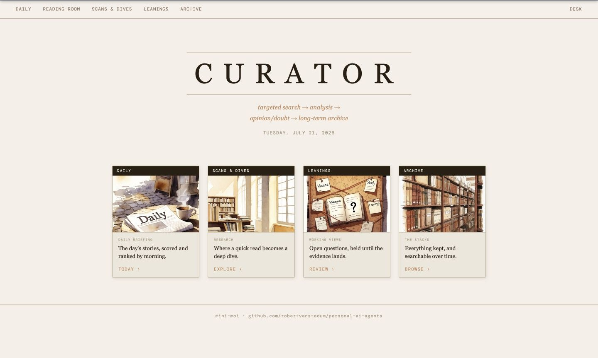](docs/screenshots/2026-07-21/curator-landing.jpg) |  |
| Daily reading, research, working views, and the long-term archive. | German conversation, reading, writing, and vocabulary in a place-based learning environment. |

| Meu Português | Guild | Chief of Staff |
|---|---|---|
|  | [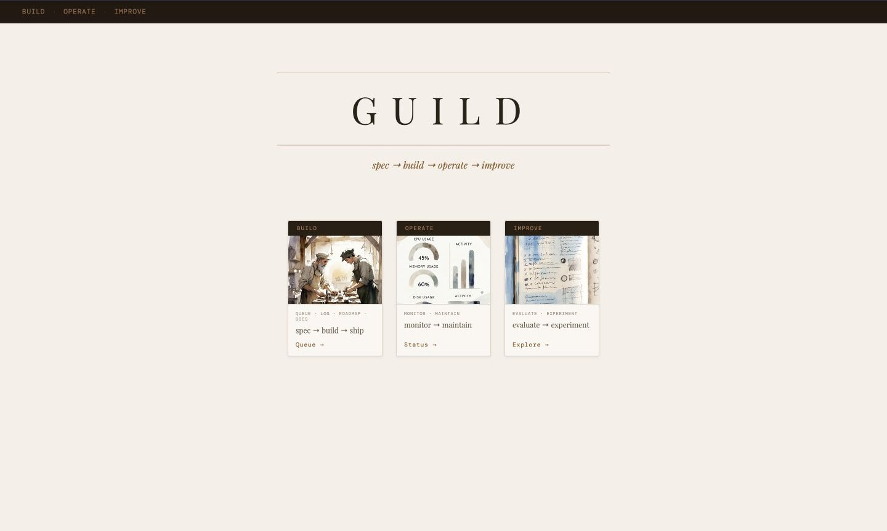](docs/screenshots/2026-07-21/guild-landing.jpg) | [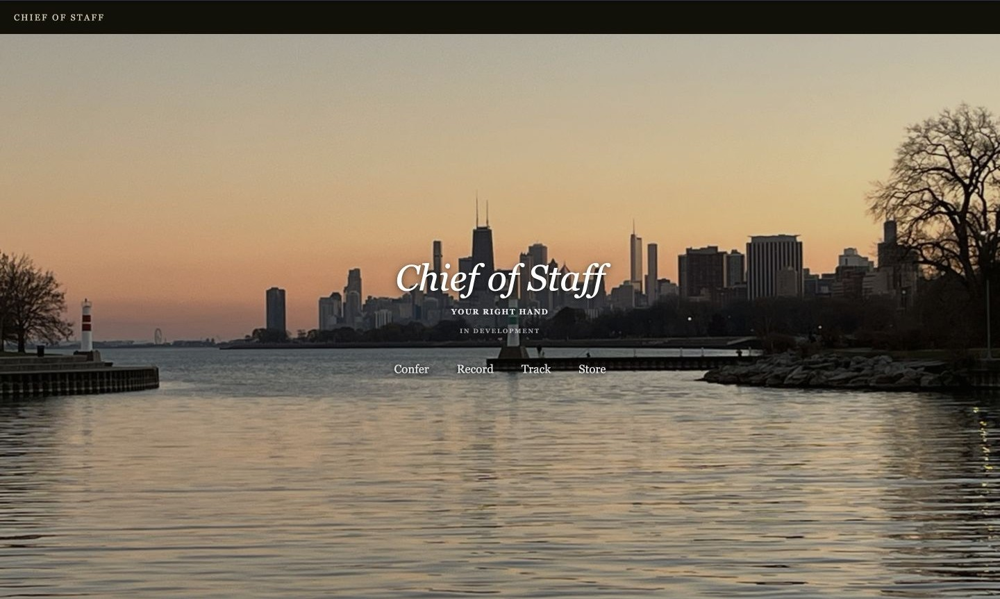](docs/screenshots/2026-07-21/chief-of-staff-landing.jpg) |
| Family Portuguese practice with separate learning records, level-agnostic immersion, and voice throughout. | Build, Operate, and Improve make platform development and operations visible. | A production beta for conversation, bounded investigation, and platform-owned notes; the image predates the agent release. |

### Curator: daily reading becomes research

The daily briefing is the beginning of the Curator loop, not the finished
product. A ranked article can be read quickly, used to provide feedback, scanned
for its argument and evidence, or turned into a larger investigation.

| Daily briefing | Article scan |
|---|---|
| [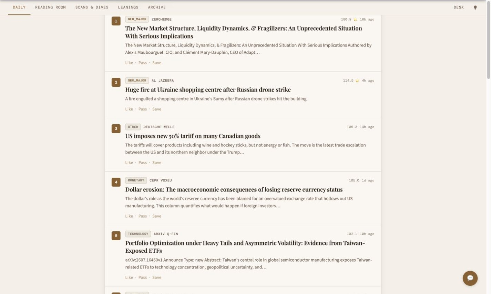](docs/screenshots/2026-07-21/curator-daily-briefing.jpg) | [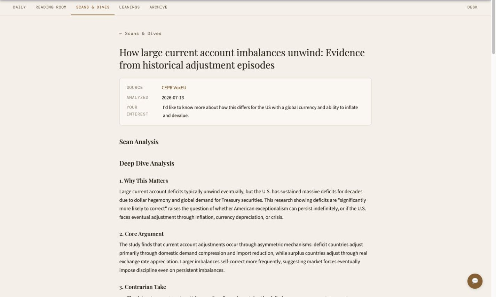](docs/screenshots/2026-07-21/curator-current-account-scan.jpg) |
| The morning selection ranks articles and keeps Like, Pass, and Save close to the reading decision. | The scan connects one article to the question that made it interesting, then extracts its argument, counterpoint, evidence, and next questions. |

| Research controls | Deeper-dive result |
|---|---|
| [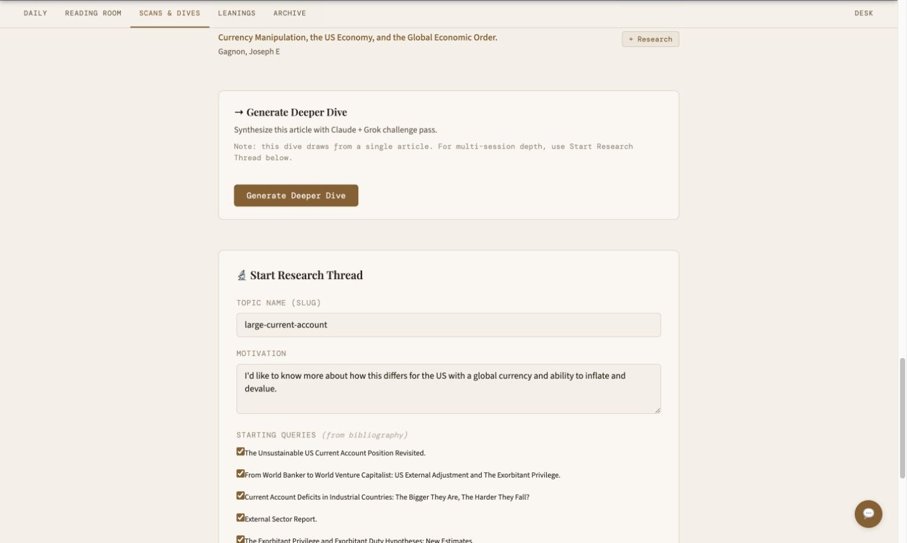](docs/screenshots/2026-07-21/curator-current-account-research-tools.jpg) | [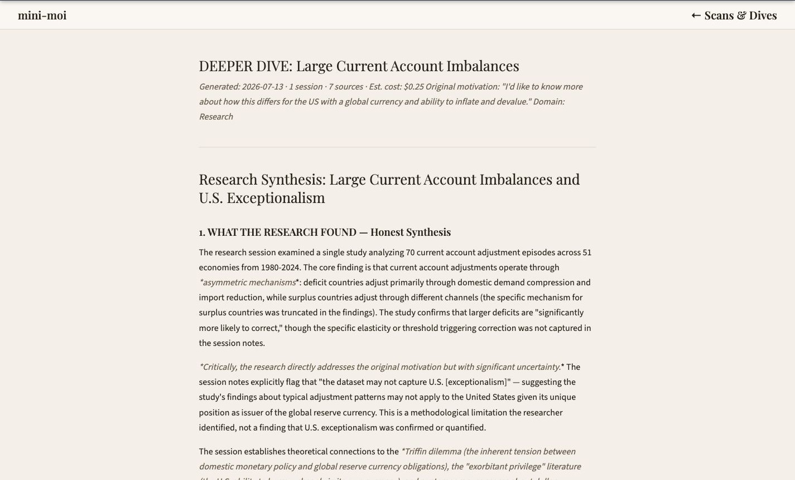](docs/screenshots/2026-07-21/curator-current-account-deeper-dive.jpg) |
| Bibliography items can seed further research; the article can also become an immediate deeper dive or a multi-session thread. | The completed synthesis states what the research did and did not establish, preserves uncertainty, and includes a separate challenge pass. |

### Language practice

The language interfaces use photography, personas, and real subjects to give
practice a setting and a reason. Correction and review remain attached to the
learner's own writing or conversation rather than becoming isolated exercises.

| German writing and correction | Portuguese conversation setup |
|---|---|
| [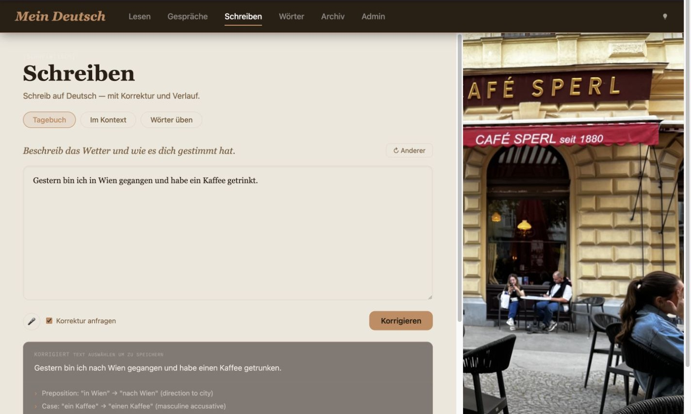](docs/screenshots/2026-07-21/german-writing-correction.jpg) | [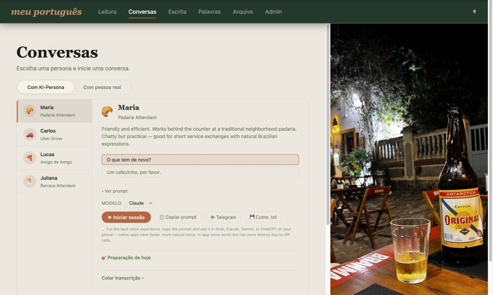](docs/screenshots/2026-07-21/portuguese-conversation.jpg) |
| A fresh demonstration sentence is corrected and explained without exposing a saved learning session. | A persona, scenario, model, and voice workflow prepare an unscripted Portuguese conversation. |

Earlier screenshots remain in [docs/screenshots/](docs/screenshots/) as part of
the project's history. Approved sets are grouped by date so a later visual
refresh can be added without overwriting this one.

---

## More detail

- [docs/README.md](docs/README.md) is the guide to working references and
  historical context, including the April 2026 platform vision.
- [docs/journal/](docs/journal/) is the tracked home for the public build narrative.
  Its publishing conventions are present; dated sprint notes, plans, and records
  of how the project changed are still being populated.
- [docs/releases/](docs/releases/) contains release notes.
- [ARCHITECTURE.md](ARCHITECTURE.md), [OPERATIONS.md](OPERATIONS.md), and
  [ROADMAP.md](ROADMAP.md) are
  the maintained core documents.

---

**Status:** In daily use since February 2026; running on AWS since June 2026.  
**Author:** Robert van Stedum
