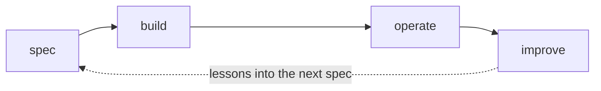
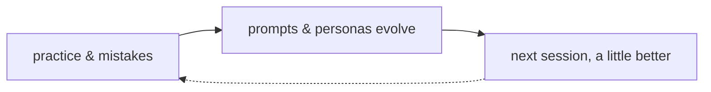
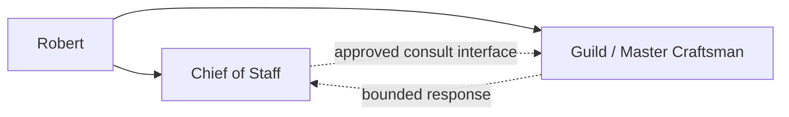

# Roadmap: Mini-moi

*Maintained baseline, reviewed through 2026-08-17. This replaces the former root
roadmap; the separate Guild roadmap view remains temporarily in place until the
Baseline document flow replaces it. Companion to ARCHITECTURE.md (what the system is
and why) and OPERATIONS.md (how it runs). This document records planned work and
work that is intentionally not planned.*

*The roadmap uses three tiers. **Committed** work is accepted and awaiting or
undergoing delivery. **Planned** work has a defined purpose and is sequenced behind
committed work. **Aspired** work records longer-term direction without implying a
schedule. Paths not taken are also recorded so those decisions can be revisited.*

---

## Direction

The objective is personal and practical: build a durable partnership in which
people and agents improve together by developing better judgment, deeper shared
context, and more effective ways of working over time, without depending on any
single model or platform. The system accumulates shared context: what was read,
what was practiced, what was decided and why, and what went wrong. Each session
starts from a stronger foundation than the last. Frontier models bring
capability; the privately controlled context layer brings continuity and
resilience as models and platforms change. The first implementation centers on
one person; the same pattern extends naturally to a family, a team, a department,
or an enterprise. The aim is not to extract knowledge from people, but to help
people and their agent partners become more capable together in their particular
context and toward their particular goals.

The learning happens in **four bounded loops**, one per domain family:

**Curator.** Reactions and pushback tune what tomorrow's briefing surfaces, and
the thinking record compounds.

**Guild.** The workshop loop follows the domain's structure:
spec → build → operate → improve, with lessons from operating feeding the next
spec. The direction here is a "master craftsman" agent role inside Guild, taking
over the coordination work CoS used to do when the two were one domain.

**The language domains.** Mistakes and practice inform the backend so prompts and
personas evolve over time. The result is measured through improved speaking,
reading, and writing.

**Chief of Staff.** The current beta supports conversation, bounded investigation,
and explicit platform-owned notes. The intended loop adds durable context and
approved read/consult interfaces over time. It does not receive unrestricted
backend access merely because its role is cross-domain.

Robert remains the direct decision point for CoS, Guild, and Guild's future Master
Craftsman. Any later information flow between agents must be optional, bounded,
and exposed by the owning domain, not an autonomous supervision chain.

Some elements remain aspirational. Each loop stays inside its domain's purpose. A
German mistake tunes German practice; it does not feed a work decision. One agent
cannot assume access to data another domain has not explicitly exposed.

Context accumulates through normal use rather than through a separate
record-keeping habit. A formal decision-record practice was tried and discontinued.
CoS currently retains explicit notes; broader conversation memory awaits the
retention and privacy design. Language sessions already retain practice and error
history, and Curator reactions form its thinking record. The longer-term database
work described below would make broader use of this accumulated context.

---

## Roadmap principles

**Usage and changing priorities shape the roadmap.** Use of what exists decides
what gets refined next. New priorities also arise outside the existing plan:
multi-user arrived that way, the CoS/Guild split arrived that way, and things not
yet on the horizon will do the same. The roadmap is expected to change with use.

**Sub-domains are open to reshaping.** Within existing domains, significant
restructuring based on what usage has taught, current life focus, and what's worth
demonstrating technically is expected. A "committed" feature inside a domain is
committed in intent, not frozen in shape.

**No new domains in the near term, except French.** Growth happens inside what
exists. French is the exception because it will inherit the converged language
template. Other domains can be added when a concrete need arises.

**Bounded actions now; broader initiative later.** Today the system acts only on
explicit instructions and exposed capabilities. This is the current risk posture
while trust is being established. The boundary may expand when use provides
evidence that additional initiative is useful and safe.

**Built for personal use.** This is a model of how to use AI in an ongoing life.
It is built, used, and expanded in that context. Personal needs are complex, so
this roadmap deliberately under-specifies: each part of the platform gets only the
machinery its role requires. It is not a software product being shaped for a
market.

**Every roadmap item adds a reusable capability.** A one-time task is absorbed into
a roadmap item rather than listed by itself. Cleanup work should also reduce the
chance that the same condition recurs.

**Dates belong in the build queue.** The roadmap holds direction; dates and deadlines
belong to the build queue, where in-flight work is tracked strictly. A tier says
what and why. The queue says when.

**Production verification is required.** Nothing on this roadmap is complete until
it is confirmed against the running system. Verification includes outputs and logs,
not only schedules and folder structures. A silently failing backup previously
passed the narrower form of verification.

---

## Committed work

Order matters within this tier, stated without dates per the principle above: tech
debt first, because it makes everything after it safer; convergence second, because
it gates French; CoS step one runs alongside both, since it touches different parts
of the system.

### 1. Technical debt cleanup (near-term, first)

Five defined blocks:

- **Production capacity and agent-state recovery.** The August 16 OOM proved that
  2 GB RAM with no swap was not a resilient home for the expanded ten-container
  stack. The host is now `t3a.medium` with 4 GiB RAM, a 50 GiB gp3 root volume,
  and 2 GiB bounded swap. Remaining work is memory/reachability alarms, container
  resource budgets, and inclusion of COS notes, gateway receipts, and Agent A
  state/auth volumes in the backup and restore test.

- **Repository and document rationalization.** Deprecate `_NewDomains/`. Its
  original purpose, providing a safe place to build without breaking production,
  is now served by the dev environment. Contents migrate to `docs/specs/` and
  `docs/design/` according to the migration map; this decision resolves rather
  than abandons the March graduation criteria. Retire stale `docs/ROADMAP.md`. Correct
  `LLM_REGISTRY.md` against the July audit. Retire the pre-AWS Guild cabinet docs
  with a note on where each function now lives.
- **Staging environment and backup restore test.** Staging was deferred earlier in
  July. Stand up an AWS staging environment by restoring production backups into
  it. This tests recovery and closes the staging gap in the same exercise. Tier 3
  (Dropbox) was found never to have run successfully
  (`rclone` never installed on EC2; the weekly job has failed silently since it was
  added). Expand Tier 1 for COS Agent A, fix Tier 3, and then restore-test all
  three tiers. Staging then becomes the deployment gate the platform currently lacks.
- **Build-health review.** Add an AI-Observations-style periodic review of Guild's
  build system: open issues going stale, specs sitting in ready-to-build that never
  started, items
  marked in-build that actually shipped, drift between the queue and reality. The
  one-time closes this rewrite surfaced (#42, #83, #136, triage #51) get done as
  part of the cleanup. The recurring review is the reusable capability. It reads
  accumulated build state rather than only fresh data, following Curator's
  accumulate-then-review pattern.
- **Security round 2.** Address #84 (silent Postgres failure logging), #87 (break-glass
  account), Gespräche read-scoping, guest-flow unification.

### 2. German / Portuguese convergence and the French template

Bidirectional normalization: Portuguese's Postgres-backed translation cache and
frontend patterns where they're ahead; German's translation fallback depth (including
the local-model safety net), review-model tier, and frontend timing transparency
where it is ahead. Portuguese acted as the feature incubator, and successful
features were promoted back to German. Implementation parity lagged. This work
normalizes the two implementations in both directions.

**Gate for French:** convergence complete. French then inherits one template, not a
choice between two. Learner-appropriate content (base personas for a new
learner, starter reading list) designed fresh rather than copied from Robert's own
configuration. To be precise about what's committed: this tier commits to
*readiness*, represented by the converged template. Building French itself becomes a build-queue
item when the gate clears.

**The template principle extends to Curator by design.** Curator's first instance
is finance and geopolitics, but topic-area instances are already part of the plan.
Health is the clearest case: nearly copy-paste on the search and scoring core,
with new inputs (wearable history from a risk monitor, for instance)
where the topic demands them. Same pattern as German → Portuguese → French: prove
the template on the first instance, converge it, then instantiate. That's growth
inside what exists, not a new domain.

### 3. Chief of Staff production beta evaluation

The intended role is a partner rather than a task executor (ARCHITECTURE.md carries
the full contract). The first bounded-agent beta shipped to production on 2026-08-16.
Daily use now decides what earns expansion:

- **Conversation is live.** Typed Confer reaches COS Agent A; selectable OpenAI
  and Grok realtime voice follow the Gespräche/Conversas pattern and can consult
  the agent or save a verified platform note through allow-listed tools.
- **Runtime independence under evaluation.** Agent A is isolated in its own
  container, OpenClaw is the current shell, and LiteLLM makes cloud-provider order
  configurable. A second runtime is not needed yet, but upgrades must continue to
  prove the adapter contract.
- **Access first.** Expand read/consult capabilities across domains
  only through explicit platform interfaces. Mutations remain platform-owned and
  receipt-backed.
- **Memory and privacy design.** Spec #150 defines JSON/text-first,
  database-projection-second storage, retention classes, explicit off-record and
  deletion controls, natural phrases such as “save this” or “come back to this,”
  and honest receipts. Raw conversation is not silently promoted to permanent
  memory before those retention decisions are made.
- **Utility remains unproven.** Daily use will determine whether CoS is useful.
  Periodic reviews over its record and expanded autonomy remain outside Planned
  until supported by that evidence.
- **Bounded OpenClaw instance.** COS Agent A is shipped. Browser, arbitrary fetch,
  filesystem, runtime, messaging, and subagents remain denied; the search adapter
  returns up to 20 quality-relevant cited sources as untrusted evidence.
- **Initial personal context.** Background, plans, and concerns are provided
  intentionally over time. The March research agent piloted this pattern; CoS
  applies it more broadly.

---

## Planned work

- **Model configuration.** Fix the broken `--model` flag path, make
  backend model choices (translation first) config-driven across the
  language domains, and re-verify the local-model path end-to-end on the
  development Mac or later suitably sized infrastructure.
  Local inference ran at the platform's beginning and remains available when
  German's translation fallback has a local provider. Curator's
  scoring moved to cloud when Haiku's cost proved negligible, as a deliberate quick
  backend swap (the designed pattern), and the scoring script's "ollama" label now
  maps to keyword scoring. This is a naming artifact to clean up, not a broken capability.
  Complete the spec_125 model-standardization work using the July audit's call-site
  inventory. User-facing model choices (voice, review) stay in the UI.
- **Shared LiteLLM rollout and cost monitoring.** COS Agent A provides the first
  shared gateway route, fallback receipt, and cost record. Apply the same reusable
  module to other domains through their own specs, then make model spend a regular
  COS checkpoint. Evaluate AWS Bedrock as a later provider option. Keep SGLang on
  the roadmap only for a future GPU-backed need; do not pay for idle GPU capacity.
- **Curator Deep Dive consolidation.** Verify what each of the coexisting scripts
  serves (Scans, Deep Dive, or Deeper Dive; at least four candidates at
  last count), then consolidate as a regression refactor.
- **Curator topic-area instances, starting with health.** The converged Curator template
  instantiated on a new topic area: search and scoring core carried over, new
  topic-appropriate inputs added (wearable/risk-monitor history being the health
  case). An instance of the Curator domain, not a sixth platform domain. Sequenced
  behind Curator's own cleanup, including the Deep Dive consolidation above, which
  makes the template clean to copy.
- **Stronger local model evaluation.** Evaluate a stronger open-weight model on rented
  cloud capacity first because it may need more compute than current hardware has.
  Move it to owned local hardware only after it proves useful in the daily
  workflow. That evidence would justify the capital purchase. The Mac Mini idea,
  retired from its April role, could then return in a new role as a local inference
  machine rather than an always-on server.
- **German multi-user content readiness.** The identity layer is done (per-user
  separation shipped with the July security work). Learner personas and a starter
  reading list become part of the French template work.

---

## Aspired work

**Use the databases fully and close the loop.** Use a graph of sources, entities,
decisions, threads, and their relationships alongside the existing data store so
each part of the platform can query the accumulated record. The record grows
through daily use; the system retrieves and reasons over it; later responses can
then reflect earlier work. The graph layer (currently gated at 20 or more tagged
sources), retrieval over the accumulated record, and adaptation when the signal
warrants are parts of one capability. This is the principal feature in this tier.
It moves into Planned when sequencing allows and may displace lower-priority work.

Other longer-term items:

- **The Reading Room.** Develop the browsable research library as a reading
  experience. The library exists; the room doesn't yet.
- **Conversational intelligence.** Support thinking aloud with the research layer,
  conversations as inputs that redirect open threads. Partially alive in CoS chat.
- **Deeper local operation.** Evaluate GPU hardware, on-device voice inference, and local models
  taking on more work including coding, as models and hardware improve.
- **Additional CoS capabilities.** If daily use supports further investment, add
  bounded consult/handoff interfaces with
  approval workflow, policy engine, and circuit breaker as trust is earned. The
  Guild Master Craftsman remains separately governed and communicates directly
  with Robert; any exchange with CoS is optional rather than supervisory. Also add
  Professional Opportunities as a standing CoS section: Loop A already
  scouts (611 companies, output refreshing); its output lands in CoS once CoS has
  proven itself worth landing things in.
- **Commercial application.** Mini-moi remains a personal platform. A separate
  commercial product may reuse its architecture for a new domain if a concrete use
  case justifies the work. The current system already demonstrates the pattern
  through daily use, hosting, and real users.

---

## Paths not taken

| Path | Why not | Revisit if |
|---|---|---|
| Mac Mini + Tailscale + cloud relay (Apr 2026, retired by decision record Jun 18) | Superseded by AWS EC2, which addressed the same need more effectively | Local inference hardware becomes justified after a stronger local model proves useful (Planned) |
| Four-cabinet Guild governance | Dissolved into the platform; each function shipped in a different form (health loop, watch loops, decision records, intent register) | Never as designed; the functions remain |
| TMF622 Technical Toolbox (career) | Paused and not moving forward in this form | A role or portfolio need justifies reviving it |
| Jaccard three-gate multi-agent curation | Design case study only; a different, real Challenger pattern shipped instead | The shipped pattern proves insufficient |
| X integration Phase 3B (PDF / YouTube / ebook ingestion; RVS site) | Scope ended at what daily use needed | An ingestion need appears |
| Proficiency-tiered language personalization | Not the current design; per-persona control is used instead. A dead `_request_user_tier()` header in the Portuguese backend remains from the earlier attempt | Family use surfaces a concrete need |
| New Ventures cabinet | Never staffed with real work | A venture becomes real |

---

## 2026 release record

Shipped work leaves the tiers above; this table is the year's record at a glance.
Detail lives in git history, CHANGELOG, and the architecture and operations
documents' current-state sections.

| Domain | Released in 1.x (2026) |
|---|---|
| Platform | AWS migration + two-node architecture (Jun) · CI/CD pipeline, push-to-live ~5 min (Jun) · scoped document/domain release pipeline prepared for production review (Aug): unrelated domains stay up, ambiguous dependencies fall back to full deployment · shared LiteLLM routing, receipts, and cost foundation (Aug) · backups: Tiers 1–2 (local, S3) verified running daily; Tier 3 (Dropbox) confirmed broken because rclone is missing · Sentry error monitoring (Jun) · unified identity/auth across domains + security remediation (Jul) |
| Curator | daily production (Feb) · v1.0 (Mar) · X bookmark integration (Feb–Mar) · AI Observations, five types + weekly synthesis · Deep Dive research briefs with multi-model cross-check (Jun) · priority feed · reading library + web portal · configurable source types, including German-language sources · model rotation to current Grok tier |
| Mein Deutsch | v1.1 (Jun) · seven-tab web interface (May) · live voice persona conversation with TTS + Whisper (May–Jun) · three transcript-review paths with user-selectable model · Anki card + lesson-plan pipeline · mobile fixes · legacy identity history reconciled and production Lesen refresh made safe and deployable (Jul) |
| Meu Português | Full domain live (Jun), based on the German domain · in-website voice · multi-user with per-user custom personas · Leitura / Conversas / Escrita |
| Guild | v1.0 (Jun; v0.9 shipped the concept and v1.0 shipped the production system) · build queue + specs views · operations dashboard |
| Chief of Staff | v0.9 (Jul) · extracted from Guild as its own domain · four-tab web UI · 30-minute health monitoring loop + Telegram alerts · daily cross-domain briefing · **production agent beta (Aug): isolated COS Agent A/OpenClaw runtime, bounded cited search, configurable model gateway, typed Confer, OpenAI/Grok realtime voice, barge-in, transcript-after-stop, and verified platform-owned notes** |
| Research Intelligence | PoC pilot (Mar) · merged into Curator's Deep Dive as its production home (Jun) |

---

*Roadmap · mini-moi · reviewed 2026-08-17 · Review at major milestones or quarterly.*
