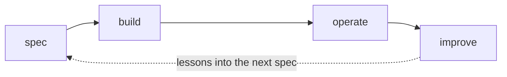
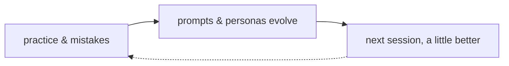
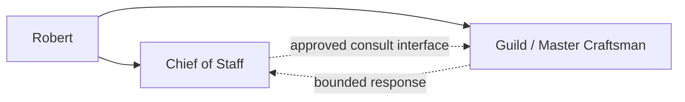

# Roadmap — Mini-moi

*Maintained baseline — reviewed through 2026-08-16. This replaces the former root
roadmap; the separate Guild roadmap view remains temporarily in place until the
Baseline document flow replaces it. Companion to ARCHITECTURE.md (what the system is
and why) and OPERATIONS.md (how it runs). This document is what happens next — and,
just as deliberately, what doesn't.*

*Three tiers, defined strictly: **Committed** — doing this, a matter of when, not
whether. **Planned** — clear intent and shape, sequenced behind committed work.
**Aspired** — real direction, not scheduled, honest about being unbuilt. Plus a
section this roadmap treats as first-class: **paths not taken** — recorded rather
than silently dropped, because a decision not to build is still a decision worth
being able to revisit.*

---

## Where This Is Going — A System That Learns With You

The objective is personal and practical: build a durable partnership in which
people and agents improve together — developing better judgment, deeper shared
context, and more effective ways of working over time, without depending on any
single model or platform. The system accumulates shared context — what was read,
what was practiced, what was decided and why, what went wrong — so each session
starts from a stronger foundation than the last. Frontier models bring
capability; the privately controlled context layer brings continuity and
resilience as models and platforms change. The first implementation centers on
one person; the same pattern extends naturally to a family, a team, a department,
or an enterprise. The aim is not to extract knowledge from people, but to help
people and their agent partners become more capable together in their particular
context and toward their particular goals.

The learning happens in **four bounded loops** — one per domain family,
deliberately, so nothing drifts:

**Curator** — reactions and pushback tune what tomorrow's briefing surfaces, and
the thinking record compounds.

**Guild** — the workshop loop, and it's literally the domain's own structure:
spec → build → operate → improve, with lessons from operating feeding the next
spec. The direction here is a "master craftsman" agent role inside Guild, taking
over the coordination work CoS used to do when the two were one domain.

**The language domains** — mistakes and practice inform the backend so prompts and
personas evolve over time, and the result is measured in life, not in the system:
actually speaking, reading, and writing better.

**Chief of Staff** — the current beta supports conversation, bounded investigation,
and explicit platform-owned notes. The intended loop adds durable context and
approved read/consult interfaces over time. It does not receive unrestricted
backend access merely because its role is cross-domain.

Robert remains the direct decision point for CoS, Guild, and Guild's future Master
Craftsman. Any later information flow between agents must be optional, bounded,
and exposed by the owning domain—not an autonomous supervision chain.

Some of this is still aspirational — but the shape is the commitment: each loop
stays inside its domain's purpose. A German mistake tunes German practice. It does
not feed a work decision. No cross-domain suggestion creep, and no assumption that
one agent can see data another domain has not explicitly exposed.

The foundation for all of it accumulates **organically, through normal use** — not
as a parallel habit or a formal record-keeping system (a formal decision-record
practice was tried and didn't stick; that's fine, and it's not coming back). CoS
currently retains explicit notes; broader conversation memory awaits the retention
and privacy design.
Language sessions have been accumulating the practice-and-error history all along.
Curator reactions are the thinking record. The infrastructure that puts this
accumulated record to full use is the one big aspiration at the end of this
document — built when the signal warrants, not before.

---

## Standing Principles For This Roadmap

**Real life drives the roadmap — in both directions.** Use of what exists decides
what gets refined next. And life adds priorities the platform didn't anticipate:
multi-user arrived that way, the CoS/Guild split arrived that way, and things not
yet on any horizon will too. This roadmap expects items it can't name yet — that's
not a planning failure, it's the nature of building for an ongoing life.

**Sub-domains are open to reshaping.** Within existing domains, significant
restructuring based on what usage has taught, current life focus, and what's worth
demonstrating technically is expected — a "committed" feature inside a domain is
committed in intent, not frozen in shape.

**No new domains near-term, with one exception: French.** Growth happens inside
what exists. French earns its exception by inheriting a proven template. (And per
the principle above: when life adds a domain, the roadmap will make room.)

**Bounded now, open to surprise later.** Today the system acts only on what it's
explicitly told, and actions stay intentional — that's a risk posture while trust
is being built, not the destination. The intent includes being surprised: a partner
that only ever plays back what it was told isn't the vision. The boundary moves as
trust is earned.

**Built for real life, not for sale.** This is a model of how to use AI in an
ongoing life — built, used, and expanded in that context. Real life is complex, so
this roadmap deliberately under-specifies: each part of the platform gets as much
machinery as its place in life actually needs, and no more. It is not a software
product being shaped for a market.

**Every roadmap item carries a capability.** A task that just gets done once isn't a
roadmap item — it's a chore absorbed into one. Cleanup work in particular must ship
features that prevent the mess from accumulating again; the one-time fix is the
occasion, the standing capability is the item.

**No deadlines here.** The roadmap holds direction loosely; dates and deadlines
belong to the build queue, where in-flight work is tracked strictly. A tier says
what and why. The queue says when.

**Verify production reality.** Nothing on this roadmap is "done" until confirmed
against the running system — the lesson this project learned repeatedly in July,
in both directions. And "verified" means outputs and logs checked, not schedules
and folder structures observed: the difference is exactly how a silently failing
backup job passed one verification and failed the next.

---

## Committed — doing this now

Order matters within this tier, stated without dates per the principle above: tech
debt first, because it makes everything after it safer; convergence second, because
it gates French; CoS step one runs alongside both, since it touches different parts
of the system.

### 1. Technical debt cleanup (near-term, first)

Five scoped blocks, mostly pre-decided:

- **Production capacity and agent-state recovery.** The August 16 OOM proved that
  2 GB RAM with no swap was not a resilient home for the expanded ten-container
  stack. The host is now `t3a.medium` with 4 GiB RAM, a 50 GiB gp3 root volume,
  and 2 GiB bounded swap. Remaining work is memory/reachability alarms, container
  resource budgets, and inclusion of COS notes, gateway receipts, and Agent A
  state/auth volumes in the backup and restore test.

- **Repo and doc rationalization** — deprecate `_NewDomains/` (its original job —
  a safe place to build without breaking production — is now done by the dev
  environment; contents migrate to `docs/specs/` and `docs/design/` as normal idea
  documents, per the migration map; the March graduation criteria are resolved by
  this decision, not abandoned). Retire stale `docs/ROADMAP.md`. Correct
  `LLM_REGISTRY.md` against the July audit. Retire the pre-AWS Guild cabinet docs
  with a note on where each function actually lives now.
- **Staging environment + backup restore test — one item.** (Staging was
  deliberately deferred earlier in July; this is its planned return.) Stand up an
  AWS staging environment by restoring production backups into it. Proves the backups
  restore and closes the no-staging gap in the same act — and the bar just moved:
  the review of this very draft found Tier 3 (Dropbox) was never running at all
  (`rclone` never installed on EC2; the weekly job has failed silently since it was
  added). So the item is: expand Tier 1 for COS Agent A, fix Tier 3, then
  restore-test all three tiers.
  Untested backups are assumptions; one of ours was a confirmed silent failure.
  Staging then becomes the deployment gate the platform currently lacks.
- **Build-health observations — the capability that replaces hygiene-as-task.** An
  AI-Observations-style periodic review pointed at Guild's build system itself: open
  issues going stale, specs sitting in ready-to-build that never started, items
  marked in-build that actually shipped, drift between the queue and reality. The
  one-time closes this rewrite surfaced (#42, #83, #136, triage #51) get done as
  part of the cleanup — but the roadmap item is the review that makes them the
  *last* one-time closes. It reads accumulated build state, not fresh data — the
  same accumulate-then-review pattern Curator already proved.
- **Security round 2** — #84 (silent Postgres failure logging), #87 (break-glass
  account), Gespräche read-scoping, guest-flow unification.

### 2. German / Portuguese convergence — the template for French

Bidirectional normalization: Portuguese's Postgres-backed translation cache and
frontend patterns where they're ahead; German's translation fallback depth (including
the local-model safety net), review-model tier, and frontend timing transparency
where it's ahead. The drift was the honest cost of moving at the speed of real use —
Portuguese was the feature incubator, and promotion back to German worked; strict
implementation parity was the part that lagged. This closes it, both directions.

**Gate for French:** convergence complete. French then inherits one template, not a
choice between two — with learner-appropriate content (base personas for a new
learner, starter reading list) designed fresh rather than copied from Robert's own
configuration. To be precise about what's committed: this tier commits to
*readiness* — the converged template. Building French itself becomes a build-queue
item when the gate clears.

**The template principle extends to Curator by design.** Curator's first instance
is finance and geopolitics, but topic-area spin-offs are already part of the plan —
health being the clearest case: nearly copy-paste on the search and scoring core,
with genuinely new inputs (wearable history from a risk monitor, for instance)
where the topic demands them. Same pattern as German → Portuguese → French: prove
the template on the first instance, converge it, then instantiate. That's growth
inside what exists, not a new domain.

### 3. Chief of Staff — production beta evaluation

The vision is a partner, not a task taker (ARCHITECTURE.md carries the full
contract). The first bounded-agent beta shipped to production on 2026-08-16.
Daily use now decides what earns expansion:

- **Conversation is live.** Typed Confer reaches COS Agent A; selectable OpenAI
  and Grok realtime voice follow the Gespräche/Conversas pattern and can consult
  the agent or save a verified platform note through allow-listed tools.
- **Runtime independence is real enough to test.** Agent A is isolated in its own
  container, OpenClaw is the current shell, and LiteLLM makes cloud-provider order
  configurable. A second runtime is not needed yet, but upgrades must continue to
  prove the adapter contract.
- **First focus remains access.** Expand read/consult capabilities across domains
  only through explicit platform interfaces. Mutations remain platform-owned and
  receipt-backed.
- **Memory/privacy is the next design gate.** Spec #150 defines JSON/text-first,
  database-projection-second storage, retention classes, explicit off-record and
  deletion controls, natural phrases such as “save this” or “come back to this,”
  and honest receipts. Raw conversation is not silently promoted to permanent
  memory before those retention decisions are made.
- **Stated plainly: this might not prove useful.** CoS is new enough that we don't
  know yet. The committed work is the experiment that finds out — everything
  further (periodic reviews over its record, expanded autonomy) waits on that
  proof, which is why none of it appears in the Planned tier below.
- **Bounded OpenClaw instance** — shipped as COS Agent A. Browser, arbitrary fetch,
  filesystem, runtime, messaging, and subagents remain denied; the search adapter
  returns up to 20 quality-relevant cited sources as untrusted evidence.
- **The knows-me corpus begins** — background, plans, risks worried about,
  deliberately given over time. Intentional only, accumulating slowly, aiming at
  professional-friend-and-partner knowledge. The March research agent piloted
  exactly this pattern; CoS generalizes it.

---

## Planned — clear intent, sequenced next

- **Model configuration made real.** Fix the broken `--model` flag path, make
  backend model choices (translation first) genuinely config-driven across the
  language domains, and re-verify the local-model path end-to-end on the
  development Mac or later suitably sized infrastructure.
  Context that matters: local inference is proven on this platform — it ran in
  at genesis and runs today when German's translation fallback has a local provider; Curator's
  scoring moved to cloud when Haiku's cost proved negligible, as a deliberate quick
  backend swap (the designed pattern), and the scoring script's "ollama" label now
  maps to keyword scoring — a naming artifact to clean up, not a broken capability.
  The spec_125 model-standardization work, informed by the July audit's call-site
  inventory. User-facing model choices (voice, review) stay in the UI where they
  belong.
- **Shared LiteLLM rollout and cost checkpoint.** COS Agent A proves the first
  shared gateway route, fallback receipt, and cost record. Apply the same reusable
  module to other domains through their own specs, then make model spend a regular
  COS checkpoint. Evaluate AWS Bedrock as a later provider option. Keep SGLang on
  the roadmap only for a future GPU-backed need; do not pay for idle GPU capacity.
- **Curator Deep Dive consolidation.** Verify what each of the coexisting scripts
  actually serves (Scans vs. Deep Dive vs. Deeper Dive — at least four candidates at
  last count) — then consolidate as a regression-refactor. Design holds; the backend
  catches up to the frontend.
- **Curator topic-area instances — health first.** The converged Curator template
  instantiated on a new topic area: search and scoring core carried over, new
  topic-appropriate inputs added (wearable/risk-monitor history being the health
  case). An instance of the Curator domain, not a sixth platform domain. Sequenced
  behind Curator's own cleanup — the Deep Dive consolidation above — which is what
  makes the template clean to copy.
- **A more capable local model.** Evaluate a stronger open-weight model on rented
  cloud capacity first — proving it may need more compute than current hardware has
  — then move it to owned local hardware once it earns its place in the daily
  workflow. That proof is the evidence that justifies the capital purchase — at
  which point the Mac Mini idea, retired from its April role, resurfaces in a new
  one: not an always-on server, a local inference machine.
- **German multi-user content readiness.** The identity layer is done (per-user
  separation shipped with the July security work); the content half — learner
  personas, starter reading list — rolls into the French template work naturally.

---

## Aspired — real direction, not scheduled

**The one that matters: use the databases fully, and close the loop.** A graph —
sources, entities, decisions, threads, and how they connect — alongside the data
store that feeds it, put to full use, so that any part of the platform can ask what
the accumulated record knows. That is what turns "mini-moi is a personal
intelligence and learning partner" from a claim into a closed loop: the record
accumulates through daily use, the system retrieves and reasons over it, and what
comes back is visibly informed by everything that came before. The mechanics have
names already — the graph layer (gated honestly today at 20+ tagged sources),
retrieval over the accumulated record, adaptation when the signal warrants — but
they are one feature, not three. This is the only big new roadmap feature in this
tier that matters, and it moves into Planned, bumping others, as soon as sequencing
allows.

**Carried alongside, smaller:**

- **The Reading Room** — the browsable research library as a genuine reading
  experience. The library exists; the room doesn't yet.
- **Conversational intelligence** — thinking out loud with the research layer,
  conversations as inputs that redirect open threads. Partially alive in CoS chat.
- **Local-first at depth** — GPU hardware, on-device voice inference, local models
  taking on more work including coding, as models and hardware improve.
- **If CoS proves its way of working** — bounded consult/handoff interfaces with
  approval workflow, policy engine, and circuit breaker as trust is earned. The
  Guild Master Craftsman remains separately governed and communicates directly
  with Robert; any exchange with CoS is optional rather than supervisory. Also add
  Professional Opportunities as a standing CoS section: Loop A already
  scouts (611 companies, output refreshing); its output lands in CoS once CoS has
  proven itself worth landing things in.
- **Curator sources beyond English** — German, Portuguese, and eventually French
  sources in the daily pipeline; the March research agent's sourcing tiers are the
  design.
- **A commercial port — the arc's last step.** Daily personal tool, demo-ready,
  hosted with real users: done. The architecture lifted into a standalone product
  for a new domain stays aspired, stated plainly: mini-moi itself remains personal
  — a commercial version would be a new thing built on the proven pattern, if and
  when a domain makes it worth building.

---

## Paths Not Taken — recorded, revisitable

| Path | Why not | Revisit if |
|---|---|---|
| Mac Mini + Tailscale + cloud relay (Apr 2026, retired by decision record Jun 18) | Superseded by AWS EC2 — solved the same problem better | Actively anticipated in a new role: local inference hardware, once a stronger local model proves itself (Planned) |
| Four-cabinet Guild governance | Dissolved into the platform — each function shipped in a different form (health loop, watch loops, decision records, intent register) | Never as-designed; the functions live on |
| TMF622 Technical Toolbox (career) | Paused — not moving forward in this form | A role or story makes it worth reviving |
| Jaccard three-gate multi-agent curation | Design case study only; a different, real Challenger pattern shipped instead | The shipped pattern proves insufficient |
| X integration Phase 3B (PDF / YouTube / ebook ingestion; RVS site) | Scope ended at what daily use needed | Ingestion needs actually appear |
| Proficiency-tiered language personalization | Deliberately not the design — per-persona control is; a dead `_request_user_tier()` header in the Portuguese backend remains as the trace of the attempt | Family use surfaces a real need |
| New Ventures cabinet | Never staffed with real work | A venture becomes real |

---

## Released This Year — the 1.x record

Shipped work leaves the tiers above; this table is the year's record at a glance.
Detail lives in git history, CHANGELOG, and the architecture and operations
documents' current-state sections.

| Domain | Released in 1.x (2026) |
|---|---|
| Platform | AWS migration + two-node architecture (Jun) · CI/CD pipeline, push-to-live ~5 min (Jun) · scoped document/domain release pipeline prepared for production review (Aug): unrelated domains stay up, ambiguous dependencies fall back to full deployment · shared LiteLLM routing, receipts, and cost foundation (Aug) · backups: Tiers 1–2 (local, S3) verified running daily; Tier 3 (Dropbox) confirmed broken — rclone missing, fix pending · Sentry error monitoring (Jun) · unified identity/auth across domains + security remediation (Jul) |
| Curator | daily production (Feb) · v1.0 (Mar) · X bookmark integration (Feb–Mar) · AI Observations, five types + weekly synthesis · Deep Dive research briefs with multi-model cross-check (Jun) · priority feed · reading library + web portal · model rotation to current Grok tier |
| Mein Deutsch | v1.1 (Jun) · seven-tab web interface (May) · live voice persona conversation — TTS + Whisper (May–Jun) · three transcript-review paths with user-selectable model · Anki card + lesson-plan pipeline · mobile fixes · legacy identity history reconciled and production Lesen refresh made safe and deployable (Jul) |
| Meu Português | Full domain live (Jun) — sibling of German · in-website voice · multi-user with per-user custom personas · Leitura / Conversas / Escrita |
| Guild | v1.0 (Jun — v0.9 shipped the concept, v1.0 shipped it as a production system) · build queue + specs views · operations dashboard |
| Chief of Staff | v0.9 (Jul) · extracted from Guild as its own domain · four-tab web UI · 30-minute health monitoring loop + Telegram alerts · daily cross-domain briefing · **production agent beta (Aug): isolated COS Agent A/OpenClaw runtime, bounded cited search, configurable model gateway, typed Confer, OpenAI/Grok realtime voice, barge-in, transcript-after-stop, and verified platform-owned notes** |
| Research Intelligence | PoC pilot (Mar) · merged into Curator's Deep Dive as its production home (Jun) |

---

*Roadmap · mini-moi · reviewed 2026-08-16 · Review at major milestones or quarterly.*
