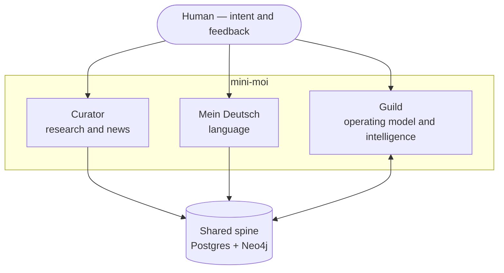

# Guild

*A working model of a human + AI team.*

**Status:** Initiating — build plan · May 2026

---

Guild is a domain within **mini-moi**, a personal AI system. But it is a different *kind* of domain than the others, and that difference is the whole point.

Where the other domains each do a job — Curator surfaces the news and research that actually matter, Mein Deutsch teaches a language — Guild models *how the work itself gets done*: how a small team of AI agents and one human divide labor, stay pointed at a shared intent, learn from what actually happens, and get measurably better over time.

The functional domains are the *what*. Guild is the *how*.

The name is deliberate. A guild was a body of craftsmen who shared what they knew and worked together to improve their craft — each member getting better because the others did. That is the model here, with AI agents and a human as the craftsmen: a small workshop that pools what it learns and compounds it. "Memory that gets better over time" is, in those terms, just accumulated craft knowledge.

---

## The idea

Many "AI tools" are used like vending machines: you ask, they answer, nothing persists. That is not how a good team works.

A good team has roles and division of labor. It works toward an intent set by a person, not a prompt issued in isolation. It takes feedback from the real world — what shipped, what broke, what landed — and it *remembers*, so the next attempt starts further along than the last. Over time it gets not just better but faster, because the team is tuned to the person and to the work.

Guild is an attempt to build exactly that, with AI agents in the team seats. The human is the leader: they set intent and make the calls.

Closest to the leader is a **Chief of Staff**. Like a White House chief of staff, it doesn't set the agenda — it carries it. It holds the leader's goals and forward-looking strategy, and it keeps the trains running on time across the domains: coordinating the work, sequencing what comes next, and watching that every department actually moves and stays healthy.

Carrying the strategy also means keeping it current. The craft and its tools shift constantly — a dependency is abandoned, a security hole opens, a standard converges — so the Chief of Staff scans for what's changing, flags what bears on a decision already made, advises, and recommends. What it never does is decide. The leader decides; the Chief of Staff's whole job is to make sure the leader decides *well-informed*. Scan, flag, advise, recommend — then hand the call back.

Beneath that, a standing division of labor does the building:

- **Design** — strategy, structure, and decisions before anything is built.
- **Implementation** — turning approved designs into working code.
- **Operations** — execution, file and repository work, the plumbing that keeps it running.

The agents don't replace judgment; they extend reach. The result is a team that does considerably more than a traditional one of the same size — not because any single agent is brilliant, but because the loop between intent, action, real feedback, and memory is tight and it compounds.

It is built and proven against one real person's daily life, which is what keeps it honest — it has to actually be useful, not just demonstrable. The model itself is extendable to anyone.

---

## Where Guild sits

The functional domains are independent — three proud, standalone systems, not a monolith. What unites them is approach and a shared goal: a system that learns *you* — why you're doing the thing, where you're going, and what you specifically struggle with.

Guild is the connective layer that makes that possible. It is where the shared memory lives and where the intelligence that reads across everything is built. In team terms, Guild is where the chief-of-staff function takes shape — the memory of what the leader wants, and the watch that keeps every domain moving and healthy.

---

## Why now

This sequencing was deliberate. The functional domains were built first, on purpose, to generate real data and real operational experience — months of actual use, actual feedback, actual failures handled. You cannot build a learning model on top of nothing; it needs something real to learn from.

That foundation now exists. So the next phase is the one it was always pointing at: turning accumulated experience into intelligence.

---

## The technical core: the spine

Guild is where the heavy technology focus lives. The other domains are functional; Guild is infrastructural.

The centerpiece is a shared **spine** — a persistent memory substrate spanning the whole system:

- **PostgreSQL** for the structured repositories — the records, the relations, the ground truth.
- **Neo4j** for the graph layer — the connections between things, which is where cross-domain intelligence actually comes from. A model of a person who is learning a language *for a specific place*, who follows *specific* threads in the world, and who works in a *specific* way is far more useful than three disconnected tools, and that "far more useful" lives in the edges between them.

Each domain exposes a small, fixed-shape summary of its own state; the spine is the connective tissue beneath them. Domains stay independent in code; the intelligence emerges from the shared memory, governed from Guild.

---

## Build plan

**Phase 0 — Foundation** *(complete)*
Functional domains in real daily use, generating the data and operational experience the rest depends on.

**Phase 1 — Guild front door** *(near term)*
A landing page that tells this story and gives context — the document you are reading, made into a place. Look-and-feel standardized to the system the platform already uses.

**Phase 2 — The spine** *(next)*
Stand up the PostgreSQL repositories and the Neo4j graph layer. Migrate existing domain data into structured, queryable form. This is the immediate hard-focus build.

**Phase 3 — Intelligence**
Build the learning loops on top of the spine: remember, adjust, improve. A cross-domain model of the user that gets sharper with use.

**Phase 4 — The operating model, formalized**
Codify the agent roles and the human-in-the-loop workflow as a reusable pattern — the extendable version of what has been proven on one life.

---

## Access

The Guild landing — this story and its context — is open. The working surfaces behind it are private to the operator. The narrative is meant to be read; the machinery is not meant to be public.

---

*Guild is part of mini-moi — not a general intelligence, a specific one.*