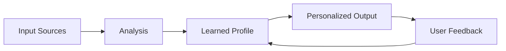
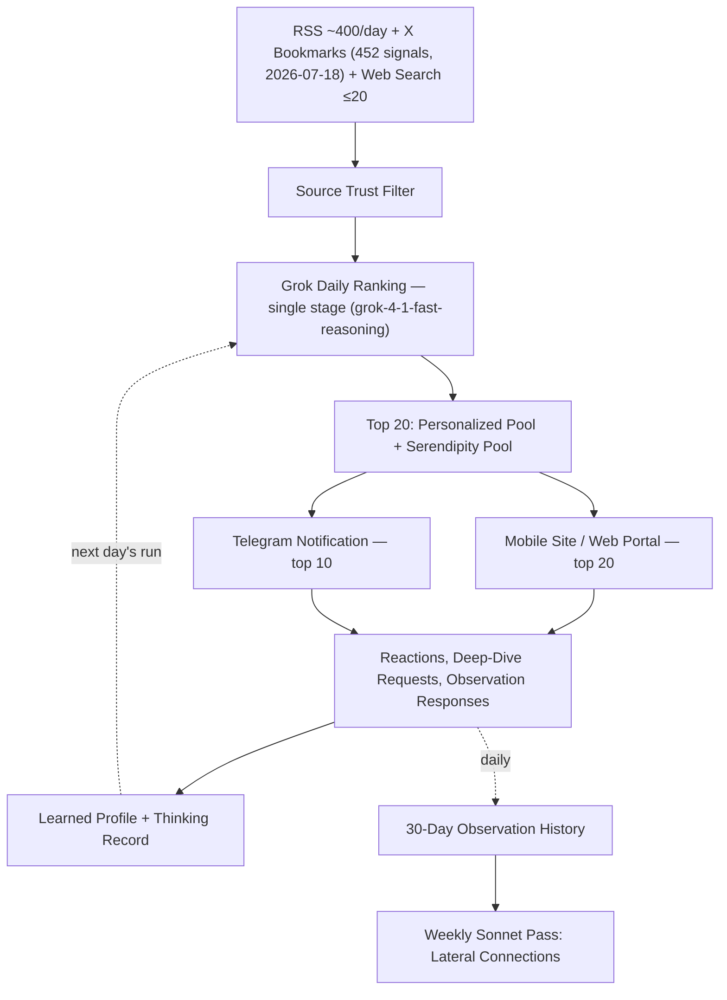
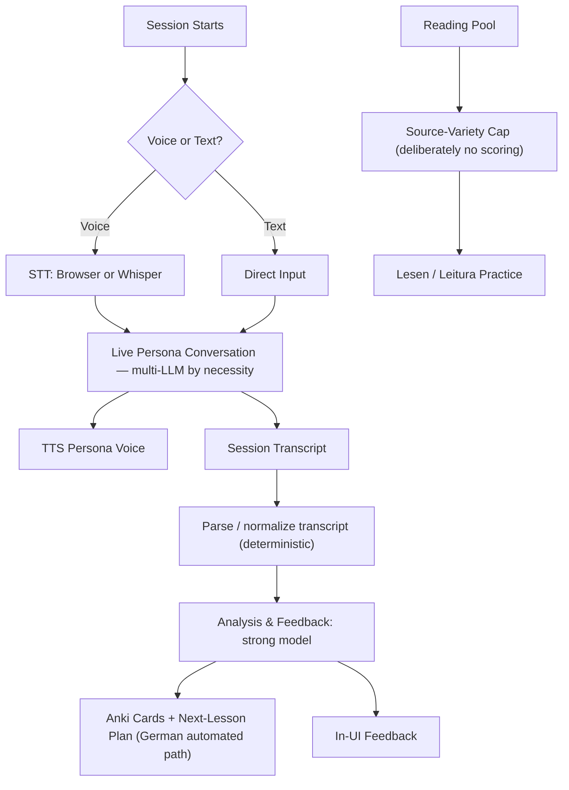
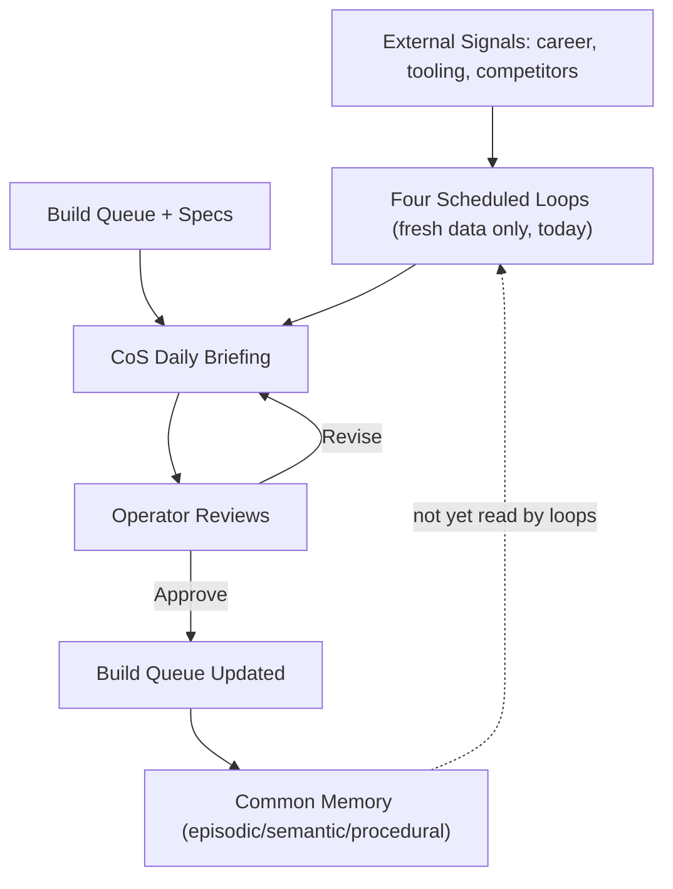

# Architecture — Mini-moi

*Final draft v1 — 2026-07-18 (drafted 2026-07-17, revised through the multi-agent review cycle). Incorporates Robert's review of v2. This document describes two things, deliberately kept separate: the design principles that have held since inception, and the current state of implementation — including where real growth has caused drift from that design. Drift is named, not hidden, and each instance is tied to its own tracked follow-up. See the end of this document for the current list.*

---

## What This Is

Mini-moi is a personal AI agent platform — a set of domains, each purpose-built around a different part of one person's life, all implementing the same underlying pattern: take in signal, run it through models suited to the job, build a profile of what matters, produce something personalized, and learn from what comes back. The domains differ in content. The architecture does not.

The deeper design goal is longitudinal: the platform doesn't just process content, it captures *thinking about* content — reactions, curiosities, areas flagged for deeper investigation, responses to what the system itself notices — and stores that as a growing record. Nine to twelve months from now, the accumulated asset isn't an archive of articles or transcripts; it's an evolving map of what one person thought, what they came back to, and how their emphasis shifted as the world moved. That's why the architecture is shaped the way it is, and it's the standard this document should be reviewed against: does the design still serve that goal.

This matters beyond the platform itself. The pattern — input, analysis, a profile that persists and updates, personalized output, a feedback loop that closes, a thinking-record that compounds — is not specific to any of these domains. It is the same pattern any organization would use to build an AI system that gets better at its job over time. The domain content is interchangeable. The architecture is the actual asset.

The platform's origin makes two of its commitments concrete. It began in 2025 as a one-day experiment: a Python + LLM build against two personal data sources — email and bank/financial statements — producing an expense-management dashboard of the kind banks advertise as a flagship feature. It was built entirely on a local Ollama model, kept local on purpose: for privacy, and to test what local models could actually do. Both reasons still stand. Local capability is where the field is heading — it already is the model for physical AI applications — and personal financial data never needed to leave the machine to get a useful result. The platform grew out of that experiment; it didn't abandon its premises.

The system has been in daily production use since February 2026, currently running five domains.

---

## The Five Domains

**Curator.** The oldest domain and the one running longest in daily production. Each morning it pulls in roughly 700 candidates — international RSS feeds, enriched X bookmarks, targeted web search — focused on a set of topics but deliberately wide-ranging in sources, with untargeted "friction" built in on purpose: a serendipity pool that surfaces what the learned profile would have suppressed, precisely so the system doesn't become an echo chamber of its own past picks. The top 20 arrive each morning. But the delivery is not the point — the point is what happens after: reactions, saved articles, deep-dive requests with stated motivations, responses to the system's own observations about shifts in the data. All of that is captured and stored. Curator is, underneath, a machine for accumulating a record of thinking over time.

The primary interface is the mobile site, used first thing; the laptop/website follows for more comfortable reading and commentary. Telegram — the original pre-UI channel — remains as a notification layer and an alternative path, not the main experience.

**Mein Deutsch.** German language practice built as simulated immersion, not a course and not coaching — with the crucial difference from real immersion that everything can be iterated. Multiple channels let the language sink in: reading with inline translation (Lesen), writing with correction (Schreiben), phrase and vocabulary drills (Wörter), a session archive (Archiv). But live voice conversation with AI personas (Gespräche) came first and is the star, because it solves the specific gap real life left: plenty of chances to listen and read day-to-day, almost none to speak. A path for sessions with a human tutor exists alongside — and unlike a predefined curriculum, conversations can be iterated, added to, and modified freely as the learner chooses.

**Meu Português.** Portuguese practice, built for family use — each person who logs in gets their own data, their own progress, and their own custom conversation personas under their own control. Portuguese also served as the platform's feature incubator: capabilities like in-website voice (easier for family members than the mobile flow, even if less fluid) and multi-user support were deliberately tried here first and then promoted back to German — which is exactly what happened. What was *not* intentional is that the new domain was built fast without strictly following German's implementation, so the two drifted apart under the hood. That drift is now being normalized in both directions — each domain adopting whichever sibling's approach proved better — with real urgency, since a third language domain (French) is planned on the same template.

**Guild.** The platform's workshop — the name is deliberate: a guild of craftsmen, captured in its three subdomains **Build · Operate · Improve** and its working cycle *spec → build → operate → improve*. This is where the multi-agent working model happens day to day: where a spec becomes a build item, status stays visible, and operations are controlled. Its scope is deliberately expanding in two directions: operations control, and *learning* — both from the platform's own mistakes (the German/Portuguese drift is a live example) and from the fast-moving landscape of new AI techniques and tools. The cycle is itself Guild's learning loop: lessons from operating feed the next spec. The direction for the domain is a "master craftsman" agent role inside Guild, taking over the coordination work CoS handled when the two were one domain.

**Chief of Staff (CoS).** The newest domain, recently extracted out of Guild once it became clear the two were different things. CoS is not an executive assistant, and it is emphatically not a secretary — it is designed as a partner that carries the operator's intent: one that holds the north star and the reasoning behind decisions rather than just the task list, can act within defined limits without being prompted for every step, surfaces things the operator didn't ask about because it watches across domains, and can push back — disagreeing plainly when the data points somewhere other than the easy answer. A daily executive briefing, note-taking, and decision/action logging are what it *does*; carrying intent with bounded authority is what it *is*. This is the design from the founding documents, and the platform is at step one of realizing it.

**Every one of these domains came out of real personal use, and that matters to how the platform grows.** Nothing here is theoretical — each domain exists because it was needed, and its usefulness in daily life is what drives focus and priority. That produces a deliberate rhythm: sometimes the platform moves fast because real use demands a capability now; other times it steps back and rationalizes what was built before the next phase of use and build. Use and build grow together, and the drift this document is honest about below is largely the visible trace of that rhythm — the cost of moving at the speed of actual need, paid down deliberately afterward.

### Current State at a Glance

| Domain(s) | Maturity | Key current gaps |
|---|---|---|
| Curator | Mature — daily production since Feb 2026 | `--model=` flag regression; Deep Dive script consolidation; AI Observations EC2 scheduling to re-verify |
| German / Portuguese | Active twins — identical to the user, converging under the hood | Bidirectional normalization ahead of French; translation model choice not yet backend-config-driven |
| Guild / CoS | Recently split; both in active redesign | CoS partner layer just starting (Python-only today, bounded OpenClaw shortly); accumulate-then-synthesize pattern not yet extended here |

---

## Design Principles

These were set down before most of the platform existed, in the March 2026 production document, and have been tested against real growth since. Two are recent additions, earned rather than assumed.

**1. Local-first data.** Learned state lives in flat files, structured to migrate cleanly to a relational store the moment volume or query complexity actually demands it — not before. Preferences and history travel with the person, not with any one machine or provider.

**2. Model-agnostic and multi-model — for cost, capability, and independence.** No domain's personalization logic knows or cares which model is behind a given call. Profile injection happens at the dispatcher level, one layer up from the model itself, so the model can change without touching what makes the output personal. This is not abstract flexibility — it's an operating discipline with three concrete payoffs. **Cost:** model choice is the platform's main cost lever, and it's used continuously — when a model appears with better capability at lower cost, it gets added, evaluated against the current one, and switched in if it wins. The add-evaluate-switch cycle is normal operation, not an event. **Capability:** different jobs genuinely need different models (fluent spoken German is a different problem than bulk article filtering), and no single provider is best at everything. **Independence:** the system must remain able to run on local models entirely. The platform ran on local Ollama before any cloud model was involved; if every cloud provider disappeared tomorrow, the design intent is that the system degrades to local operation at zero marginal cost — not that it stops. Local capability is also a bet on where the field is going: as open-source models improve and better local hardware arrives, local models are intended to take on more of the platform's work, including coding.

**3. Swappable architecture, not swappable configuration.** This is a structural claim about the code, not a claim that every call site has actually been wired up that way yet — see Principle 7 below, and the current-state notes throughout this document, for where that gap still exists in practice.

**4. Quiet paths over noise.** If there's nothing meaningful to say, nothing is sent. No domain pads output to seem active. This applies to Telegram delivery, to logs, and to this document.

**5. Operator stays in control.** No autonomous agent-to-agent calls in the build workflow: design, human review, build, human confirmation, ship — in that order, every time. This has been tested directly under real pressure this year — a security remediation session in July found and closed real cross-user data exposure risks, and the same principle governed every step of that fix.

The principle is evolving deliberately, not eroding: the intended next step is *bounded* agent-to-agent handoffs — starting with Chief of Staff coordinating with Guild's master-craftsman agent, CoS notifying the operator rather than the operator polling each agent, and the operator able to ask CoS anything and have it go find out across all agents. Control stays with the operator; what changes is that the operator gains a single point of contact instead of being the message bus between agents personally.

**6. Extract shared code only when duplication has actually happened twice and reconverged.** Starting a new domain by copying an existing one is correct. Abstracting before two domains have proven the pattern is over-engineering. This rule already existed; it just wasn't written down anywhere current until now.

**7. Verify production reality — designed intent is not the same claim as verified behavior.** This is the newest principle, earned repeatedly in the same two-week period this document was written. A directory that looked committed to git wasn't. A volume mount that looked automated had no sync step behind it. A backup script that looked complete was missing two of the five things the original did. A data-loss scare that looked like a real incident turned out to be four inconsistent identity labels for the same person. And the platform's own flagship example of config-driven model swapping — Curator's `--model=` flag — has been silently falling through to a default in production, because the value the cron scripts pass isn't one the flag recognizes. Every one of these looked fine on inspection of code or documentation. None were fine in production. Documented intent and running behavior are two different claims. Running behavior is verified in outputs and logs, not inferred from code or configuration.

---

## The Domain-Agnostic Pattern

Every domain in the platform is an instance of the same loop, stated in the March 2026 platform-framing document before German, Portuguese, or CoS existed:

Curator: RSS and X bookmarks → AI scoring → learned preferences → daily briefing → reactions, deep-dive requests, observation responses.
German and Portuguese: sessions and transcripts → correction and analysis → per-user progress state → next practice material → corrections accepted or revised.
Guild and CoS: specs, build status, external signals → triage and synthesis → build queue and decision log → daily briefing and recommendations → approved, revised, or rejected.

Same shape, five times. The pattern is visible across all five domains; the full accumulate-and-synthesize loop is proven end-to-end in Curator (see Learning Loop, below). The repetition of the shape itself, proven rather than asserted, is the evidence for "platform over product."

---

## AI Usage Across the Platform

This is the section every previous version of this document was missing. Each domain uses AI differently, deliberately — the apparatus fits the job, not the other way around. And the multi-level model pattern is not a Curator specialty: it runs through the language domains just as much, for different reasons, detailed below.

### Curator — the mature, flagship pattern

The production path is deliberately single-stage today: one Grok pass over the full
filtered pool. A two-stage mode (Haiku pre-filter → Sonnet ranking) exists as an
available alternate, selectable per run — it is not what production runs.

Tiered, purpose-fit model use, with real costs:

| Stage | Model | Cost | Config-driven? |
|---|---|---|---|
| Daily ranking (production, single-stage) | `grok-4-1-fast-reasoning` | ~$0.314/run | Designed to be, currently broken — see below |
| Two-stage alternate (pre-filter → rank) | Claude Haiku → Sonnet | ~$0.001 pre-filter | Selectable per run; not the live path |
| Deep Dives | Claude Sonnet, on-demand | ~$0.25/session | No — hardcoded |
| AI Observations (daily) | Claude Haiku | ~$0.005–0.01/run | No — hardcoded |
| AI Observations (weekly) | Claude Sonnet, Sunday only | ~$0.07/week | No — hardcoded |

**Local capability — real, proven, and deliberately parked in one place.** Local inference is not aspirational on this platform: the genesis architecture ran real local-model calls in production, and German's translation fallback runs a live local provider *today* as its no-external-dependency last resort. Curator's scoring specifically moved to cloud models when Haiku's per-run cost proved negligible — a deliberate convenience choice, made the way the design intends: a quick backend swap, the same documented pattern ("swap to local when costs warrant") that has been exercised before without issue. One naming artifact remains from that evolution: the scoring script's free-tier mode is still labeled "ollama" but runs keyword-based scoring today, not a live model call — informational precision, not a defect. The standing commitment is unchanged and matters operationally: if cloud models become unavailable or costs spike, the system swaps back to local operation at zero marginal cost. Re-verifying that swap end-to-end on the current EC2 environment is part of the planned model-configuration work — a check on a proven capability, not a rescue of a missing one.

**AI Observations** is the platform's one working example of accumulate-then-synthesize done right: five distinct observation types, each on the model tier suited to its cost and complexity, synthesizing across a rolling 30-day baseline rather than reacting to a single day's data. The weekly Sonnet pass reads the accumulated history and asks, in effect, *what have I thought about this before* — a question none of the platform's other domains can currently answer about themselves. This is also where the thinking-record vision above stops being abstract: observation responses, deep-dive motivations, and reactions are exactly the raw material that record is made of. One honest verification note: the capability shipped and is proven historically, but it is not currently scheduled on EC2 — verified directly: nothing invokes it in the EC2 cron, the Docker configuration, or the CoS scheduler. Restoring its schedule is an operations follow-up item, per this document's own seventh principle.

**The honest gap:** Curator's `--model=` flag is real and works for the values it recognizes — but both production cron scripts have been passing a value it doesn't recognize, so production has been silently using the fallback default. The correct model has been landing by coincidence, not by the mechanism functioning as designed. Already tracked as its own defect, unresolved as of this writing — the clearest illustration of Principle 7 in the entire platform.

**A capability that exists and isn't documented anywhere:** a real multi-model challenge pattern (one model drafts, others cross-check, the first reconciles) went live in Curator's Deep Dive pipeline this June. It may be the same underlying mechanism as Research Intelligence's Synthesizer+Challenger framework and Guild's `ChallengerService` — three names for what could be one capability. Needs direct confirmation; see Follow-Up Investigations.

**A known regression, not a design flaw:** Deep Dive generation currently has several coexisting scripts (at least four candidates at last count), while the frontend has grown to offer Scans, Deep Dive, and Deeper Dive as related-but-distinct options. Some of this may be genuine drift; some may be legitimately distinct features that only look like duplication from outside. The frontend across the platform has grown much faster than the backend was consolidated behind it — this is exactly the kind of drift Principle 7 exists to catch. Treat as regression-refactoring, not redesign.

### German and Portuguese — one experience, converging implementations

From the person using them, German and Portuguese are the same core experience: same navigation shape, same interaction model, converging implementations underneath — German still carries distinct automated review/Anki/lesson-plan behavior. Underneath, the implementations differ — and it's worth being precise about why, because it wasn't a design choice. Portuguese was built fast as the platform's feature incubator: try something new there (in-website voice, multi-user), promote what works back to German. The promotion worked. What didn't happen was Portuguese strictly following German's implementation as it was built — so the two drifted apart under the hood, unintentionally. That drift is now being normalized in both directions, adopting whichever sibling's approach proved better: Portuguese's Postgres-backed translation cache is arguably ahead of German's local file; German's three-tier translation fallback (fast model → capable model → local model with no external dependency) and its stronger transcript-review tier are ahead of Portuguese's. The urgency is real: French is planned next, and it inherits whichever template the twins converge on.

**The multi-level model pattern runs through these domains too — most critically in voice, the star feature.** Live persona conversation demands a model that both understands the prompt and *speaks the language fluently* — and that combination is genuinely hard to find. Quality from a single provider varies even within the same day (most plausibly under provider load). So conversation is multi-LLM out of necessity, not principle: the reviewer model choice is surfaced in the UI itself, defaulting to one provider with others one click away, because when fluency dips the person in the conversation is the first to notice and the right one to switch. Meanwhile the transcript pipeline separates its concerns deliberately: deterministic parsing normalizes the transcript first, a strong model then does the analysis and produces the feedback, and on German's automated path that analysis drives real downstream consequences — Anki card generation, the next lesson plan, progress tracking.

**Where model choice lives is itself a design split.** Voice and review-model choice are user-facing — a real, personal preference worth surfacing at the point of use. Translation is the opposite: nobody has a reason to care which model translates a phrase, so that choice belongs quietly on the backend, config-driven. Making that actually true (rather than hardcoded, as it is in both domains today) is scoped follow-up work, deliberately behind the convergence work above.

**Content selection is intentionally light, and that's a design decision, not a gap.** Curator exists to make sense of too much information under time pressure; the language domains exist to supply a variety of engaging material for embodied practice. Language learning is closer to a physical skill than a decision problem — you feel your own progress by doing it, the way you'd feel it learning an instrument. Both domains use a simple source-variety cap rather than real scoring, and that fits the job.

### CoS and Guild — recently split, both actively finding their shape

Chief of Staff was extracted out of Guild recently, and both domains are in active redesign as a direct result — not because either was broken, but because splitting them apart clarified what each is actually for. Anything below is current direction, not settled architecture.

**Where CoS actually is today:** pure Python — the chat backend and scheduled loops run as ordinary platform code, with no agent framework behind them yet. A *bounded* OpenClaw instance is planned shortly as the Phase 1 agent layer — bounded meaning scoped to mini-moi domains with the permission model below, not a general-purpose agent with the keys. It's designed as a swappable backend choice — an infrastructure call, not something the person using the platform sees — and making that swap real is acknowledged, scoped integration work. The first focus for the partner build is deliberately practical: escalations from operations, and ad hoc tasks, questions, and notes checking on areas of the application — earn the partner role on real daily work before expanding it. What already exists, and matters more than which agent runs: a common memory repository — episodic, semantic, and procedural tiers — that persists independent of whichever agent sits on top of it. Whichever agent runs CoS in the future, the accumulated memory doesn't reset with it.

**The partner contract.** CoS's relationship to the operator is a defined permission model, not a philosophy statement: *propose freely, act within defined bounds, execute only with approval.* Autonomously permitted: writing to the platform's decision and action logs as a natural part of operating (not when prompted), flagging issues noticed across any domain, proposing handoffs to other agents, retrieving documents, filing issues for identified defects. Requiring approval first: any write to domain data, any deployment or infrastructure change, and executing any handoff it proposed. The acting is bounded; the informing is not.

**The voice layer exists to produce disagreement, not warmth.** CoS carries a designed identity — the standing version of it is short and live in production today: direct, curious before certain, comfortable with "I don't know" and with disagreeing; not a cheerleader, not a search engine with manners, not trying to be liked. Architecturally, the important part is *where* that identity applies: to conversation and judgment tasks — chat, cross-domain health assessment, fit narratives, novel suggestions — and explicitly *not* to mechanical operations or raw scoring passes, which stay accuracy-first. Partner is a mode, not a global override.

**Honest status:** the founding identity document defined explicit success criteria for the partner design — including the decisive, subjective one: does the interaction feel like a working partner or a sophisticated tool — along with a two-to-three-week measurement period and a stated failure condition (if it's indistinguishable from a well-prompted neutral agent, robotic agents are the right answer). That measurement hasn't been run for the simplest reason: the partner build itself is just starting, and hasn't yet reached the point where there's something to measure. The design is documented intent ahead of its build, and this document doesn't pretend otherwise.

CoS is also where Principle 5's planned evolution lands first: bounded agent-to-agent handoffs, starting with CoS coordinating with Guild's master-craftsman agent — CoS notifying the operator, and the operator able to ask CoS anything and have it find out across all agents, instead of personally being the message bus between them. CoS is the one domain designed to reach into the others: inspecting and talking to any domain for information, and — where a domain exposes the capability — instructing it to act.

Four scheduled loops currently run — a twice-daily career scan and weekly-to-biweekly watches on language tooling, Curator's topic space, and competitive signals. Every one of them, today, evaluates only that run's freshly fetched external data; none yet reads back over the platform's own accumulated memory before calling a model. That's the concrete next place to extend Curator's proven accumulate-then-synthesize pattern — because design queues, build status, and decisions are exactly the kind of state that needs periodic reconciliation against itself.

---

## Learning Loop & Memory

Curator's is the only fully proven instance in the platform today: reactions feed a learned profile, the profile is injected at the dispatcher level into the next scoring run, and a weekly higher-capability pass reads back over 30 days of accumulated observations and asks what's actually changed. Cheaper models perform better with that accumulated context than expensive models do without it — that's the actual argument for the pattern, not just its cost profile.

This has a real, four-months-earlier lineage: the March 2026 production document's own roadmap, written before any of this year's memory-layer work began, already described activating a vector-indexed store so "every LLM call retrieves relevant personal context," framed around the same question Curator's weekly pass asks today — *what have I thought about this before?* The current memory-and-intelligence-layer roadmap is that same idea, matured through a year of real production use.

The next place this pattern needs to exist is CoS and Guild, and the shape of the extension is already clear from Curator's working example: the four scheduled loops gain a read of the platform's own accumulated state — the decision log, the action log, prior briefings, build-queue history — *before* calling a model, instead of scoring only that run's fresh external data; and a periodic higher-capability pass reconciles the accumulated record against itself, asking the same question Curator's weekly pass asks of a reading profile — what's actually changed, what's been decided but not followed through, what pattern is forming that no single day shows. Design queues, build status, and decisions are exactly the kind of state that degrades silently without that reconciliation. The language domains are the deliberate exception — practice is not a decision problem, and loading it with analytical apparatus would work against its purpose.

---

## Identity, Security & the Multi-Agent Working Model

Every domain sits behind a single portal that owns session authentication and forwards identity to the appropriate domain backend — domains never trust client-supplied identity directly. A July 2026 security review found and closed real gaps in this layer, including cases where a missing identity was silently treated as "match everything" rather than "match nothing." Detail lives outside this document by design; what belongs here is the principle it tested: nothing shipped without review, including the fix for a live exposure.

The platform is built by a defined multi-agent working model: a decision authority who approves every deployment, a design/specification layer, an implementation and deployment layer, a memory and coordination layer, and an independent review layer — each a distinct role rather than a title. The agent occupying any role is expected to change over time. The roles are the durable structure.

---

## Open Design Questions

Stated plainly rather than resolved by default:

**Does the platform depend on its current orchestration agent, or does the agent depend on the platform?** The March 2026 platform document states the latter explicitly. The current agent's own self-description leans toward the former. This needs an actual decision — and it gains weight as bounded agent-to-agent handoffs (Principle 5's evolution) put the orchestration layer at the center of more workflows.

**Is the multi-model challenge pattern in Curator's Deep Dive pipeline the same mechanism as Research Intelligence's Synthesizer+Challenger framework and Guild's `ChallengerService`?** If so, one real capability deserves one name and one home.

---

## Follow-Up Investigations Needed

1. **Instrumented live session** — run a real end-to-end session with monitoring, documenting which code paths actually execute, for what, and which never fire. The static audits found what exists; this finds what's actually *used* — the runtime extension of Principle 7, and the ground truth this document should be re-checked against. **Include explicit verification of local-model operation in Curator:** confirm `--dry-run`'s local path works as designed, and restore/verify the local (Ollama) fallback in the production scoring path — the system running fully local, at zero cost, is a founding commitment, not an optional tier.
2. **Confirm or rule out** whether Curator's Deep Dive pipeline, Research Intelligence's `generate_dive.py`, and Guild's `ChallengerService` are the same underlying capability.
3. **Re-verify** the actual purpose of each of Curator's three coexisting Deep Dive-family scripts (Scans vs. Deep Dive vs. Deeper Dive) before writing any regression/cleanup spec.
4. **Decide** whether the broken `--model=grok-4.3` production flag gets prioritized ahead of its current backlog position.
5. **`LLM_REGISTRY.md`** full correction pass — silent on CoS, Guild, and Portuguese; undercounts German; omits TTS; overstates which model handles German's user-selectable review path.
6. **German/Portuguese convergence** — bidirectional normalization ahead of building French on the same template.
7. **Backend config-driven translation model choice** across both language domains — scoped, deliberately behind item 6.
8. **The OpenClaw dependency-direction decision**, above — including the bounded agent-to-agent handoff design (CoS ↔ build agent first).
9. **Build the CoS partner layer, then run its founding measurement period** — the build is just starting, focused first on operations escalations and ad hoc tasks/questions/notes, with a bounded OpenClaw instance coming shortly (Python-only today). Once the partner layer is actually in daily use, run the founding document's measurement: before/after comparisons, novel-suggestion tracking, and the decisive "partner or tool" judgment over two to three weeks, with its explicit failure condition. That's what turns the partner design from documented intent into a validated (or honestly falsified) claim.
10. **A separate, living set of per-domain flow diagrams** — who calls what within each domain — kept outside this document so it updates on its own schedule.
