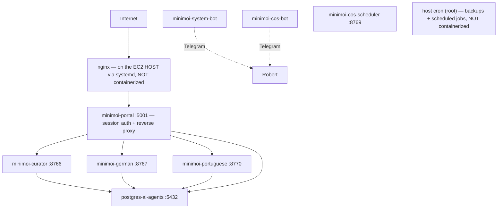

# Operations — Mini-moi

*Draft v1 — 2026-07-18. Full rewrite, replacing the layered accumulation the previous
OPERATIONS.md had become. Everything stated as current in this document was verified
against the running production system on 2026-07-18 (live read-only queries via SSM)
or is marked otherwise. Companion evidence file:
`CURRENT_STATE_OPERATIONS_2026-07-18.md`. System design and the reasoning behind it:
[`ARCHITECTURE.md`](ARCHITECTURE.md) — this document is about keeping that system
running.*

---

## Topology — what is actually running

Mini-moi runs across two nodes with distinct roles (see ARCHITECTURE.md for the design
rationale; this is the operational view):

| Node | Role | URL | Compose file |
|---|---|---|---|
| AWS EC2 (t3.small, us-east-1, `i-0d13db821169627e2`) | **Production** — live traffic, all bots, scheduled jobs | minimoi.ai | `docker-compose.prod.yml` |
| Mac (local, Colima) | **Dev / standby** — development, private-repo sync, DNS-switchable fallback | dev.minimoi.ai | `docker-compose.yml` |

### Production: 8 containers + 2 host-level services



| Container | Port (localhost) | Purpose |
|---|---|---|
| `postgres-ai-agents` | 5432 | PostgreSQL (`personal_agents`) — auth, guild, portuguese, research, pipeline, jobs schemas |
| `minimoi-portal` | 5001 | Session auth + reverse proxy — single entry point; forwards identity headers, domains never trust client-supplied identity |
| `minimoi-curator` | 8766 | Curator Flask service |
| `minimoi-german` | 8767 | Mein Deutsch Flask service |
| `minimoi-portuguese` | 8770 | Meu Português Flask service |
| `minimoi-system-bot` | — | Telegram polling bot — inbound system/German commands only; the Curator briefing is sent by `telegram_bot.py --send` inside `minimoi-curator`, via cron, on the separate outbound token |
| `minimoi-cos-bot` | — | CoS chat bot |
| `minimoi-cos-scheduler` | 8769 | CoS scheduled-loop agent |

**Two things run on the host, outside Docker — easy to forget, previously documented
nowhere:**

1. **nginx** — native systemd service (active since 2026-06-20), reverse proxy in front
   of the portal container. `systemctl status nginx` to check; config under
   `/etc/nginx/`.
2. **cron (root)** — all backup jobs and scheduled pipelines. `sudo crontab -l` to see
   the real schedule. A container-only mental model of production misses both of these.

All container ports bind to `127.0.0.1` — nothing is directly exposed except through
nginx.

---

## Deploy & Rollback

### Deploy

Push to `main` triggers CI/CD (GitHub Actions): test → build images → push to ECR →
deploy to EC2 via SSM. **~4–5 minutes to live.**

Two operational facts worth stating plainly:

- **A plain `git push` to `main` rebuilds and redeploys all 7 built services
  automatically — including on docs-only commits.** There's no path filtering in the
  workflow, and a fresh CI build always produces a new image digest even for
  byte-identical source, so `pull && up -d` recreates all 7. **`postgres-ai-agents` is
  the one exception** — stock image, not in the build matrix, never touched by the
  pipeline. Live proof: after a docs-only push, `docker inspect` showed all 7 app
  containers sharing an identical start timestamp to the second, while postgres kept
  its prior-day timestamp. All 7 restart *together*, not staggered — each comes back in
  seconds, so in practice it reads as near-zero perceived downtime rather than a
  visible outage. But it is all 7, not just the one you happened to be using.
  Updating a *single* container is possible, but only via the manual path under
  Rollback below — it is not something a push triggers.
  One footnote: the workflow's `workflow_dispatch` trigger defines an `image_tag`
  input that the deploy job never actually reads — it always pulls `:latest`. That
  input is vestigial; don't mistake it for a working single-tag deploy capability.
- **There is no staging gate in the deploy pipeline.** A push to `main` goes
  straight to production. `dev.minimoi.ai` routes via Cloudflare Tunnel to the Mac
  dev environment (verified in the tunnel config) — a genuinely separate origin,
  useful for development, but not a gate the pipeline passes through on the way to
  prod. A real AWS staging environment is committed work (see ROADMAP). Until then:
  the standing rule is that nothing is pushed without explicit approval of the
  reviewed diff.

### Recovery options

**Access channels** (always available, independent of any rollback action): SSH
(security-group allowlisted) and AWS SSM Session Manager / EC2 Instance Connect —
the fallback that works even when SSH rules are wrong. Both verified working.

**Rollback actions**, typical order:

1. **`git revert` + push** — rides the same CI/CD pipeline; previous state live in
   ~4–5 minutes. The default for any bad deploy.
2. **Manual container recreate on the host** — can be faster than a revert when only
   one service is affected:

```bash
cd /opt/minimoi
# Verify which Compose form this host actually has before an incident, not during:
#   which docker-compose   |   docker compose version
sudo docker-compose -f docker-compose.prod.yml up -d --force-recreate <service-name>
# Use the Compose SERVICE name (e.g. curator), not the container name.
```

Pulling a specific prior image from ECR is possible but Compose is pinned to
`:latest` — an exact, tested command for that path is an open runbook item, not yet
written.

### Manual health check (EC2)

```bash
sudo docker ps --format "table {{.Names}}\t{{.Status}}"
df -h /                                   # 30GB volume; alert threshold 80%
free -m
curl -s http://localhost:8766/health      # curator
curl -s http://localhost:8767/health      # german
curl -s http://localhost:8770/health      # portuguese
curl -s http://localhost:5001/health      # portal
systemctl status nginx                    # host nginx — not in docker ps
sudo docker logs minimoi-portal --tail 30 # when something looks wrong
```

Automated version: CoS's Loop H runs every 30 minutes — checks the seven other
expected containers (it cannot meaningfully check its own liveness from inside
itself), disk < 80%, memory < 85%, and four /health endpoints — alerting via the
**CoS bot token** (not the system bot). It does **not** check host nginx; nginx is
currently unmonitored beyond systemd itself. CoS detects and escalates — **Robert
decides the action.**

---

## Scheduled Jobs

Cron, split across two users, is the entire scheduling story on this host — verified
live 2026-07-18 (`crontab -l` as both users; `systemctl list-timers` confirmed no
app-level systemd timers exist, only stock OS ones). Checking one crontab and assuming
it's the whole picture misses the pipeline.

| User | Time (UTC) | Job | What it does |
|---|---|---|---|
| root | 02:00 daily | `backup_local.sh` | Tier 1 — full local backup to `/opt/minimoi/backups/YYYY-MM-DD/` |
| root | 03:00 daily | `backup_s3.sh` | Tier 2 — S3 sync |
| root | 04:00 Sunday | `backup_dropbox.sh` | Tier 3 — weekly Dropbox sync — **BROKEN: rclone not installed; fails silently every run** |
| ec2-user | hourly | `run_curator_cron_ec2.sh` | Curator pipeline — fires at most once/day, gated below |

The pipeline wrapper runs hourly but only actually fires once a day, gated in order:
**role guard** (exits silently unless `MINIMOI_ROLE=production` inside the container —
safe on a standby node), **time gate** (12:00–20:00 UTC only), **idempotency check**
(reads `briefing_date` from `curator_latest.json`; skips if today already ran). When it
fires: pulls new X bookmarks (non-fatal on failure), runs the scoring pipeline, sends
the Telegram briefing, stamps the date. One known wart, documented in ARCHITECTURE.md
and tracked separately: the `--model=grok-4.3` value the script passes isn't valid and
silently falls through to the hardcoded default — the model that runs is right by
coincidence, not by configuration.

### In-container scheduling (APScheduler) — the second scheduling layer

Host cron is not the whole story. `minimoi-cos-scheduler` runs its own in-process
scheduler with **seven jobs** (confirmed in `domains/cos/chief_of_staff.py`):

| Job | Schedule |
|---|---|
| Loop A — career focus scout | 06:00 and 18:00 daily |
| Loop B — German watch | Sunday 09:00 |
| Loop C — Curator watch | Sunday 10:00 |
| Loop D — novelty watch | 1st and 15th, 08:00 |
| Loop F — build-discipline check | daily 07:30 |
| Loop G — guest-access staleness nudge | hourly |
| Loop H — EC2 health check | every 30 min |

The scheduler's timezone has not been explicitly confirmed — verify before relying
on these clock times. Checking only `crontab -l` misses this entire layer; the full
scheduling inventory is host cron (both users) **plus** this container scheduler.

---

## Data Persistence & Backups

### Persistence

All three domain containers mount their data directories to the host — confirmed in
`docker-compose.prod.yml`. Container restarts and redeploys do not touch domain data.
This closed the ephemeral-storage defect that cost the June 22–July 13 curator
briefings (lost before the mounts existed — a mounts problem, historical and
unrecoverable, not an ongoing risk).

Also host-mounted: `guests.json`, `build_queue.json`, `cos_memory.md`,
`cos_context.json`, `docs/design/`, `docs/specs/`, and `/opt/minimoi/agent_logs/`.

### Backups — Tiers 1–2 live, Tier 3 broken

- **Tier 1 (local, 02:00 daily):** confirmed working — dated folders in
  `/opt/minimoi/backups/` through today. What it captures: full `data/` rsync, auth
  files, local Postgres dump, `agent_logs/` sync, retention prune. Includes a manual
  pre-password-rotation Postgres dump (2026-07-16).
- **Tier 2 (S3, 03:00 daily):** confirmed working — real objects in
  `s3://minimoi-backups/`, logs show clean completion on consecutive recent days.
- **Tier 3 (Dropbox, 04:00 Sunday): broken, never ran successfully.** `rclone` was
  never installed on EC2 — the job's single log entry (its first scheduled Sunday)
  is `rclone: command not found`, and it has failed silently every week since. It
  remains scheduled and will keep failing until fixed. No alert fires on backup job
  failure — that's its own gap, tracked below.

**Status corrections, both on the record:** defect #136's framing of Tier 1 as
"never built" was wrong — `scripts/backup_local.sh` exists and its cron runs; that
half of #136 should be formally closed with a correcting comment. And the first
version of *this* document claimed all three tiers verified — that verification
checked cron entries and folder structure but not log output, which is exactly how
a silently failing Tier 3 passed it. Verified means logs and outcomes, not
schedules and folders.

**Known gaps that remain true:** Tier 3 needs `rclone` installed and a first
successful run; backup job failures don't alert; and a backup that exists is not a
backup that restores — no restore test has been run. All tracked below; the restore
test is planned as the acceptance test for the staging environment.

---

## Monitoring

| Layer | Status | Detail |
|---|---|---|
| Sentry | **Live** | Wired into curator, german, portuguese servers and the portal (shipped 2026-06-23) |
| CoS health loop | **Live** | Every 30 min on EC2: containers, disk, memory, /health endpoints → Telegram alert |
| CloudWatch | **Live (basic)** | EBS disk cross-check used by the health loop |
| Prometheus / Grafana | **Proposed, never built** | Exists only in spec documents. Do not treat any historical monitoring-stack spec as describing production. |

Known monitoring gaps, tracked: silent Postgres failure during login `auth_id` lookup
(#84 — `except Exception: pass` with no logging), and no break-glass admin account
(#87).

---

## Credentials & Third Parties

Production credentials live in AWS SSM Parameter Store under `/minimoi/production/*` —
never in files, never in git. (Mac/dev uses macOS Keychain via `keyring`; that story is
dev-only now.) The live parameter set is the authoritative third-party inventory:

| Category | Parameters |
|---|---|
| LLM APIs | `grok_api_key` (xAI), `anthropic_api_key`, `openai_api_key` |
| Search / retrieval | `brave_api_key`, `tavily_api_key` |
| Translation | `deepl_api_key` |
| Messaging (Telegram) | `telegram_bot_token`, `telegram_cos_bot_token`, `telegram_system_bot_token`, `telegram_polling_bot_token`, `telegram_agent_bot_token` |
| Email | `zoho_smtp_password` (live — portal email), `gmail_app_password` (**orphaned — zero code references; resolve: delete or wire up**) |
| App / DB | `flask_secret_key`, `postgres_password`, `minimoi_password`, `minimoi_agent_password`, `robert_sql_password` |

**Telegram token → bot mapping** (traced to consuming code, 2026-07-18):

| SSM parameter | Consumed by | Runs where |
|---|---|---|
| `telegram_bot_token` | `telegram_bot.py` — outbound briefing sender | `minimoi-curator` (invoked by hourly cron) |
| `telegram_polling_bot_token` | `telegram_bot.py` — inline-button/callback handling | `minimoi-curator` |
| `telegram_system_bot_token` | `telegram_system_bot.py` — own polling loop | `minimoi-system-bot` |
| `telegram_cos_bot_token` | `telegram_cos_bot.py` | `minimoi-cos-bot` |
| `telegram_agent_bot_token` | `utils/telegram.py` — OpenClaw gateway | **Mac only** — per its own code comment |

One placement note: `telegram_agent_bot_token` is scoped in code to the Mac-only
OpenClaw gateway, yet it sits in the `/minimoi/production/` SSM namespace alongside
the four that actually run in production. Not broken — misfiled. Cleanup candidate.
One residual thread: whether `telegram_polling_bot_token` is actively exercised in
production today (vs. a webhook-testing leftover) was not verified in this pass.

**One real exception to the SSM pattern:** Curator's production xAI scorer reads its
key directly from `~/.openclaw/agents/main/agent/auth-profiles.json` — an
OpenClaw-managed file at a fixed path — rather than the shared SSM helper every other
service uses (German, Portuguese, CoS all resolve `xai_api_key` via the helper). This
is fragile and undocumented anywhere else: the Curator container depends on that file
existing. Related naming wrinkle to reconcile: the SSM inventory lists
`grok_api_key` while the shared helper resolves `xai_api_key` — verify how the live
container actually obtains the key, then document one authoritative name.

DB roles are separated (`robert_sql`, `minimoi_agent`) and rotated off the old weak
password — confirmed as distinct SSM parameters.

---

## Docs Sync

Committed docs reach the production doc viewer via `scripts/sync_docs.sh`: git commit →
GitHub raw URL → SSM pull to the host (docs paths are host-mounted into the portal
container). **Exact scope, verified in the script:** `docs/design/*`, `docs/specs/*`,
and `data/guild/build_queue.json` — and nothing else. Root documents
(`ARCHITECTURE.md`, `OPERATIONS.md`, `ROADMAP.md`) are **not** synced: they are
GitHub-only unless a copy is placed under `docs/design/` or the sync script is
extended. **A git push alone does not make a new spec visible in prod** — the sync
step is what lands it.

---

## Dev / Standby Environment (Mac)

The Mac runs substantially more than a mirror of the prod compose stack — this section
is the fully verified picture (live `launchctl`/`docker`/`crontab`/`lsof` inspection,
2026-07-18), and most of it was previously documented nowhere.

### Application layer actually running on the Mac

| Service | Port | Runs as | Notes |
|---|---|---|---|
| Guild Operations agent | 8768 | launchd `com.user.operations` | **Guild's agents appear only here** — absent from the prod container list entirely |
| Guild Dev agent | 8771 | launchd `com.user.devagent` | Same |
| CoS (bare) | 8769 | launchd `com.user.cos` | Runs **simultaneously** with the containerized dev CoS below — dual-instance |
| CoS (containerized dev) | 18769 | Docker `minimoi-cos-dev` | |
| Portuguese | 8770 | launchd `com.user.portuguese` | Plus scheduled `com.user.portuguese-leitura` |
| German | 8767 | launchd `com.vanstedum.german-html-server` | Plus hourly time-gated `com.vanstedum.lesen-refresh` |
| System bot (Mac-local standby) | — | launchd `com.vanstedum.system-bot` | **Distinct from the EC2 system-bot container** — code implements a deliberate standby/production token switch so the two never collide on the same Telegram token |
| cloudflared, Colima | — | launchd | Tunnel + Docker runtime |
| Usage report | cron 08:00 + 10:00 | `track_usage_wrapper.sh` | Same script twice — likely retry redundancy, not two different jobs |

Dev-only by design, never migrating: Ollama (local models, `gemma3:1b`), the OpenClaw
gateway, and the nightly private-repo sync (`scripts/sync_private_repo.sh`, 02:00
local). Keychain-based credentials are the dev flow; production uses SSM.

**Legacy automation still loaded:** five launchd jobs from the pre-AWS era remain
loaded but idle (`com.vanstedum.curator`, `curator-intelligence`,
`curator-priority-feed`, `portal-boot-restart`, `minimoi-portal`). Not flagged for
removal here — flagged so nobody is surprised that the Mac has more loaded automation
than the active-service list suggests.

**Open item — port 8766 ambiguity:** a native launchd process
(`com.user.curator-server`, running `curator_server.py` via the project venv) holds
host port 8766 per `lsof`, while the local `minimoi-curator` container claims to
publish the same port and `docker port` reports the mapping as active. The OS-level
listener answering `curl localhost:8766/health` is the *native* process. Which one
Docker-bound traffic actually reaches was not resolved — tracked in Known Gaps, stated
here as an ambiguity rather than a conclusion.

After a Mac reboot: `colima status` → `docker ps` → start what's missing. Dev being
down never affects production.

---

## Known Gaps & Open Items

| Item | Tracked | Status |
|---|---|---|
| Curator cron wrapper masks failed scoring runs — `STATUS=$?` captures Telegram's exit code, not curator's; a failed run + successful stale send stamps `briefing_date` as success | — | **High — idempotency guarantee weaker than documented; found by Codex review 2026-07-18** |
| Tier 3 Dropbox backup broken — rclone never installed; fails silently weekly | — | **High — fix before the restore test; found by review 2026-07-18** |
| Curator xAI key read from an OpenClaw file path, outside the SSM pattern; SSM naming (`grok_api_key` vs `xai_api_key`) unreconciled | — | Open — verify live retrieval path, then standardize |
| Host nginx unmonitored (health loop doesn't check it) | — | Open |
| APScheduler timezone unconfirmed for the 7 in-container jobs | — | Open — verify before relying on clock times |
| Backup job failures do not alert (cron failure is silent) | — | Open — same silent-failure family as #84 |
| No break-glass admin account | #87 | Open |
| Silent Postgres failure on login lookup (no logging) | #84 | Open — next after current work per standing decision |
| No isolated staging environment (dev = prod origin) | — | Acknowledged; future AWS staging |
| Backup restore test never run | — | Open — instrumented follow-up |
| `telegram_agent_bot_token` in production SSM namespace but Mac-only in code | — | Misfiled, not broken — naming/placement cleanup |
| `telegram_polling_bot_token` — confirm actively used in prod vs. leftover | — | Open — one residual from token mapping |
| Mac port 8766: native `curator_server.py` vs. Docker container both claim it | — | Open — resolve which one traffic actually reaches |
| Vestigial `workflow_dispatch` `image_tag` input in deploy.yml | — | Remove or document — implies a capability that doesn't exist |
| Orphaned `gmail_app_password` SSM parameter | — | Delete or wire up |
| #136 formally close with correcting comment | #136 | Robert/OpenClaw action |

---

*Verified against production 2026-07-18 (read-only). When this document and the running
system disagree, the system is right — fix the document, and say so in the commit.*
