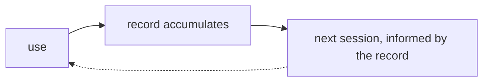

# mini-moi

**Not a general intelligence to consult, but a specific one to build.**

Large language models have the world's knowledge. They do not have your intent,
your context, your goals, or the risks you want mitigated. mini-moi works on that
gap: a personal AI agent platform that carries one person's context across the
things they actually do, and improves through use.

The platform has been in daily production since February 2026 and was ported to
AWS in June 2026. It is a real application in daily life, not a demo and not a
prototype that grew. The premise was proven in a proof of concept, and the
platform was built as a production system from the start. The domains cover informed
reading and research for decisions, simulated language immersion, the platform's
own build and operations, and coordination across all of it.

---

## Current state (July 2026)

| Domain | What it is |
|---|---|
| **Curator** | Informed reading and research in geopolitics and finance, in service of decisions, with the longer aim of tracking decisions, learning, and mistakes over time. Roughly 700 candidates each morning from international RSS, X bookmarks, and targeted search, scored against a learned profile. Headlines come along, but the themes underneath are focused: shaped by the initial prompts and curated references, a base that grows through use while those initial sources keep shaping it. A serendipity pool is included on purpose so the reading does not become a confirmation loop. Top 20 on the web, top 10 to Telegram. Deep dive research briefs on demand. AI observations, including a weekly synthesis capability. |
| **Mein Deutsch** | Simulated German immersion with iterated practice. Live voice conversation with AI personas is the star feature. Reading with inline translation, writing with correction, vocabulary drills, and a session archive around it. |
| **Meu Português** | Portuguese sibling of the German domain, built for family use. Multi-user, with custom conversation personas under each user's own control. The two language domains share one experience and are converging under the hood. |
| **Guild** | The platform's workshop: specs, the build queue, and an operations dashboard, organized as Build, Operate, and Improve, with the working cycle spec, build, operate, improve. Build keeps spec and build discipline inside the solution itself, not in a third party tool, so the learning stays within the solution. Operate keeps daily-life use dependable, with the foundation in place to ramp up when needed. Improve is deliberately tech focused: the AI landscape is in flux, and step one is visibility into new tools and techniques and the chance to learn which ones belong. |
| **Chief of Staff** | The newest domain, split from Guild in July 2026. A partner in intent. Today: a daily cross-domain briefing, chat with a defined voice, scheduled watch loops, and health monitoring. Early, and stated as such. The first committed expansion is access: the ability to inspect and talk to the other domains. |

Infrastructure in one line: AWS EC2 production with a Mac dev standby, an
eight-container application stack with host nginx and cron alongside, CI/CD
from push to live in about five minutes, monitored with error tracking and
scheduled health checks.

The deep detail lives in three maintained documents:
[ARCHITECTURE.md](ARCHITECTURE.md) for what the system is and why,
[OPERATIONS.md](OPERATIONS.md) for how it runs, and [ROADMAP.md](ROADMAP.md) for
what happens next, including the record of what shipped this year.

---

## AI in daily use, and the learning loop it is becoming

What exists today is not aspirational: AI support is woven through different
contexts with different models fit to each job, in ongoing personal use, with
real tangible benefit. A reasoning model ranks the morning briefing. Voice models
carry live conversation practice in two languages. Translation runs through a
layered fallback chain. Review models analyze practice transcripts, and
German's automated path turns that analysis into flashcards and the next
lesson plan. Watch loops scan for career opportunities and
tooling changes on a schedule.

The solution design to capture and execute a learning loop is in place, and
the record-keeping is at different stages by domain. Curator closes its loop
today: reactions and saved articles feed the next morning's scoring. German
updates persona memory and progress from reviewed sessions; Portuguese stores
sessions and progress. Guild's build-lesson synthesis and Chief of Staff's
light tagging of decisions and actions are committed next steps, not current
capabilities. Every record stays inside its domain's boundary by design. A
German mistake tunes German practice. It does not feed a work decision.

The aspiration, stated plainly: this learning and doing turns into a closed
learning loop over time, where the accumulated record feeds back into every next
session. That part is evolving, not finished. The roadmap states where each
piece stands.

*The design shape, per domain. Proven end to end in Curator, evolving elsewhere.*

---

## What it aspires to do

General intelligence is widely available. Specific intelligence, grounded in one
person's context, history, and way of making decisions, is not. That is the gap
this platform works on.

The objective is practical: better decisions and better learning for the person
using it, from a system that accumulates context instead of resetting every
session. The pattern transfers conceptually beyond one person. Applied to a
team, it is about making the team better and its members better. The personal
version comes first, and it is the one running.

Parts of this are proven in daily use. Parts are direction. The
[roadmap](ROADMAP.md) states which is which.

---

## Design approach

A few deliberate choices explain most of the architecture.

**Local-first data.** Learned state lives in flat files structured to match a
database schema for clean migration when volume demands it, not a rewrite; an
idempotent migration path is already proven in the Guild and research layer.
Functionality came first. The infrastructure gets built when it is earned.

**Model-agnostic and multi-model, for cost, capability, and independence.**
The architecture keeps personal context above the model layer, injected at the
dispatcher level, so a model change does not require redesigning the
personalization logic. When a model appears with better capability at lower
cost, it gets added, evaluated, and switched in if it wins. Add, evaluate,
switch is normal operation. Wiring that property consistently through every
call site is ongoing work; the July audit found the design ahead of the
configuration in several places, and the model standardization work tracks it.

**Local capability is real, not aspirational.** The platform's genesis ran on a
local model in production. A local model runs today as the last resort in
German's translation fallback chain. Curator's scoring moved to cloud models
when the cost proved negligible, as a deliberate choice made through a small
backend swap. The return path is designed the same way and is scheduled for
end-to-end re-verification on the current EC2 environment. Cloud models are
used where their cost and capability earn it.

**The platform is built through a multi-agent working model, with the operator
in control at its center.** Design, review, build, confirm, ship, in that
order, with the operator as the hub: handing work off and gathering reviews and design perspectives from
multiple agents, especially in design, and in code review and test as well.
The current lineup: Claude Code for development, Claude.ai for design, OpenClaw
for review and local coordination and actions, toggling models as needed, Grok
for review and revision, and OpenAI Codex recently added for review, with
expanded use planned after strong initial results. Models change; the roles are
durable. One standing discipline: work is verified by more than one agent during the
build, because practice showed that a second reviewer almost always finds
something, a mistake or a better approach, almost every time. That
cross-verification is operator discipline today and may automate over time.

**Verify production reality.** Documented intent and running behavior are
different claims. Production behavior is verified in outputs and logs, not
inferred from code or configuration alone. The platform's documents are
corrected against what actually runs, and say so when they change.

Cost discipline is a design constraint throughout, not an afterthought.

---

## Screenshots

*A full screenshot refresh across the platform is in progress. The set below
will cover all five domains: the portal, the Curator briefing and deep dives,
live Gespräche and Conversas sessions, the Guild workshop, and the Chief of
Staff page. Prior screenshots remain in the repository for history.*

---

## More detail

- [journal/](journal/) is the home for the public build narrative: sprint
  notes, plans, and how the project evolved. It is being populated.
- [docs/releases/](docs/releases/) holds release notes.
- [ARCHITECTURE.md](ARCHITECTURE.md), [OPERATIONS.md](OPERATIONS.md), and
  [ROADMAP.md](ROADMAP.md) are the maintained core documents.

---

**Status:** in daily production since February 2026, on AWS since June 2026.
Released this year: see the 1.x record in [ROADMAP.md](ROADMAP.md).
**Author:** Robert van Stedum
