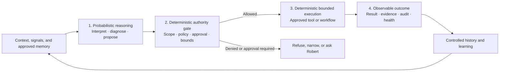

# CoS Agent and Master Craftsman — Living Product & Solution Approach

**Subtitle:** Proving bounded agent mechanics in one domain, then applying the learning to another 
**Status:** Working draft v0.6 — governed agentic architecture added, not approved to build 
**Date:** 2026-08-13 
**Owner / decision point:** Robert 
**Audience:** Design, implementation, review, and planning collaborators

CoS and Master Craftsman are two already-planned agent roles with different
purposes. CoS goes first only because using one bounded CoS capability can prove
agent mechanics before a separate Guild implementation begins. This approach
is intended to turn those plans into useful capabilities while limiting wasted
build effort and preserving the option to change runtime or memory choices as
evidence emerges.

> **Authority gate — what this document does not authorize** 
> This document does not authorize implementation, tool installation,
> infrastructure changes, deployment, production access, expansion of agent
> authority, or changes to protected files. It establishes the current product
> and solution approach. Approved component specs, reviewed implementation
> diffs, and Robert's existing decision gates still govern what gets built and
> shipped.

---

## 1. At a glance

### Current baseline

- **Existing direction:** CoS and Guild already have distinct purposes; this
  work makes their planned agent roles tangible rather than inventing a new
  domain strategy.
- **Learning sequence:** Select one bounded CoS capability → review current
  tools and memory → prove the agent mechanics in real CoS use → assess what is
  reusable → define and build Master Craftsman separately in Guild.
- **Hard boundary:** CoS does not guide Build, supervise Master Craftsman, own
  development verification, carry Guild quality memory, or serve as the
  required relay for Master Craftsman notifications.
- **First technical candidate:** OpenClaw receives the first serious live
  evaluation because of its history in mini-moi; it is not selected by default.
- **Memory preference:** Durable meaning and history remain platform-owned or
  demonstrably portable and rebuildable.
- **Architecture principle:** Probabilistic reasoning may interpret, diagnose,
  and propose; deterministic policy and execution controls govern side
  effects; correlated evidence closes the loop. Reasoning is not authority.
- **Reuse rule:** Shared agent code or framework extraction requires two real
  consumers to demonstrate the same need.
- **Master Craftsman direction:** A separate conversational, memory-bearing
  Guild agent with small, explicit authority for useful development
  verification—not a permanently read-only observer. It reports its findings
  and requests for action directly to Robert.
- **Decision now:** Select the first bounded CoS capability and its authority
  envelope before behavioral implementation begins.

### Decisions needed next

| ID | Decision | Owner | Evidence needed |
|---|---|---|---|
| D1 | Select the first bounded CoS capability | Robert | A current personally valuable situation that meets the selection criteria in Section 5 |
| D2 | Define when that capability may initiate contact | Robert | Observable material-change triggers and examples of useful versus distracting contact |
| D3 | Approve the OpenClaw-first technical review and reference-task spike | Robert | Reconciled baseline, bounded reference task, acceptance scenarios, timebox, and rollback |
| D4 | Define what counts as mechanics proven | Robert, informed by technical review | Binary evidence for isolation, sessions, memory, separation of reasoning from authority, bounded execution, cancellation, recovery, and correlated observability |

Chief of Staff and Guild were created with distinct purposes. CoS is Robert's
cross-domain working partner. Guild is the workshop for building, operating,
verifying, and improving mini-moi. The planned Master Craftsman belongs in
Guild as an advisory quality role that can also perform explicitly bounded
development-verification work.

That direction already exists. The work now is to make each role tangible and
useful without committing prematurely to a large agent architecture or a long
build path that real use may disprove.

The proposed sequence is:

1. Create an agent for CoS and give it **one bounded CoS capability** that
   Robert and CoS use together through conversation and memory.
2. Review the current technical landscape and test OpenClaw as the first serious
   runtime candidate, using the selected CoS capability as the reference task.
3. Use that real capability to prove the mechanics of operating a bounded agent:
   runtime, sessions, tools, memory, proactive behavior, failure handling,
   observability, and the separation of probabilistic reasoning from
   deterministic authority and execution controls.
4. Review what was actually reusable. Carry the proven technical mechanics and
   lessons into Guild, not CoS's responsibility, identity, or memory.
5. Create Master Craftsman as a separate Guild agent with its own conversation,
   development context, memory, and bounded authority.
6. Start Master Craftsman with one or two useful development-verification tasks,
   then expand only from evidence.

The order creates technical learning. It does not make CoS the guide, manager,
or coordinator of Guild's build work.

---

## 2. Existing intent, not a new domain design

mini-moi already established the conceptual roles:

- **CoS** carries context and intent, exercises judgment, supports decisions,
  notices connections, and engages Robert as a working partner.
- **Guild** makes specification, build work, operations, quality, and
  improvement visible.
- **Master Craftsman** is the planned build-quality and standards role inside
  Guild.

This document does not reconsider those boundaries. It describes how to move
from the planned roles to working capabilities while reducing avoidable
technical and product risk.

### Explicit non-goal

CoS is not the guide of Build. It does not supervise Master Craftsman, own the
development workflow, judge releases, assign coding agents, or carry Guild's
quality memory.

The two agent efforts are related only in this initial sense:

> Building and using the CoS agent should answer technical questions that would
> otherwise have to be rediscovered when Master Craftsman is built.

The initial CoS-to-Guild interface is narrow: Robert may use CoS as a
conversational front door for an ad hoc question or request to an approved Guild
inquiry capability. CoS may also include a material Guild issue or required
operator action in Robert's broader view. It does not assign Master Craftsman
work, approve its findings, or become the required path for its notifications.
Broader autonomous communication remains a later, separately justified
capability.

---

## 3. Why the document is living

Many load-bearing questions cannot be answered honestly from design alone:

- whether the selected runtime supports reliable sessions and cancellation;
- what tool constraints are technically enforceable;
- how memory behaves across restarts and model changes;
- what useful proactive behavior feels like in daily conversation;
- how much context improves judgment before it becomes noise;
- which runtime mechanisms transfer cleanly to a second agent;
- which Master Craftsman tasks produce enough value to justify additional
  authority;
- where automated verification ends and Robert's judgment begins.

The purpose of a living approach is not to keep the direction vague. It is to
make current decisions, assumptions, unknowns, and evidence visible so the next
component spec is based on what has been learned rather than what was imagined
months earlier.

This document should therefore change as evidence changes the preferred
solution. Consequential reasoning is preserved in decision records. Detailed
implementation behavior belongs in reviewed component specs.

### AI Product Owner function

This is the working artifact of an AI Product Owner function: product outcome,
experience, architecture, delivery learning, and authority design are managed
together because agent behavior and technical mechanics jointly shape the
product. The function does not erase specialist review or decision rights. It
keeps the end-to-end intent coherent while component specs, implementation,
independent review, and production approval remain distinct gates.

---

## 4. Governed agentic reference architecture

The architectural pattern for both roles is:

> **Governed agentic architecture:** a hybrid probabilistic–deterministic,
> closed-loop control pattern. Models reason and propose; deterministic policy
> and bounded workflows control side effects; observable outcomes support
> audit and learning.

This names mini-moi's intended operating model more precisely than “an LLM with
tools.” The model contributes interpretation and judgment. It does not acquire
authority merely by recommending or selecting an action. Authority is granted
outside the model by explicit product policy and Robert's decision gates; side
effects occur only through named, bounded operations.

The separation is analogous to established policy decision point (PDP) and
policy enforcement point (PEP) patterns: the authority gate decides whether a
proposed operation is allowed, and the bounded tool or workflow enforces that
decision. The reasoning model is neither point. This is architectural lineage,
not a claim that mini-moi already implements a particular access-control
standard.

| Layer | Role in the system | Required boundary |
|---|---|---|
| 1. Probabilistic reasoning | Interpret conversation and evidence; diagnose; compare options; propose a candidate action and expected result | Treat output as a proposal, not permission or fact; expose material uncertainty and supporting evidence |
| 2. Deterministic authority gate | Validate identity, domain, target, capability, policy, approval, limits, and current state | Enforce in application or runtime controls outside the prompt; the same validated request and state follow the same rule path |
| 3. Deterministic bounded execution | Perform one approved operation through a fixed, testable tool or workflow | Least authority, explicit inputs and outputs, timeout and cancellation, idempotency where practical, and rollback or safe-stop behavior |
| 4. Feedback and observability | Correlate the proposal, gate decision, operation, outcome, and human response | Preserve sufficient evidence to audit what happened and improve future reasoning without silently promoting every result into durable memory |

“Deterministic” does not mean the external world or result is guaranteed. A
test, network request, browser journey, or deployment observation may fail or
vary. It means the authority decision and execution path are rule-bound and
testable: who may invoke which operation, against what target, with which
approval and limits. Failure must be explicit and observable rather than
reinterpreted as success by the model.

### Architectural invariants

1. **Reasoning is separated from actuation.** The model can recommend or
   select a candidate operation but cannot bypass the authority gate.
2. **Prompts are not security boundaries.** Permissions, target restrictions,
   protected-file rules, and approval requirements are technically enforced.
3. **Authority is capability-specific.** Each operation has the least scope
   needed for the task; greater blast radius or uncertainty raises the human
   approval level.
4. **Side effects use named operations.** No unrestricted shell, repository,
   credential, or production access is implied by the agent's role.
5. **Evidence is correlated end to end.** A reviewer can connect the context
   and proposal to the gate decision, execution, result, and later outcome.
6. **Learning is controlled.** Operational history remains factual; promotion
   into semantic or procedural memory requires provenance, correction, and
   evidence rather than automatic self-reinforcement.
7. **Human judgment remains explicit.** The system may return `INCONCLUSIVE`,
   `DENIED`, or `HUMAN JUDGMENT NEEDED`; it must not manufacture certainty to
   complete a workflow.

### Role-specific application

The pattern is shared; the responsibility, policy, tools, and memory are not.

| Layer | Chief of Staff | Master Craftsman |
|---|---|---|
| Probabilistic reasoning | Interpret dialogue and approved context, investigate a bounded CoS matter, notice a material change, and propose follow-through | Compare a spec, branch, diff, tests, and prior evidence; diagnose coverage or release risk; propose verification or a bounded change |
| Deterministic authority gate | Enforce the selected CoS domain, approved sources and tools, privacy boundary, proactive-contact triggers, approval for external side effects, and Robert-initiation for ad hoc Guild requests | Enforce repository, branch, task, command, environment, protected-file, credential, edit, commit, deploy, production-observation, and direct-notification rules |
| Deterministic bounded execution | Perform approved research or observation, update an approved CoS store, deliver a proactive message when a defined trigger is satisfied, or invoke an approved Guild inquiry for a Robert-initiated ad hoc request | Run named tests or analysis, perform an approved UAT, capture evidence, edit explicitly granted test files, and notify Robert directly of findings or required action; no merge, deploy, or production mutation by default |
| Feedback and observability | Record why the trigger or ad hoc request occurred, sources and tools used, any Guild capability invoked, message delivery, Robert's response, outcome, and memory provenance | Record code version, environment, commands, exit status, artifacts, screenshots, diff, verdict, direct notification, reviewer decision, and later defect or release outcome |

### Current state versus target state

The pattern is partly visible in today's CoS implementation, but it is not yet
an end-to-end proven architecture. To preserve mini-moi's “verify production
reality” discipline, future specs and evidence records should label each claim
as **implemented and verified**, **implemented but not yet verified**,
**documented target**, or **proposed**.

| Layer | CoS reality now | Gap to prove | Master Craftsman reality now |
|---|---|---|---|
| Probabilistic reasoning | A direct-model backend and the live CoS voice layer support conversational judgment; current context is a simple capped read of platform memory | The first bounded CoS responsibility is not selected, and the OpenClaw backend remains a stub rather than a proven reasoning/runtime path | The role and useful quality questions are planned; there is no approved Master Craftsman v0 capability yet |
| Deterministic policy/gate | The current main-branch `ConferTurnService` applies the same hardcoded observation-only policy to every supported Confer channel before each backend call. The platform coordination layer also owns routing, offered-tool policy, and the approved memory write path; the direct backend exposes observational functions and a pending-recommendation write, not unrestricted mutation | The Confer contract is covered by channel-neutral unit tests, but this review did not independently reverify every production channel. The broader partner contract is not proof of an explicit policy decision for every capability; OpenClaw-native tool restrictions and approval handling still require conformance evidence | The authority table in this document is illustrative. Existing Guild watch/log/notify behavior is useful precedent, not a Master Craftsman permission model |
| Deterministic bounded execution | Current named operations can observe health or logs, create a pending item or memory entry through platform-owned paths, and route a Confer turn through a fixed contract with mutation disabled | The existing Confer path proves a bounded turn contract, not general action execution. External action and handoff execution remain manual or unimplemented; cancellation, safe failure, rollback, and production behavior must be proven for each newly selected capability | No Master Craftsman executor is approved; the first spec must name exact commands, targets, credentials, edits, and prohibited side effects |
| Feedback and observability | CoS has file logs, platform memory, and a pending agenda surface | Those artifacts are not yet a correlated proposal → gate → execution → outcome trace. Scheduled loops do not yet read accumulated common memory, so the feedback loop is open | Guild has build, test, and watcher evidence to build on, but Master Craftsman's audit and learning path has not been defined or validated |

Memory supports feedback, but memory is not itself the observability layer.
Operational evidence should remain an immutable factual record; selected results
may later be promoted into episodic, semantic, or procedural memory through a
controlled process. This prevents a model from turning its own unverified
output into reinforcing “knowledge.”

A small common proposal contract can make the separation testable across both
roles. Before an operation, the agent should identify the intended action and
target, rationale and evidence, confidence or uncertainty, expected outcome,
risk and safe-stop or rollback, and required approval. The exact schema belongs
in the first approved component spec; this document establishes the separation
it must preserve.

---

## 5. CoS agent: one bounded capability first

The first CoS capability must be more meaningful than note-taking, reminders,
or email cleanup. It should require Robert and CoS to work together and should
exercise four properties:

1. **Conversation:** Robert can discuss the matter naturally rather than fill
   out a workflow form.
2. **Memory:** CoS carries relevant context, prior reasoning, and open questions
   into later exchanges.
3. **Action:** CoS can perform a limited set of useful actions, such as research
   or observation, rather than only restating the conversation.
4. **Initiative:** CoS can re-enter the dialogue when evidence or circumstances
   change, while avoiding low-value interruptions.

### The question to return to

> What bounded responsibility would be valuable in Robert's ongoing dialogue
> with CoS, require memory plus tool use plus proactive follow-through, and
> remain clearly outside Guild and build execution?

That question should be answered before writing the behavioral component spec.
The technical gateway spec can clarify runtime unknowns, but it should not
invent CoS's first product responsibility.

### Selection criteria

The first capability should:

- address a real situation Robert currently cares about;
- benefit from a continuing dialogue over days or weeks, not a single answer;
- require relevant memory to make a later interaction better than a fresh chat;
- use at least one bounded observational or research capability;
- have an observable condition that could justify proactive follow-up;
- produce an outcome Robert can judge as useful, neutral, or distracting;
- remain clearly inside CoS and outside Guild's development responsibility;
- be small enough to stop, replace, or redesign without stranding a large build.

### Candidate failure conditions

Reject or redesign a candidate if:

- it is a demonstration invented only to exercise the technology;
- a one-shot prompted model would provide essentially the same value;
- its usefulness depends mainly on note-taking, reminders, or generic summaries;
- it requires broad credentials, mutation rights, or external action to become
  meaningful;
- its proactive trigger cannot be distinguished from scheduled chatter;
- it overlaps Build, Master Craftsman, or another domain's responsibility;
- Robert cannot tell after a bounded use period whether it helped.

### Candidate capability shapes

These are examples for discussion, not decided scope.

#### A. Active inquiry

Robert gives CoS one meaningful question or situation to investigate with him.
CoS remembers the question, assumptions, people, prior findings, and what would
change the conclusion. It performs bounded research, brings relevant evidence
into later conversation, and reopens the topic when something material changes.

Examples:

- evaluate an important career or interview opportunity over time;
- investigate a strategic choice affecting Robert's work or portfolio;
- compare an external development in AI with Robert's existing direction and
  return when the comparison becomes decision-relevant.

#### B. Opportunity companion

CoS supports one live job or professional opportunity from initial interest
through a decision. It researches the organization and role, remembers Robert's
concerns and positioning, connects current mini-moi work to interview evidence,
challenges weak assumptions, and surfaces preparation gaps at useful moments.

This is more than a job feed. It is a continuing conversation about one real
opportunity.

#### C. Decision companion

CoS helps Robert carry one consequential non-build decision from exploration to
closure. It preserves alternatives and uncertainty, retrieves relevant context,
tests the reasoning, performs approved research, and identifies when sufficient
evidence exists to decide.

### Initial CoS authority envelope

The exact envelope depends on the selected capability, but a first version may
reasonably include:

- read its approved CoS memory and context;
- perform approved web or repository observation relevant to the capability;
- maintain its own conversational memory and inquiry state;
- send a proactive CoS message when a defined material condition changes;
- propose an action or artifact for Robert's approval.

It should not mutate domain data, manage Guild work, deploy, modify code, or
take external action on Robert's behalf without separate explicit authority.
For Guild, it may relay a Robert-initiated ad hoc inquiry through an approved
read or query capability; this is an inquiry boundary, not build management.

### CoS evidence

During a bounded live-use period, record:

- whether Robert naturally returned to the capability in conversation;
- useful, neutral, and distracting proactive interventions;
- one investigation completed without detailed procedural direction;
- one instance where memory improved the later conversation;
- one instance where CoS changed or sharpened Robert's view;
- failures of continuity, timing, relevance, or tool behavior;
- whether Robert wants to keep using the capability.

The capability succeeds because it improves a real situation, not because the
agent produces fluent responses.

---

## 6. Technical component and tool review

OpenClaw is the intentional first candidate. Robert adopted it early and used
it during mini-moi's design and build, so the project has real experience and
an existing integration direction to build from. That is a reason to test it
seriously, not a reason to skip current evaluation.

Agent runtimes, provider agent APIs, coding agents, tool protocols, memory
systems, and local-model approaches are changing quickly. The current choice
should therefore be based on live capabilities and fit for the bounded task,
not on documentation or experience from an earlier version.

### Technical decision question

> What current combination of agent runtime, platform-owned coordination,
> memory, tools, and model access gives this bounded role the best balance of
> usefulness, control, portability, inspectability, and build cost?

There may not be one answer for both domains. OpenClaw may fit CoS's persistent
conversation and initiative well while a coding-oriented agent or a simpler
application-owned loop fits Master Craftsman's repository and test work better.
Reuse of architecture and lessons does not require reuse of the same vendor or
runtime.

### Review scope

The review covers six technical components:

1. **Agent runtime and orchestration** — sessions, background work, triggers,
   wait/resume, cancellation, failure recovery, model routing, and upgrades.
2. **Memory architecture** — conversation state, episodic records, semantic
   lessons, procedural knowledge, retrieval, compaction, provenance, correction,
   deletion, privacy, and portability.
3. **Tool and authority model** — tool discovery, sandboxing, observation versus
   mutation, proposal-to-policy separation, per-turn grants, credential
   boundaries, deterministic gate enforcement, audit trail, and rollback.
4. **Model and provider access** — quality, latency, fallback behavior, local
   options, cost visibility, and the ability to change models without moving
   product responsibility into the runtime.
5. **Integration and operations** — adapter complexity, process isolation,
   deployment topology, health, logs, traces, testability, version pinning, and
   recovery, including correlation from proposal through outcome.
6. **Role-specific fit** — conversational initiative for CoS versus branch,
   test, browser, and development-environment work for Master Craftsman.

### Candidate categories

The landscape review should be current when performed and use primary technical
sources plus live spikes. It should consider, at minimum:

- the current pinned and current available OpenClaw releases;
- direct provider agent APIs or SDKs with application-owned coordination;
- coding-agent runtimes suited to repository and test work;
- graph or workflow runtimes where explicit durable execution is valuable;
- runtime-native memory and external memory services;
- mini-moi's existing platform-owned file/database memory pattern;
- local-first or hybrid approaches where privacy, cost, or resilience matters.

This is not a request to catalogue every framework. A candidate enters the
shortlist only when it plausibly improves a load-bearing requirement or removes
a material OpenClaw gap.

### Role-specific evaluation

**Provisional evaluation frame—not finalized weights.** The criteria below show
how the two roles are likely to differ. Their emphasis must be revised after the
bounded CoS capability and first Master Craftsman task are selected; the table
is not a completed scorecard or tool decision.

| Criterion | CoS emphasis | Master Craftsman emphasis |
|---|---|---|
| Natural continuing conversation | High | Medium-high |
| Memory continuity and provenance | High | High |
| Safe proactive triggers | High | Medium |
| Repository, branch, and diff fluency | Low | High |
| Test and shell execution | Low-medium | High |
| Browser or authenticated UAT | Medium | High |
| Fine-grained tool authority | High | High |
| Cancellation and partial results | High | High |
| Observability and evidence | High | High |
| Backend and memory portability | High | High |
| Local-first options | Medium-high | Medium-high |
| Implementation and operating cost | High | High |

The weights should be finalized only after selecting the bounded CoS capability
and the first Master Craftsman task. A tool cannot be judged independently of
the work it is expected to do.

### Memory review

Memory deserves its own technical comparison rather than being treated as a
feature of whichever runtime is chosen. Review at least three shapes:

1. **Runtime-native memory:** convenient and potentially capable, but must be
   tested for inspectability, correction, isolation, export, and backend
   replacement.
2. **Platform-owned memory:** maximizes control and portability, but mini-moi
   must own selection, retrieval, compaction, and lifecycle behavior.
3. **Hybrid memory:** platform-owned authoritative records with runtime-native
   working context or indexes that can be rebuilt.

The starting architectural preference remains platform ownership of durable
meaning and history. The review may improve retrieval or working-memory
mechanics without surrendering the ability to inspect, correct, migrate, or
rebuild the record.

### Review method and deliverables

1. Define the bounded reference task and acceptance scenarios first.
2. Verify the installed OpenClaw version and live capability surface rather than
   assuming commands or protocols from older designs still apply.
3. Perform a focused current landscape scan using official documentation and
   primary sources.
4. Shortlist only candidates with a credible material advantage or an answer to
   an OpenClaw gap.
5. Run small, comparable spikes using the same reference task, authority
   boundary, failure cases, and evidence requirements.
6. Record observed behavior, integration effort, limitations, cost, and
   operational burden.
7. Produce a decision record for the first implementation; keep rejected
   alternatives and the conditions that would justify reconsidering them.

Expected lightweight outputs:

- current technical landscape note;
- role-specific evaluation scorecard;
- OpenClaw live-capability and gap report;
- capability and authority map showing where policy is enforced;
- reference-task spike evidence;
- memory approach recommendation;
- runtime and adapter decision record;
- component spec for the approved bounded implementation.

The review is timeboxed and evidence-seeking. Its purpose is to prevent a dead
end, not create one through endless comparison. The approved spike should be
measured in working days rather than left open for multiple weeks; the exact
limit belongs in D3 after the reference task and candidate shortlist are known.

---

## 7. What CoS is expected to prove technically

The CoS implementation is the first real consumer of the bounded agent
mechanics. It should provide evidence about:

| Concern | Question to answer |
|---|---|
| Isolation | Is the agent separated from personal OpenClaw and unrelated data? |
| Authentication | Can only the approved application and operator reach it? |
| Sessions | Does relevant conversational state survive reconnects and restarts? |
| Memory boundary | Does platform-owned memory remain intact if the backend changes? |
| Reasoning/authority separation | Can the model propose an operation without possessing the permission or credentials to execute it directly? |
| Tool policy | Are identity, target, operation, limits, and approval enforced outside the prompt rather than merely suggested? |
| Deterministic bounded execution | Does each allowed operation have a fixed, testable path with validated inputs, explicit results, timeout or cancellation, and safe failure behavior? |
| Initiative | Can defined triggers cause useful contact without uncontrolled behavior? |
| Cancellation | Can Robert stop an active task and receive an honest partial result? |
| Failure handling | Are provider, tool, network, and runtime failures visible and recoverable? |
| Observability | Can a reviewer correlate the reasoning context, proposal, policy decision, tool execution, outcome, latency, error, and cost? |
| Portability | Can the backend be swapped without moving CoS responsibility into the runtime? |

Passing these checks does not prove Master Craftsman. It only prevents Guild
from rediscovering the same infrastructure facts from zero.

---

## 8. Reuse: technical mechanics, not domain responsibility

After CoS has been used, review what genuinely transfers.

### Likely reusable mechanics

- isolated runtime provisioning and lifecycle;
- authenticated backend connection;
- session, wait, timeout, and cancellation handling;
- proposal contracts, tool registration, deterministic authority gates, and
  bounded execution wrappers;
- model selection and fallback behavior;
- correlated logging and traces from proposal through gate, execution, and
  outcome, plus health, cost, and error evidence;
- platform-owned memory interfaces;
- safe restart and upgrade procedure;
- testing patterns for runtime conformance.

### What should not be reused as shared behavior

- CoS identity or system prompt;
- CoS conversation history or memory content;
- CoS proactive triggers;
- career, personal, or cross-domain context;
- CoS success measures;
- assumptions about which tools Master Craftsman needs;
- assumptions that both agents require identical authority or deployment
  topology.

The second consumer is the proof of reuse. Shared code or a generalized agent
framework should be extracted only where Master Craftsman demonstrates the same
need in practice.

**Two-consumer rule:** Do not create a shared agent framework or promote
CoS-specific code into a common layer until CoS and Master Craftsman have both
demonstrated the same requirement through real use. Small, temporary duplication
is preferable to institutionalizing an imagined abstraction.

---

## 9. Master Craftsman: separate conversation, memory, and bounded action

Master Craftsman is an advisory development-quality agent in Guild. Advisory
does not mean passive or read-only. It should be able to do useful verification
work within a deliberately small authority boundary.

Robert should be able to open a continuing conversation with Master Craftsman
and ask questions such as:

- “Check this branch against the approved spec. What changed, and what worries
  you?”
- “Run the relevant test cases and tell me what actually passed.”
- “Does this regression test protect the failure we just fixed?”
- “Compare these two branches and explain the quality tradeoff.”
- “What verification is missing before I approve this deployment?”
- “Run the UAT I would normally perform and show me the evidence.”
- “Have we seen this failure pattern before, and what did we learn?”

The conversation is part of the product. Master Craftsman should remember the
build context and prior verification findings so Robert does not have to begin
each quality inquiry from zero.

### Communication and notification boundary

Master Craftsman communicates directly with Robert. It should notify him when
an approved verification task completes, fails, is inconclusive, detects a
material quality risk, becomes blocked, or requires an approval or action. The
notification should state the evidence, impact, recommendation, and exact
decision or action requested; it should not be routed through CoS as a matter of
course.

CoS has a different path. Robert may ask CoS an ad hoc question about Guild or
ask it to obtain current Guild evidence through an approved inquiry capability.
CoS can return that answer in the ongoing CoS conversation and can surface a
material Guild issue in a cross-domain view. This does not make CoS Master
Craftsman's supervisor, task allocator, reviewer, or standing message relay.

The initial communication paths are therefore:

1. **Routine quality work:** Robert ↔ Master Craftsman.
2. **Master Craftsman finding or action needed:** Master Craftsman → Robert,
   directly and with evidence.
3. **Robert-initiated cross-domain or ad hoc inquiry:** Robert → CoS → approved
   Guild inquiry capability → CoS → Robert.
4. **Material Guild issue in Robert's broader view:** CoS may surface it, while
   the Guild or Master Craftsman evidence remains authoritative.

No autonomous CoS-to-Master-Craftsman task assignment or
Master-Craftsman-to-CoS escalation is required for the first useful versions.

### Candidate first tasks

These examples identify useful territory. The exact first one or two tasks
remain to be selected after the CoS mechanics are proven.

The tasks and authority examples below are illustrative decision material, not
settled Master Craftsman v0 scope. The Guild-specific component spec will select
the task, tools, and permission boundary after the reuse review.

#### 1. Branch and diff inquiry

Given a named branch and approved spec, Master Craftsman may:

- inspect the branch, commits, and diff;
- trace changed behavior to acceptance criteria;
- identify unexplained scope, missing tests, risky interactions, and relevant
  history;
- run safe local checks;
- answer follow-up questions with file, test, and evidence references.

This is advisory review support. It does not replace the independent reviewer
or Robert's approval.

#### 2. Test-case execution and evidence

Given an approved test set, Master Craftsman may:

- determine the correct safe execution context;
- run the tests;
- record code version, environment, commands, and results;
- distinguish product failure, test failure, infrastructure failure, and
  inconclusive evidence;
- recommend the next verification step.

#### 3. Regression-test refinement

Given a defect, changed behavior, or review finding, Master Craftsman may:

- inspect existing regression coverage;
- identify whether the real failure mode is protected;
- propose a better test;
- with explicit task authority, create or edit the bounded test files;
- execute the relevant suite and present the diff and results for review.

This is an example of useful bounded action beyond read-only inspection.

#### 4. Deployment verification and UAT

After an approved deployment, Master Craftsman may:

- verify the intended version and artifacts are running;
- inspect health, service, migration, and test evidence;
- execute one approved release-specific browser or API journey;
- capture results and screenshots;
- report `PASS`, `FAIL`, or `HUMAN JUDGMENT NEEDED`;
- recommend follow-up without independently repairing or rolling back the
  release.

### Possible initial authority envelope

| Authority | Initial treatment |
|---|---|
| Read branches, diffs, specs, logs, and test definitions | Allowed within repository scope |
| Run non-destructive local tests and analysis | Allowed within task scope |
| Write findings and Master Craftsman memory | Allowed through its approved store |
| Notify Robert of results, material risk, blocked state, or required action | Allowed and expected through the approved channel, with evidence and a clear requested decision |
| Create or refine bounded regression tests | Allowed only when the task explicitly grants edit authority |
| Use authenticated dev or production observation for an approved UAT | Turn-specific approval and credential boundary |
| Create commits or handoff patches | Separate explicit approval; stop for diff review |
| Merge, deploy, roll back, or mutate production | Not initially allowed; existing Robert approval gates remain |
| Modify protected files | Never without Robert's explicit instruction |

The correct boundary is “bounded, governed, and observable,” not “read-only
forever.” Master Craftsman's advisory role permits action inside an approved
capability; it does not make the model itself the source of authority.

---

## 10. Master Craftsman memory

Memory should support real quality conversations before a detailed schema is
designed. Start with the minimum needed and let use reveal the stable shape.

The durable taxonomy remains episodic, semantic, and procedural. A fourth item
below—conversation context—is working memory for the current inquiry, not a new
durable memory tier.

The likely forms are:

- **Conversation context:** The branch, spec, release, questions, and current
  verification thread Robert is discussing with Master Craftsman.
- **Episodic history:** What was inspected or run, by whom, against which code,
  with what result and final outcome.
- **Semantic lessons:** Repeated failure patterns, coverage gaps, misleading
  green checks, and quality principles supported by multiple episodes.
- **Procedural knowledge:** Current ways of working, approval gates, safe test
  procedures, verification checklists, and domain-specific constraints.

Agent contribution history may also become valuable, but early records should
capture factual task, finding, miss, review, and outcome evidence rather than
premature agent rankings.

Historical records should not be rewritten. Candidate lessons should be
promoted only after evidence supports them. Current procedures should point to
their authoritative source rather than silently replacing it.

---

## 11. Learning increments, not a dated roadmap

| Increment | Product capability | Principal question | Evidence gate |
|---|---|---|---|
| 0. Align | Coherent current technical baseline | Do gateway, adapter, queue, ports, runtime assumptions, and approval state agree? | Conflicts resolved or explicitly recorded |
| 1. Choose CoS capability | One bounded CoS responsibility | Is the task valuable, conversational, memorable, actionable, and clearly outside Guild? | Robert selects capability and authority envelope |
| 2. Review tools and memory | Current landscape plus OpenClaw-first evaluation | Is OpenClaw still the best first fit, which memory responsibilities remain platform-owned, and where are policy and execution controls enforced? | Shortlist, live capability report, scorecard, authority map, and spike plan |
| 3. Prove CoS mechanics | CoS agent performs the capability in development | Do runtime, sessions, memory, initiative, and the reasoning → authority gate → bounded execution → observable outcome loop work? | Correlated technical evidence plus safe rollback |
| 4. Use CoS for real | Robert and CoS use the capability together | Does it improve a real decision or situation over time? | Live-use evidence and keep/change/stop decision |
| 5. Reuse review | Technical lessons evaluated for Guild | Which proposal, policy, execution, observability, runtime, and memory mechanics truly transfer, and which were CoS-specific? Would a different runtime better fit development work? | Explicit reuse and tool decisions; no premature framework |
| 6. Define Master Craftsman v0 | One or two development-verification tasks | Which task and technical combination provide immediate quality value with a small safe authority envelope? | Reviewed component spec and testable measures |
| 7. Use Master Craftsman | Ongoing quality conversation and bounded work | Does it improve verification, regression coverage, or release confidence? | Evidence from real branches, tests, or deployments |
| 8. Expand carefully | Additional tools or authority | Has observed value justified a larger action boundary? | Separate reviewed decision and rollback |

Each increment earns the next. Valid outcomes include proceed, revise, pause,
replace the runtime, narrow the task, or stop.

---

## 12. Avoiding long dead ends

| Risk | Mitigation |
|---|---|
| Building agent infrastructure without a valuable use | Select the bounded CoS capability before behavioral implementation |
| Choosing OpenClaw only because it was valuable earlier | Verify the current live version and compare it against the bounded reference task |
| Endless framework and memory research | Timebox the landscape review; shortlist only material alternatives; prefer small comparable spikes |
| Mistaking fluent conversation for agency | Require memory, tool action, initiative, and real-world usefulness evidence |
| Treating prompt instructions as deterministic guardrails | Enforce capability, target, credential, and approval policy outside the model and test both allowed and denied paths |
| Giving a reasoning model direct ambient authority | Separate proposal from permission; expose only named bounded operations after the authority gate |
| Collecting logs without an auditable causal chain | Correlate context, proposal, gate decision, execution, result, human decision, and later outcome |
| Allowing feedback to become self-reinforcing memory | Keep factual episodes distinct from semantic lessons and require provenance and evidence for promotion |
| Allowing CoS to drift into Guild | State and test the domain boundary; no build-guidance responsibility in CoS |
| Making CoS a required relay for Guild quality findings | Master Craftsman notifies Robert directly; reserve CoS for Robert-initiated ad hoc Guild inquiry and material cross-domain awareness |
| Designing Master Craftsman entirely from CoS assumptions | Conduct a reuse review, then write a Guild-specific component spec |
| Making Master Craftsman permanently passive | Grant small, explicit action permissions such as safe test execution or bounded test edits |
| Granting broad mutation authority too early | Expand per task and per evidence gate; keep merge, deploy, and production gates separate |
| Premature shared agent framework | Extract only mechanics proven common by two consumers |
| Forcing one runtime onto both roles | Evaluate CoS and Master Craftsman against different role-specific weights |
| Runtime-native memory becoming vendor lock-in | Keep durable meaning platform-owned or demonstrably exportable and rebuildable |
| Memory schema built for imagined use | Capture minimum conversation and episode data; promote lessons after repeated evidence |
| Automated checks creating false confidence | Preserve `INCONCLUSIVE` and `HUMAN JUDGMENT NEEDED` outcomes |
| Specs expanding ahead of knowledge | Write the next component spec just in time for the next approved increment |

---

## 13. Artifact model

This document is the narrative spine connecting product intent, architectural
choices, learning sequence, and evidence. It does not replace component specs.

| Artifact | Purpose | Update behavior |
|---|---|---|
| Living Product & Solution Approach | Current end-to-end intent, boundaries, unknowns, and learning sequence | Update when evidence changes the preferred approach |
| Technical landscape and spike report | Compare current tools, memory approaches, and observed reference-task behavior | Refresh at a major selection or reconsideration point |
| Decision record | Preserve why a consequential choice was made or replaced | Additive; supersede rather than erase history |
| Capability and authority map | Name each proposed operation, target, policy owner, approval level, credential boundary, and evidence requirement | Define per component; revise only through a reviewed authority decision |
| Component spec | Define one approved implementable capability and acceptance evidence | Create just in time; review before build |
| Implementation diff | Realize an approved component spec | Independent review from the actual diff |
| Evidence record | Show what happened in runtime acceptance, live use, testing, and deployment | Add factual results after each increment |
| Agent memory | Carry relevant conversation, episodes, lessons, and procedures into later work | Keep role-specific; promote durable lessons cautiously |

The flow is:

> Existing product intent → bounded capability → component spec → build and
> review → real use → evidence → revised solution approach

### Relationship to the specification standard

This living approach sits above component specifications. Each approved
implementation increment should be expressed through the mini-moi Specification
Standard once its authoritative source is registered in the repository. No
standalone authoritative Specification Standard file was located during the
v0.4 review; until one is registered, component specs should follow the
repository's established spec practice and explicitly state scope, exclusions,
authority, acceptance evidence, rollback, and review gates. This traceability
gap should be resolved rather than filled with an invented reference.

This traceability gap is recorded but is not a blocker for selecting the CoS
capability or running an approved development spike. If an authoritative
standard is later registered, the component spec should link to it; until then,
the explicit requirements above govern the next spec.

---

## 14. Related current artifacts

These are inputs to the approach, not automatically approved implementation
instructions.

| Artifact | Relationship |
|---|---|
| [`ARCHITECTURE.md`](../../ARCHITECTURE.md) | Establishes distinct CoS and Guild roles and places Master Craftsman in Guild |
| [`config/cos_interface.md`](../../config/cos_interface.md) | Defines the platform-owned CoS coordination and swappable backend boundary |
| [`docs/specs/spec_146_openclaw_cos_gateway_2026-08-09.md`](../specs/spec_146_openclaw_cos_gateway_2026-08-09.md) | Draft gateway setup and acceptance input; requires baseline reconciliation and approval |
| [`domains/cos/backends/openclaw_backend.py`](../../domains/cos/backends/openclaw_backend.py) | Current unimplemented CoS adapter stub |
| [`data/guild/build_queue.json`](../../data/guild/build_queue.json) | Existing separate Guild and Master Craftsman intentions plus current queue state |
| [`tests/smoke/test_live.py`](../../tests/smoke/test_live.py) | Current live post-deployment health coverage relevant to future Master Craftsman verification |
| [`scripts/deploy.sh`](../../scripts/deploy.sh) | Current deployment process relevant to future bounded verification |
| [`scripts/tools/tour_capture/`](../../scripts/tools/tour_capture/) | Existing browser-journey and evidence-capture foundation |
| [`docs/DECISION_RECORD_PRACTICE.md`](../DECISION_RECORD_PRACTICE.md) | Existing practice for preserving consequential reasoning |

### Technical-baseline questions by gate

**Blockers before approving a CoS implementation spec:**

- select the bounded CoS capability and initial authority envelope;
- resolve the queue identity conflict around `#146` and establish the governing
  spec's approval status;
- reconcile the development profile and port disagreement between the adapter
  stub and gateway spec;
- state which durable memory is authoritative and which component owns its
  approved write path;
- define the minimum proposal-to-policy contract, capability map, and human
  approval rule for the selected CoS operation;
- define the development spike's scope, acceptance evidence, timebox, and safe
  rollback.

**Questions the development spike must answer before application integration or
production enablement:**

- the pinned runtime's actual session, wait/resume, timeout, and cancellation
  behavior;
- the available token or role-scoping mechanism and connection authentication;
- technical enforcement of allowed and disallowed operations, targets, limits,
  and approval states outside the prompt;
- proof that the reasoning component cannot directly access credentials or
  bypass the policy gate;
- restart, reconnect, failure, and partial-result behavior;
- the minimum correlation identifier and evidence envelope connecting context,
  proposal, gate decision, execution, outcome, latency, error, and cost;
- export, correction, isolation, and rebuild behavior for any runtime-native
  working memory.

**Important later questions—not blockers for the development runtime proof:**

- the production service account, network path, and host/container topology;
- the production local-model fallback and hardware fit;
- which runtime and memory combination best fits Master Craftsman's eventual
  development-verification tasks;
- whether any agent-to-agent communication is valuable enough to design later.

These questions are about implementation readiness and evidence. They do not
assign CoS responsibility for later Guild work.

---

## 15. How this document lives

“Living” means the document remains the best current understanding without
silently erasing why important choices changed.

1. Keep the main sections current.
2. Make unresolved questions and assumptions visible.
3. Update the approach when use or technical evidence changes it.
4. Create or link a decision record when the reasoning behind a consequential
   change deserves preservation.
5. Link component specs rather than copying their implementation detail here.
6. Add concise evidence entries after approved increments.
7. Keep CoS and Master Craftsman evidence and memory distinguishable.
8. Keep secrets, personal data, credentials, and unnecessary low-level
   configuration out of a shareable version.

### Evidence and learning log

| Date | Event | Evidence | Change to the approach | Linked record |
|---|---|---|---|---|
| 2026-08-11 | Initial framing | Existing architecture, CoS gateway work, Guild intent, deployment and test surfaces reviewed | Proposed CoS mechanics first, followed by Master Craftsman development verification | v0.1 |
| 2026-08-11 | Domain-boundary correction | Robert clarified that CoS does not guide Build and Master Craftsman need not be read-only | Removed CoS stewardship of Master Craftsman; limited reuse to technical learning; added separate Master Craftsman conversation, memory, and bounded actions | v0.2 |
| 2026-08-11 | Technical review added | Robert identified OpenClaw history and the possibility of newer runtimes and memory approaches | Added an OpenClaw-first but evidence-based tool, runtime, and memory review with role-specific criteria | v0.3 |
| 2026-08-11 | Grok baseline review | Grok assessed the artifact as a strong fit for an AI Product Owner and identified baseline-readiness improvements | Added the compact baseline, capability decision frame, gate-classified questions, spec relationship, and v1.0 readiness criteria | v0.4 |
| 2026-08-11 | Claude handoff review | Claude found the approach sound and identified several places where illustrative material could appear more decided than intended | Clarified reader context, provisional evaluation, spike duration, illustrative Master Craftsman scope, and working versus durable memory | v0.5 |
| 2026-08-13 | Governed architecture and current-state review | Interview preparation named the four-layer pattern; Claude mapped it to CoS and Master Craftsman; repository verification found both real implementation seams and still-aspirational controls | Added the reference architecture, invariants, separate role mapping, current-versus-target assessment, control-path evidence, and risks | v0.6 |
| 2026-08-13 | Guild communication boundary | Robert clarified that Master Craftsman should notify him directly and CoS should mainly support Robert-initiated ad hoc Guild requests | Made direct Master Craftsman-to-Robert notification the normal path; kept CoS outside routine quality reporting, supervision, and task assignment | v0.6 |
| 2026-08-13 | Claude v0.6 baseline review | Claude found the architecture sound and the role separation consistent; repository recheck confirmed the merged Confer turn contract and channel-neutral policy tests while not independently proving every production path | Credited the implemented Confer observation-only gate, retained per-capability proof requirements, and recorded the Claude baseline-review gate as satisfied | v0.6 |

### Open product decisions

1. Which single bounded capability should CoS and Robert use together first?
2. What conditions may cause that CoS capability to initiate contact?
3. What evidence is sufficient to declare the agent mechanics proven?
4. What minimum proposal contract, deterministic policy gate, bounded execution
   interface, and correlated evidence envelope must both roles prove?
5. Which current tools and memory approaches merit a reference-task spike
   alongside OpenClaw?
6. Which one or two Master Craftsman tasks should follow: branch inquiry, test
   execution, regression refinement, deployment verification, or a deliberate
   combination?
7. What may Master Craftsman do without turn-specific approval, and what always
   requires it?
8. What minimum conversation and episodic memory will make the first Master
   Craftsman quality inquiry better than a fresh coding-agent session?
9. Which Master Craftsman events require an immediate direct notification, and
   which can wait for Robert's next conversation with it?

### Readiness for living baseline v1.0

Promote this working draft to **Living baseline v1.0** when:

- D1 and D2 are decided;
- the pre-spec technical blockers above are resolved or explicitly parked with
  an owner, rationale, and required evidence;
- the technical review and reference-task spike have an approved scope and
  timebox;
- the first component spec identifies the reasoning, authority, execution, and
  evidence responsibilities and proves that policy is enforced outside the
  prompt;
- Claude has reviewed the product framing, domain boundaries, and learning
  sequence (**satisfied 2026-08-13**);
- Robert confirms the document as the current durable approach.

Baseline v1.0 will not mean the agent architecture is final. It will mean the
current direction, boundaries, first product choice, discovery method, and
decision gates are stable enough to govern the next component specs.

---

## Change log

### 2026-08-13 — Working draft v0.6

- Named the shared pattern as governed agentic architecture: a hybrid
  probabilistic–deterministic, closed-loop pattern with probabilistic reasoning,
  deterministic policy and execution controls, and observable evidence.
- Added the four-layer reference loop, architectural invariants, and separate
  CoS and Master Craftsman mappings without blending their responsibilities.
- Added a current-state-versus-target assessment so existing CoS seams are
  distinguished from unverified OpenClaw controls, the still-open feedback
  loop, and the not-yet-built Master Craftsman role.
- Incorporated Claude's v0.6 review by grounding the pattern in policy decision
  and enforcement lineage and crediting the merged, channel-neutral Confer
  observation-only contract without treating it as proof of broader action or
  every production path.
- Made Master Craftsman's direct notification to Robert the normal quality
  path; limited CoS's Guild interface to Robert-initiated ad hoc inquiry and
  material cross-domain awareness rather than supervision or routine relay.
- Clarified that deterministic control means a rule-bound authority and
  execution path, not a guarantee that models or external systems produce the
  same outcome.
- Made reasoning-to-authority separation, prompt-external enforcement, bounded
  execution, and end-to-end evidence part of the CoS technical proof.
- Added a capability and authority map to the lightweight artifact set and
  extended risks, learning increments, open decisions, and baseline readiness
  to cover the governed control path.

### 2026-08-11 — Working draft v0.5

- Incorporated the focused handoff clarifications from Claude's review.
- Added a short cold-reader explanation of why the two roles are discussed
  together and why CoS goes first.
- Marked the role-specific evaluation table as provisional rather than a
  completed scorecard.
- Made the technical-review timebox concrete as working days, with the exact
  limit deferred to D3 and the chosen reference task.
- Marked Master Craftsman tasks and authority examples as illustrative pending
  its Guild-specific component spec.
- Clarified that conversation context is working memory, not a fourth durable
  tier alongside episodic, semantic, and procedural memory.
- Kept CoS-to-Guild communication out of current scope and kept the missing
  Specification Standard as a non-blocking traceability gap.

### 2026-08-11 — Working draft v0.4

- Incorporated Grok's baseline-readiness review.
- Added a compact current-baseline panel and surfaced the four immediate
  decisions with owners and required evidence.
- Added selection and failure criteria for the first bounded CoS capability.
- Classified technical questions by the gate they block.
- Strengthened the two-consumer rule for shared agent abstractions.
- Clarified the AI Product Owner function and relationship between this living
  approach and component specifications.
- Added explicit criteria for promotion to Living baseline v1.0.

### 2026-08-11 — Working draft v0.3

- Added an explicit technical component and tool-review track.
- Kept OpenClaw as the intentional first candidate while requiring current live
  capability verification.
- Added role-specific evaluation criteria so CoS and Master Craftsman are not
  forced onto the same runtime.
- Added memory architecture as a separate platform decision covering runtime-
  native, platform-owned, and hybrid approaches.
- Defined a timeboxed landscape review, comparable reference-task spikes, and
  lightweight technical decision artifacts.

### 2026-08-11 — Working draft v0.2

- Corrected the domain boundary: CoS does not guide or steward Guild's build
  work.
- Reframed sequencing as reuse of technical learning, not domain coordination.
- Left the first CoS capability as an explicit product decision and added
  candidate shapes for discussion.
- Defined Master Craftsman as a separate conversational and memory-bearing
  Guild agent.
- Replaced the read-only assumption with a small, explicit, observable action
  boundary.
- Added candidate tasks for branch inquiry, test execution, regression-test
  refinement, and deployment verification.

### 2026-08-11 — Working draft v0.1

- Established the living product-and-solution-approach artifact.
- Separated runtime proof from later Master Craftsman product proof, but blended
  the domain responsibilities too closely; corrected in v0.2.
