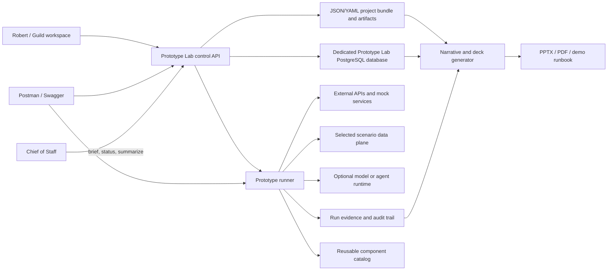

# Spec #153: mini-moi Prototype Lab

**Version:** v1.0 review baseline  
**Date:** 2026-08-26  
**Status:** Official spec; multi-agent review pending; implementation not authorized  
**Decision point:** Robert  
**Alpha seed:** Project Sable — runnable API, data, Postman, Swagger, and
connectivity baseline derived from the completed weekend exercises  
**First product prototype:** Project Nightjar — synthetic telecom BSS /
consumption POC  
**Broader purpose:** A reusable environment for learning, client demonstrations,
integration experiments, and testing possible mini-moi capabilities before they
become production domains.

**Decisions incorporated from Robert's review:** Prototype Lab is part of Guild;
PostgreSQL is the operational datastore; JSON/YAML remains the portable project
definition; every prototype requires a polished 2–5 slide product deck; the
closeout process explicitly separates the prototype's fate from the fate of its
reusable components; and the lab starts fully isolated in both Mac development
and AWS rather than sharing the production mini-moi database or runtime.

**Alpha decision:** Prototype Lab begins with working code and data, not an empty
framework. The completed API learning exercises seed Project Sable and become
the executable baseline that Project Nightjar extends.

## 1. Executive decision

Build **Prototype Lab** as a reusable mini-moi capability **inside Guild / Design-Build**.
Guild owns the project library, lifecycle, show-and-tell experience, and reusable
component catalog. Execution still runs in a separately bounded service so that
Guild does not become a monolithic integration runtime.

Do not make it part of Chief of Staff. Chief of Staff may create a lab brief,
request a run, or summarize results, but it should not own integration code,
credentials, data, or execution.

Do not initially make it a full mini-moi domain. A production domain owns a
durable user experience, data, learned behavior, and an operating feedback loop.
The lab is an incubation environment that creates and tests those things. A
successful prototype may later be promoted into a domain.

The completed weekend API work becomes **Project Sable**, the Alpha seed. It
provides working APIs, Swagger, Postman, external retrieval, OAuth connectivity,
and persisted records that Robert can open and exercise immediately.

The consumption-billing work then becomes **Project Nightjar**, the first product
prototype built from that baseline. Its committed identity, deck, sample data,
and interfaces must not reveal a real employer, interviewer, customer, prospect,
or interview process.

### The two important clarifications

1. Robert intended **PostgreSQL**, not Postman, as the permanent operational
   datastore. Postman remains the durable manual request, test, example, and
   demonstration library.
2. **“Always available” should not mean “all compute always running.”** The lab
   control API can remain available on AWS while Snowflake warehouses, temporary
   workers, and model activity suspend when idle. Availability and cost discipline
   are compatible.

### Three distinct kinds of persistence

- **Portable design truth:** JSON/YAML files for project definitions, contracts,
  flows, synthetic examples, slide narrative, and component manifests.
- **Operational truth:** a dedicated Prototype Lab PostgreSQL database for
  projects, lifecycle, connections, runs, checks, artifacts, and reusable
  component records. Its application tables may use a `prototype_lab` schema,
  but the database and credentials are not shared with production mini-moi.
- **Scenario data:** the data platform selected by the project—Snowflake first,
  PostgreSQL for simple cases, and later a free/local or AWS analytical option.

## 2. Why this is bigger than the original preparation exercise

The work already completed contains the beginning of a general method:

1. State a business requirement and scenario.
2. Define an API contract.
3. exercise it manually in Swagger and Postman.
4. Build a small service or connector.
5. stage and inspect data.
6. automate a repeatable flow.
7. gather evidence.
8. explain the design and result.

That is useful for a technical product demonstration, but it is also how Robert
can test:

- a new external API before adding it to mini-moi;
- a new data source before making it a Curator feed;
- an immersive Mein Deutsch video/cartoon conversation simulation before
  deciding whether it belongs in the production language domain;
- a new agent or agentic loop before granting it production tools;
- a new model/provider behind an existing interface;
- a possible client solution before investing in a formal product; and
- a possible mini-moi domain before committing to its operating model.

The reusable asset is therefore not a one-company demo. It is a governed path from
**idea → manual proof → automated prototype → evidence → demonstrate → harvest
reusable parts → promote, maintain, mothball, or archive**.

## 3. Product identity and ownership

### Working name

**Prototype Lab**

“Sandbox” should be used for an individual isolated environment, not for the
whole capability. “Tech domain” would be misleading because the lab is a method
and runtime, not a subject-matter domain.

### Placement

| Concern | Owner |
|---|---|
| Project brief, priorities, and decision gates | Robert |
| User-facing workspace, lifecycle, decks, and project library | Guild / Design-Build |
| Execution service and adapters | Prototype Lab service |
| Cross-project status and routing | Chief of Staff, through the service API |
| Operational records | Dedicated Prototype Lab PostgreSQL database |
| Portable definitions and templates | JSON/YAML project bundle |
| Project data and credentials | Project-scoped data planes and secret references |
| Reusable component catalog | Guild / Prototype Lab |
| Promotion to a production domain | Separate reviewed domain spec and build |

### Rebranding rule

The internal system remains Prototype Lab. A project may have a presentation
profile such as `Project Nightjar` or another invented product identity.
Rebranding changes titles, colors, terminology, and generated
artifacts; it does not fork code or change the internal security boundary.

### Codename and disclosure rule

Every prototype receives an invented internal codename in the style of a
company “dark project”: memorable, neutral, and unrelated to a real client,
employer, interview, or vendor pursuit.

Rules:

- Project IDs and committed filenames use the codename, not a company name.
- Synthetic company, account, product, contact, and transaction names are
  invented and checked for accidental resemblance to real parties.
- Decks use Prototype Lab branding or an invented product identity; no copied
  client logos, screenshots, confidential terminology, or internal material.
- Git history, commit messages, issues, branches, fixtures, comments, and test
  output follow the same rule—not only the visible UI.
- A private, local cross-reference may record why Robert created a project, but
  it is never committed, deployed, logged, or exposed through Guild.
- Public/vendor documentation may be cited as technical research, but the
  prototype identity must remain vendor-neutral unless Robert explicitly
  approves a public vendor-specific example.

The Alpha seed codename is **Project Sable**. The first product-prototype
codename is **Project Nightjar**, representing a synthetic telecom BSS and
consumption-monetization scenario. The existing career working materials retain
their current names and location; they are source research, not committed
Prototype Lab identities.

## 4. Goals

The lab should let Robert:

1. Create a project from a concise business and technical brief.
2. Keep sample data, contracts, manual calls, SQL, code, run evidence, and demo
   materials together.
3. Use Postman and Swagger for visible, manual exploration.
4. Turn a successful manual call into a small repeatable function or connector.
5. Read from and write to a chosen data platform, starting with Snowflake.
6. Simulate inbound and outbound integrations safely.
7. Run a scenario end to end and preserve evidence of what actually happened.
8. Maintain a polished 2–5 slide product deck for every prototype.
9. Generate a consistent show-and-tell package from the same project facts.
10. Compare results and decide whether to maintain, promote, mothball, archive,
    or discard the prototype.
11. Harvest reusable connectors, mocks, templates, contracts, and workflow
    patterns even when the originating prototype is closed.
12. Support bounded agentic-loop experiments later without giving an agent
    unrestricted access to mini-moi or external systems.

## 5. Non-goals for the first release

- A generic low-code integration platform.
- A replacement for Postman, Swagger, Snowflake, a target billing platform, or
  an ETL product.
- A production master-data or financial system.
- A public developer API.
- A place for unrestricted customer or personal production data.
- A way to expose existing mini-moi domain ports or Swagger pages publicly.
- A general autonomous-agent runtime in the first release.
- Automatic promotion of prototype code into production domains.
- A general slide-design application. The lab does require and generate a
  polished product deck, but Robert still controls the final story and approves
  every external presentation.

## 6. The standard lab lifecycle

Every project follows the same stages. Stages may be skipped deliberately, but
their status remains visible.

| Stage | Purpose | Primary artifact |
|---|---|---|
| 0. Frame | Define the business question and proof required | Project brief |
| 1. Contract | Define inputs, outputs, identifiers, and errors | OpenAPI/data contracts |
| 2. Probe | Exercise the boundary manually | Postman collection + evidence |
| 3. Stage | Load, profile, map, and reconcile data | SQL, curated views, checks |
| 4. Automate | Convert the manual path into a repeatable adapter/function | Prototype service or job |
| 5. Compose | Join several calls and data steps into a scenario | Flow definition |
| 6. Present | Maintain the 2–5 slide product story and live-demo sequence | Product deck + demo runbook |
| 7. Demonstrate | Run the scenario and retain results | Run/evidence bundle |
| 8. Harvest | Identify and package reusable technical assets | Component records |
| 9. Decide | Maintain, promote, mothball, archive, or discard | Decision record |

This preserves Robert's preferred sequence: understand the business purpose and
overall flow first, then work down into technical mechanics.

### Prototype disposition is separate from component disposition

A project and the technical assets created inside it do not have to share the
same fate.

| Prototype disposition | Meaning |
|---|---|
| `active_experiment` | Still proving the idea or mechanics |
| `evergreen_demo` | Kept current for repeated interviews, client discussions, or learning |
| `promoted` | Became a production mini-moi domain/feature or separately governed product |
| `mothballed` | Not maintained, but retained because the scenario may become useful again |
| `archived` | Closed and preserved as historical evidence |
| `discarded` | No continuing value; retain only the minimum decision/audit record |

A connector, data adapter, OpenAPI contract pattern, mock service, deck template,
or flow component may be marked `candidate`, `lab_reusable`, or `promoted` even
when its originating prototype is mothballed or archived. Harvesting is a
required closeout decision, not an accidental copy-and-paste exercise.

## 7. Conceptual architecture



The control API knows projects, runs, policies, and artifact locations. It does
not absorb the business logic of every prototype. Each adapter owns the meaning
of its external call, and each project owns its scenario configuration.

## 8. Core components

### 8.1 Project registry

The registry has two deliberately different authorities:

- JSON/YAML is authoritative for portable, reviewable project definitions.
- PostgreSQL is authoritative for live operational state and history.

Each project has a machine-readable manifest, a human-readable brief, and a row
in the PostgreSQL registry tied to the manifest version/hash. Runtime actions
must not silently rewrite the portable definition.

The registry records:

- stable internal project ID;
- presentation/brand profile;
- business question and success criteria;
- environments;
- data classifications;
- API and data contracts;
- adapters and allowed destinations;
- secret reference names, never secret values;
- project stage and decision status;
- costs/expiry limits;
- runs and evidence locations; and
- prototype disposition and component-harvest decision.

### Dedicated PostgreSQL database from the start

Prototype Lab does not use the existing mini-moi PostgreSQL database. It receives
its own database in each environment:

- **Mac development:** separate PostgreSQL container, database, credentials,
  port binding, and named data volume under the Prototype Lab Compose profile.
- **AWS lab:** separate PostgreSQL runtime, credentials, encrypted persistent
  storage, backup policy, and network rules. It shares no data volume, database
  role, connection string, or backup set with production mini-moi.

Within the dedicated database, the application tables may live in a
`prototype_lab` schema. Use separate owner, application, migration, and optional
read-only roles; the running service does not receive database-owner privileges.

Initial tables should cover:

- `projects` — identity, owner, state, manifest version/hash, classification;
- `project_versions` — immutable definition checkpoints;
- `connections` — non-secret connection metadata and secret reference names;
- `scenarios` — named demo flows and current versions;
- `runs` — status, timing, trigger, result summary, and trace ID;
- `run_steps` — ordered operations and sanitized outcomes;
- `checks` — reconciliation and acceptance results;
- `artifacts` — deck, runbook, evidence, and contract locations/hashes;
- `components` — reusable adapters, mocks, templates, contracts, and runners;
- `project_components` — where a component originated and where it is used; and
- `lifecycle_events` — maintain/promote/mothball/archive/discard decisions.

Snowflake is not the project registry and must not write directly into the
control tables.

### 8.2 Contract library

Each prototype service has its own OpenAPI 3.1 contract. The contract is the
source for:

- Swagger/OpenAPI documentation;
- request and response examples;
- schema validation;
- a generated or maintained Postman collection;
- contract tests; and
- diagrams and field tables used in the deck.

The lab must not combine unrelated services into one misleading platform-wide
OpenAPI file.

### 8.3 Manual probe library: Postman

Postman remains the visible learning and demonstration surface for API calls.
It stores:

- requests grouped by scenario step;
- sanitized example bodies;
- environment variable names;
- pre-request and test scripts;
- expected status and contract checks; and
- saved example responses that contain no secrets or sensitive data.

Local/current environment values hold temporary tokens during manual work. An
exported collection or environment must never contain live credentials.

Postman may call Snowflake's SQL API, the Prototype Lab service, a mock service,
or later a vendor sandbox. It is not responsible for durable business data or
run history.

### 8.4 Prototype service and runner

New API-first prototypes should use **FastAPI and Pydantic** unless the use case
provides a reason not to. This is a natural extension of the completed API
learning:

- explicit request and response models;
- generated OpenAPI and Swagger;
- validation and clear 4xx behavior;
- small, reviewable adapters;
- straightforward local execution with Uvicorn; and
- clean promotion path to an AWS container.

Existing Flask domains are not rewritten. Flask and FastAPI coexist.

The runner supports two execution modes:

1. **Interactive:** Postman or Swagger calls one operation at a time.
2. **Scenario:** a named flow runs a bounded sequence and captures evidence.

### 8.5 Data-plane adapters

Snowflake is the first supported warehouse/data-plane adapter, not a mandatory
dependency for every project. The lab should eventually offer several useful
options rather than one default for every case:

| Option | Best use | Direction |
|---|---|---|
| PostgreSQL | Operational data, small relational prototypes, direct application behavior | Available from the base platform, but project tables stay outside the control tables |
| DuckDB + files | Free/local analytical experiments and portable demos | First low-cost warehouse-style alternative |
| Snowflake | Cloud warehouse, customer ingestion, mediation, separation of compute/storage | First cloud warehouse adapter and current pilot |
| AWS S3 + Athena | AWS-native, serverless query over staged files | First AWS analytical option after Snowflake |
| Redshift Serverless | More sustained AWS warehouse scenarios | Add only when a project justifies the added platform and cost |

The adapter should support:

- execute a parameterized query;
- load a small file or row set into a project-scoped schema;
- query curated views;
- retrieve row counts and reconciliation results;
- write a synthetic event idempotently; and
- return a bounded result for a demo or downstream step.

Later adapters might include an API-only source or a message stream. They should
appear only when a real project needs them.

### 8.6 PostgreSQL-to-warehouse movement

The architecture should permit PostgreSQL ↔ Snowflake and PostgreSQL ↔ AWS
analytical flows, but the first implementation should use a named lab connector
or job rather than a privileged database-to-database link.

```text
project PostgreSQL data
    → Prototype Lab connector/job
    → staged/curated warehouse data
    → reconciliation result
    → prototype_lab.checks and artifact evidence
```

The reverse path is allowed when a use case needs a derived result returned to
an application store, but it must target project data—not the Prototype Lab
control tables—and it must declare idempotency, ownership, and reconciliation.
Direct vendor connectors or managed ingestion can be evaluated later when data
volume or customer realism makes them valuable.

### 8.7 External API and mock-service adapters

Projects need both kinds of outbound behavior:

- call a real approved external sandbox/API; or
- call a lab-owned mock when the real system is unavailable or inappropriate.

The first mock service should be the planned serviceability/address check:

```http
POST /v1/serviceability/check
```

It should validate the request, return deterministic outcomes for known sample
addresses, issue a request ID, and support a controlled error case. That proves
the outbound pattern without pretending the lab has a real network coverage
engine.

### 8.8 Run and evidence store

Every scenario run receives a unique run ID. The evidence bundle records:

- project and scenario versions;
- start/end times and outcome;
- sanitized request/response summaries;
- source and target row counts;
- reconciliation checks;
- generated object identifiers;
- warnings, rejected rows, and known limitations;
- trace/correlation IDs;
- artifact hashes where useful; and
- costs or token usage when applicable.

Evidence is what turns “I configured it” into a reviewable demonstration.
Sensitive bodies are retained only when the project policy permits them.

### 8.9 Product deck and narrative generator

A polished **2–5 slide product deck is required for every prototype**. This is
part of the prototype definition, not an optional final documentation task.

The initial deck is created during framing and states the hypothesis. It is then
updated as contracts, screens, and evidence become real. A prototype cannot be
marked `demo_ready`, `evergreen_demo`, `promoted`, or formally closed without a
rendered and visually reviewed deck.

The slide capability should be built as two layers:

1. **Narrative model:** structured JSON/YAML generated from the project manifest,
   architecture, scenario steps, and run evidence.
2. **Renderer:** produces PPTX first, with PDF optional later.

This avoids burying the business story in PowerPoint code and makes other
renderers possible.

The standard product story is compressed into at most five slides:

1. **Problem and opportunity** — user/customer, friction, and business value.
2. **Product proposition** — what the prototype does and the experience it
   enables.
3. **How it works** — architecture, data/API flow, and live-demo checkpoints.
4. **What was proven** — observed results, reconciliation, and limitations.
5. **Where it goes next** — production path, reusable assets, and decision.

A simple prototype may combine these into two or three slides. A complex
prototype may use all five. Supporting technical detail belongs in the demo
runbook or appendix material, not in a longer default product deck.

Every factual claim should be marked as one of: project input, observed run
evidence, design assumption, or proposed production direction. Generated slides
must not convert an assumption into an observed result.

Project Nightjar must have its own 2–5 slide telecom BSS deck even before a
target billing sandbox is available. The early version should distinguish the
product vision and architecture from the portions actually exercised in Postman
and Snowflake. Once a target platform is available, the evidence slide is
updated rather than the deck being reinvented.

### 8.10 Reusable component catalog

The component catalog prevents useful work from disappearing with a closed
prototype. A component record includes:

- stable component ID and type;
- origin project;
- purpose and supported contract;
- current maturity (`candidate`, `lab_reusable`, `promoted`, `retired`);
- compatibility and dependency notes;
- tests and evidence;
- security/data classification;
- current consumers; and
- owner and review date.

Promotion into the shared catalog is deliberate. Project code is not declared
reusable merely because another project could theoretically import it.

### 8.11 Agentic experiment runner: later phase

Agentic loops belong in the lab only after the ordinary deterministic runner is
working. The loop runner must be bounded by:

- an explicit tool allowlist;
- project-scoped credentials;
- maximum steps, time, and cost;
- read-only defaults;
- human approval before external mutation;
- complete trace and tool-call receipts;
- idempotency/reconciliation for approved writes; and
- a kill switch.

An agent may propose the next call or mapping. It does not get unrestricted shell,
AWS, Snowflake, mini-moi, or vendor access.

## 9. Project bundle standard

A portable project should look conceptually like this:

```text
projects/<project-id>/
  project.yaml                 # machine-readable manifest
  BRIEF.md                     # business question and success criteria
  brand/
    brand.yaml                 # client-facing display profile
  contracts/
    <service>.openapi.yaml
    schemas/
  postman/
    collection.json
    environment.example.json  # variable names only; no current secrets
  data/
    synthetic/                 # safe sample inputs
    mappings/                  # source-to-target maps
  data_plane/
    snowflake/                  # only when selected by the project
      setup.sql
      curated_views.sql
      reconciliation.sql
  adapters/
    <purpose>/                 # project-specific translation/business meaning
  flows/
    <scenario>.yaml
  components/
    components.yaml             # assets nominated for reuse
  evidence/
    <run-id>/                  # sanitized run facts; usually private/runtime data
  presentation/
    narrative.yaml
    demo_runbook.md
    product-deck.pptx           # required 2–5 slide show-and-tell deck
    product-deck.pdf            # verified presentation copy when useful
    renders/                    # page images used for visual QA
  DECISION.md                  # maintain / promote / mothball / archive / discard
```

The repository can hold safe templates, contracts, code, and synthetic samples.
Private project data and run evidence belong in private/mounted storage and are
gitignored unless explicitly curated for public use.

## 10. Minimal project manifest

Illustrative only; the schema must be reviewed before implementation.

```yaml
id: project-nightjar
name: Project Nightjar
status: active
owner: robert
stage: stage

purpose:
  business_question: Can a mixed recurring and consumption offer be staged,
    configured, metered, billed, and reconciled with bounded integrations?
  success_criteria:
    - five accounts reconciled
    - one usage event inserted idempotently
    - one curated usage contract produced
    - one external serviceability call demonstrated

data_policy:
  classification: synthetic
  retain_run_bodies: false
  expires_on: 2026-10-01

connections:
  - id: snowflake-nightjar
    type: snowflake
    environment: trial
    secret_ref: /minimoi/prototype-lab/nightjar/snowflake
    allowed_operations: [query, load_sample, merge_usage]
  - id: serviceability-mock
    type: https_api
    contract: contracts/serviceability.openapi.yaml
    allowed_operations: [check]

presentation:
  brand_profile: brand/brand.yaml
  audience: product-demonstration
  deck:
    required: true
    min_slides: 2
    max_slides: 5

lifecycle:
  disposition: active_experiment
  component_harvest_required: true
```

## 11. AWS runtime recommendation

### Region

Use AWS `us-east-1` so the lab is near the existing mini-moi deployment and the
new Snowflake account. Region alignment is operationally convenient, but it does
not merge trust boundaries or eliminate external data-transfer considerations.

### Initial deployment

The AWS version starts as a **separate stoppable Prototype Lab stack**, not code
embedded in the Portal, Guild pages, Chief of Staff, an existing domain process,
or the current production PostgreSQL instance.

The stack has:

- a separate compute runtime for the Prototype Lab service/runner;
- a separate PostgreSQL database runtime and encrypted persistent storage;
- separate security groups/network rules;
- separate IAM role and SSM secret prefix;
- separate logs, backup set, and artifact prefix;
- no existing mini-moi data volumes or database grants; and
- one narrow authenticated integration path from Guild to the lab API.

The first implementation should favor a topology that can stop compute cleanly
while retaining database and artifact storage. A dedicated EC2-based lab stack
is a reasonable initial design because the whole stack can be stopped and its
encrypted volumes retained; a managed/container-serverless alternative may be
selected if its measured cost and stop/start behavior are better. The exact AWS
service choice belongs in the Phase 1 build spec.

Guild remains available when the lab is down. It reads the safe JSON project
catalog and displays `offline`, `starting`, `ready`, `stopping`, or `error`.
Starting or stopping the AWS stack is an owner-only operation backed by a narrow
AWS permission; it is not a general cloud-management capability.

When the lab is running, Guild proxies only approved authenticated routes. The
lab database and direct service ports are never browser- or internet-facing.

### Persistence

- JSON/YAML project definitions: project-scoped persistent volume, with backup.
- Operational registry and run ledger: the dedicated Prototype Lab PostgreSQL
  database and restricted application role.
- Larger artifacts and generated decks: project-scoped S3 prefix when needed.
- Scenario data: PostgreSQL, DuckDB/files, Snowflake, or an approved AWS data
  adapter selected by the project.
- Production mini-moi domain data: never mounted into the lab by default.
- Secrets: SSM `SecureString` or the approved production secret mechanism;
  local development uses ignored environment values/keychain as appropriate.

### Cost behavior

- Mac development uses an explicit Compose profile; stopping the profile stops
  service and database containers while preserving the named database volume.
- The AWS lab stack has explicit start, stop, status, and idle-shutdown
  operations.
- A scenario may request a temporary “keep warm until” deadline for a scheduled
  demo; otherwise the default is automatic shutdown after the approved idle
  window.
- Snowflake X-Small warehouse auto-suspends after the shortest practical idle
  period.
- Temporary workers terminate after runs.
- Each project has an expiry/review date.
- Model and agent runs have budgets.
- Guild's catalog remains available while Prototype Lab compute is stopped.

### GitHub and repository protection

GitHub preserves the safe, reproducible definition of the lab; it does not store
the running lab or its secrets.

- The normal reviewed-diff and protected-branch workflow applies.
- Only generic platform code, invented project identities, synthetic fixtures,
  contracts, migrations, deck sources, and deliberately sanitized deck outputs
  may be committed.
- Active database contents, credentials, tokens, raw run payloads, private
  cross-references, and unsanitized evidence are ignored and stored only in the
  approved runtime/private locations.
- CI checks committed files and Git metadata for secrets and prohibited real
  client/employer/interview references.
- Project manifests declare whether an artifact is `commit_safe`,
  `private_runtime`, or `generated_review_required`.
- A release or public push requires a rendered-deck review in addition to code
  and test review.

## 12. Security and operating controls

The lab is intentionally an integration surface, which makes it a higher-risk
component than a static demo. Required controls include:

1. No secrets in Git, exported Postman files, manifests, decks, or evidence.
2. Project-scoped credentials with least privilege and expiry.
3. Separate development, lab, and vendor-sandbox environments.
4. Synthetic or masked data by default.
5. Explicit outbound host allowlists and blocked private/metadata addresses.
6. Connect/read timeouts and response-size limits.
7. No automatic retry of mutating calls without an idempotency strategy.
8. Trace IDs and sanitized logs.
9. Human approval before a scenario makes external writes outside a lab-owned
   system.
10. Project retention and deletion policy.
11. A stop/disable control independent of the project code.
12. No direct access from the lab to existing domain data files; approved
   interactions use domain-owned HTTP contracts.
13. A dedicated PostgreSQL database and restricted application role for control
    data; project data receives its own declared location and grants.
14. No Snowflake, Athena, Redshift, or external connector may write directly to
    Prototype Lab control tables.

The lab should reuse the integration-boundary standards already drafted for
mini-moi: shared transport mechanics, domain/project-owned business mapping,
per-service contracts, evidence states, and explicit mutation controls.

## 13. Alpha seed and first product prototype

### 13.1 Project Sable — Alpha seed

Prototype Lab does not begin as an empty shell. **Project Sable** incorporates
the safe, working mechanics from the completed weekend exercises so Robert can
open Guild, start the lab, open Swagger or Postman, retrieve stored records,
make a write, call an external source, test authentication, and confirm the
result in PostgreSQL.

Project Sable is not presented as a client solution. It is the lab's executable
reference project and acceptance test.

#### Source material and disposition

| Existing work | Alpha use | Do not carry forward |
|---|---|---|
| Personal Learning Record FastAPI service | Pydantic request validation, GET/POST behavior, UUID/timestamp generation, OpenAPI 3.1, Swagger, success and error examples | Personal/default names, local absolute paths, `.venv`, caches |
| Postman Learning Record collection | Manual calls, environments, saved success/422/500 examples, collection-run baseline | Current secret values, provider-specific filenames, personal workspace metadata |
| Curator-style external workflow | Live external GET, select-by-ID POST, saved-item GET, 404/409/422/500/502 behavior | Hardcoded personal application title/user agent and any assumption that one feed is the permanent source |
| OAuth client-credentials exercise | Token acquisition, in-memory reuse until near expiry, protected downstream connectivity check | `.env`, client ID/secret, tenant/domain values, returned tokens, unrelated roles use case as product logic |
| Four learning records and two saved items | Private import source and schema/behavior verification | Personal names or unsanitized payloads in committed fixtures |

No source directory is copied wholesale. The Alpha deliberately excludes
`.env`, `.venv`, `__pycache__`, token responses, Postman current values, and
credential-bearing provider/domain filenames.

#### Alpha service modules

Project Sable exposes a small coherent API rather than three disconnected
training folders:

```text
System
  GET  /health/live
  GET  /health/ready

Records
  GET  /api/v1/records
  POST /api/v1/records

External signals
  GET  /api/v1/signals/recent
  POST /api/v1/saved-items/{item_id}
  GET  /api/v1/saved-items

Connectivity
  POST /api/v1/connectivity/oauth/verify
```

The OAuth verification operation returns safe connection metadata and outcome;
it never returns the access token to the browser, Postman response examples,
run evidence, or logs.

FastAPI generates `/docs` and `/openapi.json`. On the Mac these may be opened
directly on the loopback lab port. In AWS they are available only through the
authenticated Guild/Prototype Lab route and may be disabled independently of
the execution API.

#### Alpha data

Project Sable selects PostgreSQL as its scenario data plane. Its records and
saved items use a dedicated project-data schema/role inside the already isolated
Prototype Lab database; they do not share the control tables.

JSON remains the portable seed and export format:

- committed seed fixtures are synthetic but meaningful and produce real,
  queryable PostgreSQL rows;
- the four learning records and two saved items from the weekend may be imported
  into Robert's private Mac runtime after a sanitization review;
- the AWS seed defaults to the commit-safe synthetic fixtures; and
- the idempotent seed loader records a fixture version/hash so restarting or
  rerunning it does not duplicate rows.

“Actual data” means the UI and API read and write persisted database rows and a
live external source—not screenshots or hardcoded response stubs. It does not
mean placing personal or pursuit-specific data in GitHub.

#### Alpha Postman collection

The Project Sable collection has these folders:

1. Health and contract discovery.
2. Retrieve and create records.
3. Retrieve external signals and save one item.
4. Retrieve saved items and prove duplicate protection.
5. Verify OAuth client-credentials connectivity.
6. Controlled 404, 409, 422, and upstream-failure examples.

The collection uses environment variables for the Guild/local base URL and
secret references. Exported environments contain variable names and safe
defaults only.

#### Alpha presentation

Project Sable has the same mandatory product discipline as every later
prototype. Its initial three-slide deck is:

1. Prototype Lab — from idea to a governed, runnable proof.
2. Project Sable — Postman/Swagger → FastAPI → PostgreSQL/external API.
3. What the Alpha proves and how a new dark project extends it.

#### Alpha acceptance test

Project Sable is ready when Robert can:

1. Start the isolated Mac lab stack.
2. Open Project Sable from Guild and see its current runtime status.
3. Open the authenticated Swagger view.
4. Run the sanitized Postman collection.
5. Retrieve seeded rows, create a new record, and retrieve it again.
6. Fetch a live external feed, save an item, and observe duplicate protection.
7. Verify client-credentials connectivity without exposing a token.
8. Confirm the data in the project PostgreSQL schema.
9. Stop and restart the lab and confirm the data persists.
10. Repeat the same contract and persistence test against the isolated AWS lab.
11. Open the rendered three-slide Project Sable deck.

Project Sable then becomes the reference smoke test for later platform changes.
It remains an `evergreen_demo` even after other prototypes are archived.

### 13.2 Project Nightjar — first product prototype

Existing private preparation material remains private working source for the
first product prototype. Its location and original purpose are recorded only in
the private multi-agent handoff/cross-reference, not in the official project or
public Git history. Only generic mechanics, invented data, and sanitized
conclusions are carried into Project Nightjar.

### Pilot flow

1. Load five safe customer extracts into Snowflake.
2. Profile row counts and key relationships.
3. Use Postman to call Snowflake's SQL API.
4. Insert one usage event with an idempotent `MERGE`.
5. Retrieve a curated event contract suitable for mediation and usage rating.
6. Call the serviceability mock from Postman.
7. Automate the same Snowflake and serviceability steps through the FastAPI
   prototype service.
8. When a target billing sandbox is available, create selected objects through
   its approved APIs/loaders and configure the usage-ingestion path.
9. Reconcile source → accepted event → usage/rating → invoice result.
10. Maintain the required 2–5 slide telecom BSS product deck throughout the
    build; update its proof slide from the final run evidence.
11. Harvest the Snowflake adapter, serviceability mock, API contract pattern,
    evidence format, and deck pattern into the component catalog as warranted.

### What remains project-specific

- target billing-platform object model and private adapter configuration;
- mediation mappings and meters;
- consumption price models;
- account/catalog/subscription/AR migration choices;
- Project Nightjar product story and invented branding; and
- target-sandbox credentials and constraints, held only in private runtime
  configuration.

### What becomes reusable

- project manifest;
- OpenAPI/Postman pattern;
- Snowflake query/load/reconciliation adapter;
- FastAPI prototype skeleton;
- serviceability mock pattern;
- run/evidence format;
- flow runner;
- deck narrative model and renderer;
- component catalog and harvest decision; and
- promotion/maintenance/mothball/archive decision process.

## 14. Build sequence and approval gates

No code should be built merely because this working spec exists.

### Phase 0 — Ratify architecture

Confirm:

- Prototype Lab identity and Guild placement;
- isolation boundary;
- dedicated PostgreSQL database/role boundary and JSON/YAML authority;
- project/artifact storage;
- Project Sable Alpha scope and Project Nightjar boundary; and
- relationship to the API standardization work.

**Exit:** Robert approves the architecture and authorizes a detailed Phase 1
build spec.

### Phase 1 — Project Sable Alpha on the Mac

- Define and validate `project.yaml`.
- Define the dedicated Mac PostgreSQL container/database, internal schema,
  permissions, persistent volume, and stop/start behavior as a reviewed design;
  implementation remains separately approved.
- Audit and selectively migrate the completed FastAPI, OpenAPI/Swagger, Postman,
  external-feed, OAuth, and safe seed-data mechanics into Project Sable.
- Build the minimal Prototype Lab FastAPI service and Project Sable routes.
- Persist Project Sable scenario rows in its project-data schema and lab
  operations in the control schema.
- Define the evidence schema and capture the Alpha acceptance run.
- Create and visually review the three-slide Project Sable product deck.

**Exit:** Project Sable passes its complete local acceptance test, survives a
stop/restart, and provides a runnable Swagger/Postman/database baseline.

### Phase 2 — Project Nightjar on the proven local baseline

- Derive Project Nightjar's safe artifacts from the existing private source
  materials without carrying over identifying names or history.
- Add Snowflake and serviceability adapters.
- Add the serviceability OpenAPI contract and Postman requests.
- Complete the Snowflake manual exercise and then automate the same path through
  the Prototype Lab service.
- Add contract, error, idempotency, redaction, and reconciliation tests.
- Create and visually review the initial 2–5 slide telecom BSS product deck.

**Exit:** Project Nightjar repeats its manual path automatically, produces
equivalent evidence, and demonstrates that a product prototype can extend the
Alpha without forking the lab.

### Phase 3 — Isolated AWS lab runtime

- Provision the separate stoppable compute and PostgreSQL stack.
- Containerize and deploy behind Guild's authenticated proxy path.
- Add scoped SSM secrets and private artifact storage.
- Add start/stop/status, idle shutdown, cost/expiry controls, backup, monitoring,
  and independent rollback.
- Verify the lab cannot read existing domain data or credentials.
- Run the Project Sable acceptance collection first, then the current Project
  Nightjar smoke test.

**Exit:** Project Sable and Project Nightjar are available on demand from AWS,
persist across stop/start, and cause no production-domain regression.

### Phase 4 — Repeatable narrative and slide generation

- Finalize the narrative schema.
- Regenerate the already-required 2–5 slide product deck and demo runbook from
  the project definition and current evidence.
- Support a project brand profile.
- Verify all result claims trace to evidence or are labeled assumptions.

**Exit:** A new run can update the evidence and regenerate the show-and-tell
package without manually rebuilding every slide.

### Phase 5 — Target sandbox and richer connectors

- Add the target billing platform only after sandbox access and a defined
  scenario; keep vendor-specific credentials and pursuit context outside the
  committed project identity.
- Add a second, unrelated dark project to prove that the lab is genuinely
  reusable.
- Add the DuckDB/files option and AWS S3/Athena option only when selected pilots
  make their acceptance criteria concrete.
- Extract shared mechanics only after both projects demonstrate the same need.

**Exit:** Two materially different, non-identifying projects use the same lab
pattern.

### Phase 6 — Bounded agentic experiments

- Add tool and policy manifests.
- Add step/time/cost limits and approval gates.
- Add trace/replay and a hard stop.
- Start with read-only planning or mapping, not external mutation.

**Exit:** An agentic experiment can be replayed and audited, and cannot escape
its project scope.

## 15. Definition of Done

Prototype Lab is successful when:

- Project Sable remains a runnable Alpha smoke test on both Mac and AWS;
- a project can be understood from its brief and manifest without reading its
  code first;
- the same API call can be demonstrated manually and executed automatically;
- inputs and outputs validate against explicit contracts;
- the first product prototype's sample data can be staged, queried, and reconciled in
  Snowflake, while later projects can select a different declared data plane;
- operational state is queryable in PostgreSQL without making the database the
  only copy of portable project definitions;
- Postman collections remain useful but contain no durable data or secrets;
- a run produces evidence that distinguishes observed results from assumptions;
- every project has a rendered, visually reviewed 2–5 slide product deck;
- the product deck and runbook are derived from the same project facts and run
  evidence;
- one project can be rebranded without forking its runtime;
- a prototype can be mothballed or archived while approved components remain in
  the reusable catalog;
- the lab cannot read or modify existing mini-moi domain data by default;
- cost and credentials are bounded by project;
- Robert remains the decision point for external writes and production promotion;
  and
- a second prototype can reuse the pattern without adopting Project Nightjar's
  telecom data model.

## 16. Architecture pushback and unresolved decisions

### Recommendation: do not call this a domain yet

Calling the lab a domain would invite domain-specific UI, memory, and storage
before the incubation method has proved itself. Present it as a Guild workspace
backed by an isolated platform service. Revisit domain status only if the lab
develops a durable user-specific learning loop of its own.

### Recommendation: do not put the runtime in Chief of Staff

Chief of Staff should know what is being tried and why. It should not become an
integration super-service. Keeping execution separate preserves backend
swappability, narrows credentials, and lets deterministic prototypes work
without an agent.

### Recommendation: Snowflake is an adapter, not the foundation

Snowflake is excellent for the first ingestion and mediation case and useful for
data-heavy prototypes. Making every future prototype use it would add cost and
friction to simple API experiments. The project chooses its data plane.

### Recommendation: separate the control store from project data

The dedicated Prototype Lab PostgreSQL database should hold the operating
model—projects, runs, checks, artifacts, lifecycle, and component lineage. It
should not become a generic dumping ground for every prototype's source data.
Each project declares its data plane and access boundary.

Starting with separate databases and runtimes on the Mac and AWS is intentionally
more infrastructure than a shared schema. The additional boundary is justified
because integration experiments and future agentic loops are less predictable
than ordinary domain traffic, and stop/start cost control is now a first-class
requirement.

### Recommendation: the deck begins with the hypothesis and matures with evidence

The product deck starts during framing because show-and-tell is a core purpose of
the lab. Before execution it must clearly label the value proposition and design
as hypotheses or proposed direction. After execution, it is updated from
trustworthy run facts. This preserves product clarity without allowing a polished
story to overstate what the prototype proved.

### Conflict to reconcile before build

The August 20 API standardization working spec excludes building the original
interview POC inside production mini-moi. This design now resolves that concern
directly: Project Nightjar has an invented identity and runs inside the separately
isolated lab service, database, and AWS stack with no production-domain data
access. The earlier working spec should still be cross-referenced in the Phase 1
build spec so the boundary remains explicit.

## 17. Recommended next decision

Robert has confirmed these design directions:

1. **Identity:** Prototype Lab is part of Guild / Design-Build.
2. **Presentation:** every prototype requires a polished 2–5 slide product deck.
3. **Lifecycle:** prototypes may remain evergreen, be promoted, mothballed,
   archived, or discarded; reusable components have their own lifecycle.
4. **Operational data:** use a dedicated Prototype Lab PostgreSQL database in
   both Mac development and AWS, with JSON/YAML retained as portable design
   truth.
5. **Scenario data:** Snowflake is the first warehouse option; PostgreSQL,
   DuckDB/files, and an AWS-native analytical adapter provide appropriate
   alternatives as real projects require them.
6. **Isolation and cost:** use separate stoppable lab runtimes; Guild remains the
   authenticated catalog/front door while the lab is offline.
7. **Disclosure:** all committed projects use invented dark-project codenames,
   synthetic data, and automated checks against real pursuit/client references.
8. **Alpha seed:** selectively migrate the completed Swagger/OpenAPI, Postman,
   FastAPI, persisted-record, external-feed, and OAuth mechanics into the
   evergreen Project Sable reference project.
9. **Sequence:** pass Project Sable locally first; then complete the Project
   Nightjar/Snowflake flow and its first telecom BSS product deck, then automate
   the proven path; bounded agentic loops remain later work.

The remaining Phase 0 decisions are the exact Mac/AWS topology, stop/start
mechanism, database schema, storage paths, and first-release acceptance test.
Approval of this v1.0 review baseline would authorize creation of a detailed Phase 1
build spec only. It would not authorize code, deployment, new cloud resources,
or production changes.

## Commit and authorization

This document is now official Spec #153 and is the canonical review target in
`docs/specs/`. Registration in the Guild build queue does not authorize
implementation.

Before any Phase 1 code or infrastructure work:

1. Claude, OpenClaw, and Grok review this spec without editing it.
2. Codex compares their separate findings against the repository and this spec.
3. Robert decides which findings to accept and whether a revised spec is needed.
4. Robert explicitly authorizes the Phase 1 build specification.
5. The resulting implementation diff receives independent review and Robert's
   separate approval before commit, merge, deployment, database creation, or AWS
   resource creation.

No GitHub issue, branch, commit, database, deployment, or cloud resource is
authorized by this registration alone.
