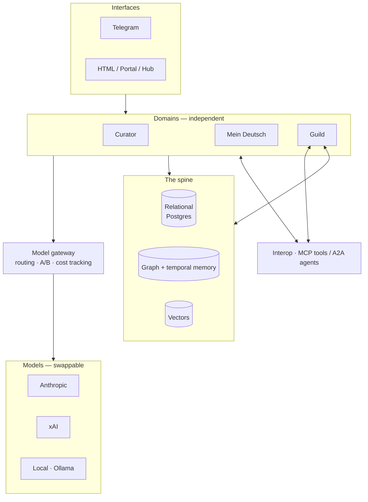

# Guild — Technical Plan & Stack Investigation

*Engineering companion to the Guild charter.*

**Status:** Planning · **Horizon:** June build + July–September evolution · **Landscape snapshot:** May 2026

---

## How to read this

The charter is the *why*. This is the *how* — and, deliberately, the *what we still need to decide*. The spine is too load-bearing to lock on a default, so several choices below are left open with candidates and a decision rule, to be settled in a short pre-build investigation against real data. Where a choice is already clear, it's stated as such.

Tool and protocol facts here are a May 2026 snapshot; this space moves monthly, so treat the appendix as a dated scan, not gospel.

---

## Principles

These shape every choice that follows.

1. **Local-first and independent.** Runs on owned hardware. No hard cloud dependency; the domains keep working without a network. Cloud is a tier, not a requirement.
2. **Model- and agent-independent.** Every model call goes through one abstraction layer. Swapping a model or running an A/B is *configuration, not code*. This is already practiced in design; it becomes architectural.
3. **Domains stay independent.** Thin adapters and summary contracts. The spine *connects* the domains; it does not absorb them.
4. **Standards over bespoke.** Adopt the converged open standards — MCP, AGENTS.md, OpenAI-compatible APIs — so the system interops and stays unlocked from any one vendor. Writing custom agent plumbing in 2026 is writing technical debt.
5. **Investigate before committing — and keep investigating after.** For load-bearing choices — the spine above all — prototype on real Curator and German data before locking. And because the landscape shifts under any locked choice, the investigation never fully ends; it becomes a standing function (see *The Chief of Staff as technology radar*).

---

## Architecture at a glance

Four decisions define the build. Three of the four have a settled standard; the spine is the one that needs a real bake-off.

---

## Decision 1 — The spine *(investigate before committing)*

This is the central choice. Requirements: hold structured repositories (relational), model relationships across domains (graph), support retrieval (vectors), and — critically for "remember, adjust, get better" — track **how facts change over time** (temporal). That last requirement is the one most stacks get wrong by storing only current-state snapshots.

**Candidate A — Postgres-unified.** PostgreSQL + Apache AGE (openCypher graph *inside* Postgres) + pgvector (vectors inside Postgres). One local store, one backup, SQL and Cypher in the same engine. Fewest moving parts, cleanest ops, fully local. Trade-off: AGE is less battle-tested for heavy graph workloads, and temporal logic (fact-validity windows) is something you'd build yourself.

**Candidate B — Postgres + Neo4j + Graphiti.** Relational ground truth in Postgres; the temporal knowledge graph via Graphiti (open-source) on Neo4j. Best-in-class for exactly the learning-loop goal — Graphiti stores fact-validity windows rather than timestamped snapshots, so "what did we believe in February, and why did it change" is a native query. Trade-off: two engines to run; heavier; Graphiti's graph construction can be token-expensive at write time.

**Candidate C — Embedded graph.** An in-process property graph with built-in vector and full-text search (RyuGraph, the maintained fork of Kuzu — note Kuzu itself was archived October 2025). Lightest possible, zero-server, maximally local. Trade-off: youngest and least proven post-fork; smallest ecosystem.

**The temporal point that cuts across all three:** the charter's whole thesis is a temporal-memory problem. Whatever store wins, design for temporality from day one — validity windows on facts, not just current values. Candidate B gets this for free; A and C require building it.

**Build-vs-buy on memory itself:** rather than build the memory engine from scratch, the accelerators in scope are Graphiti/Zep (temporal KG), Mem0 (drop-in personalization), Letta (OS-style tiered memory), and Cognee (local-first graph RAG). A common, durable pattern is a **hybrid**: a markdown vault for canonical, human-owned, portable knowledge, plus a memory engine for transient/agent memory. The vault holds what you own; the engine holds what the agent needs to recall.

**Decision rule:** stand up Candidate A and Candidate B locally, load one month of real Curator + German data into each, and run 10–15 real temporal and cross-domain queries as the benchmark. Pick on measured temporal-query quality, ops burden, and cost — not on preference. Neo4j was the working default; this investigation confirms or replaces it.

---

## Decision 2 — The model gateway *(settled: adopt a gateway; pick is swappable)*

The home of model- and agent-independence. Requirement: one internal interface; route, swap, or A/B any model (Anthropic, xAI, local) by config; keep keys and data local; track cost per call.

**Primary — LiteLLM, self-hosted.** OpenAI-compatible proxy across 100+ providers, with fallbacks, caching, cost tracking, and A/B routing; keys never leave the machine. Fits local-first, cost control, and A/B in one component. **Security caveat:** pin to v1.83.0 or later and verify integrity — a March 2026 PyPI supply-chain compromise hit versions 1.82.7/1.82.8. The gateway sees every key, so treat it as the most security-sensitive component in the system.

**Complement — OpenRouter.** Managed gateway, 300+ models, one key and one bill, low ops, roughly a 5% markup. Good for reaching breadth or running quick hosted A/Bs without self-hosting. Because both LiteLLM and OpenRouter speak the OpenAI-compatible interface, moving between them is a one-line config change — so this choice is genuinely reversible.

**Local tier — Ollama.** Local models as a zero-cost fallback tier; the gateway treats local and hosted models identically. Which specific local models earn their place (Gemma, Qwen, Llama, etc.) is an A/B detail *behind* the gateway, not an architecture commitment.

**Design point:** route by task, not by habit — cheap or local models for pre-filtering, stronger models for synthesis (Curator already does tiered scoring). The gateway makes that routing explicit and measurable, and turns "which model is better for X" from a hunch into a logged A/B.

---

## Decision 3 — Reaching tools and other agents *(settled standards; phased adoption)*

Two layers, both now converged open standards under the Linux Foundation's Agentic AI Foundation.

**MCP (Model Context Protocol) — now.** The won standard for agent-to-tool access; supported by Claude, Cursor, OpenAI, and Google. This is how Guild's agents reach tools and data, and how the system exposes its own capabilities. The existing connectors formalize onto MCP. Build internal capabilities **as MCP servers**, so any agent — Claude, Cursor, or a local model — can use the same tools without reimplementation.

**A2A (Agent2Agent) — horizon.** The emerging standard for agent-to-agent coordination, using Agent Cards that describe what an agent can do and how to invoke it. This is the answer to "how do we reach other agentic systems / external LLM agents." Adopt when cross-agent delegation is actually needed. A Q3 2026 MCP/A2A joint specification — the first formal protocol bridge — falls inside the evolution window below.

**Sequencing** matches the field consensus: MCP first (tools), A2A later (agents), with further tiers (ACP/ANP) only if decentralized discovery is ever needed.

**Security:** MCP best practice is read-only and scoped by default, OAuth 2.1 / PKCE, audit logging, and never exposing raw SQL or write access to untrusted agents. The spine sits *behind* MCP and is never directly reachable with write/raw access.

---

## Decision 4 — Multi-assistant development: Claude + Cursor *(settled standard)*

Requirement: develop with both Claude Code and Cursor to balance cost and play to each tool's strengths, while keeping them reading identical rules.

**AGENTS.md is the single source of truth.** It is the cross-tool open standard, read natively by Cursor, Codex, Copilot, Windsurf, and others. Claude Code does not read AGENTS.md natively (as of May 2026), so bridge it: a thin `CLAUDE.md` that imports AGENTS.md (`@AGENTS.md`), or a symlink. Result: Claude and Cursor follow one set of conventions, and the existing `ORCHESTRATOR.md` aligns to or feeds AGENTS.md as the routing source of truth.

**Shared capability via MCP.** Tools built as MCP servers are used identically by both assistants — no per-tool divergence.

**A/B the assistants, not just the models.** Same task, both tools, compared — the personal A/B discipline extended from models to dev assistants. Cost-route deliberately: heavier reasoning to whichever proves better at it, bulk mechanical edits to the other.

**Secrets:** none of these config files hold credentials — they're committed to git. Keys live in `.env` or a secret manager, always.

---

## The Chief of Staff as technology radar *(standing function)*

Everything above is a snapshot, and snapshots rot. Kuzu was archived; LiteLLM was compromised; a protocol bridge is landing in Q3 — none of which was visible from inside the system. A team whose premise is "remember, adjust, get better" cannot let its own toolchain quietly age while it does that for everything else. So stack-scanning is not a one-time pre-build task; it is an ongoing responsibility of the Chief of Staff — the forward-looking half of the role, alongside the domain-health watch.

The function is **scan, flag, advise, recommend — the human decides.** The radar surfaces what's changing in the craft and its tools, flags what bears on a decision already made, and recommends; it never swaps a dependency on its own. That preserves the leader-decides principle and keeps the system from churning itself.

Two things make this cheap and durable rather than a new build:

- **It is Curator pointed inward.** Curator is already a research-intelligence engine — ingestion, scoring, novelty detection, deep dives. The technology radar is that same machinery aimed at the team's own stack instead of the world. It inherits Curator's discipline: tuned for *signal* — deprecations, security issues, standard convergence or divergence, genuine step-changes — and deliberately silent on what is merely trending. "A room to think, not a feed to scroll" applies to tooling too; chasing every new tool is its own failure mode.
- **Decisions are stored as temporal facts.** Each choice in this document lives in the spine as a fact with a validity window and its rationale ("chose X on date D, because premise P"). When the radar detects that a premise changed, it flags it *against the stored decision*: "this rested on Kuzu being maintained; it no longer is — revisit?" That is the remember/adjust/get-better loop turned on the architecture itself.

This very document was run #1 of that loop, performed by hand. The function is to run it on a cadence and route its output to the leader as recommendations.

---

## June build plan

Phases 1–2 of the charter, made concrete. The theme is *prove the loop, not the breadth.*

- **Week 1 — Foundations.** Ship the look-and-feel cleanups (Hub + Curator standardization, specced separately). Establish `AGENTS.md` + importing `CLAUDE.md` so Claude and Cursor are aligned from here forward. Stand up the model gateway (LiteLLM, pinned ≥ v1.83.0); route existing domain model calls through it; capture a baseline cost-per-call.
- **Week 2 — Spine bake-off.** Stand up Candidate A (Postgres + AGE + pgvector) and Candidate B (Postgres + Neo4j + Graphiti) locally. Load one month of real Curator + German data into each. Write the 10–15 temporal/cross-domain benchmark queries.
- **Week 3 — Decide and migrate.** Pick the spine on the evidence. Begin migrating domain data into the chosen store *behind the summary contract* — the Hub already reads the contract, so nothing downstream changes.
- **Week 4 — First intelligence loop.** One real "remember → adjust" behavior, end to end (e.g., Curator novelty/feedback memory, or German error-pattern memory — the persistent `Mein Frau → Meine Frau` class of correction), writing to and reading from the spine. One loop working beats five half-built.

Throughout: every internal capability an agent calls gets exposed as an MCP server as it's built.

---

## July–September evolution

- **July — Deepen the intelligence.** Build the cross-domain model of the user in the temporal graph (language goals × research interests × work intent as connected, time-aware facts). Expand the remember/adjust loops per domain. Stand up the **Chief-of-Staff function** as a real service over the spine: the intent register, the domain-health watch (which also powers the Hub's failure alerts), and the technology radar (scan/flag/advise/recommend, on a cadence) reusing Curator's pipeline pointed inward at the stack.
- **August — Agent coordination.** Introduce A2A for agent-to-agent delegation; let the Chief-of-Staff agent coordinate the domain agents through it. Begin exposing select capabilities for cross-agent use. Model and assistant routing become data-driven from gateway metrics rather than judgment calls.
- **September — Extendability and hardening.** Generalize the operating model beyond a single user — the charter's "extendable" claim made real. Align with the Q3 2026 MCP/A2A joint spec. Add observability (OpenTelemetry across the protocol layer). Graduate Guild from `_NewDomains` into a first-class domain.

---

## Open questions to settle in investigation

- **Spine:** A vs B vs C, decided on the real-data benchmark — not before.
- **Memory build-vs-buy:** owned markdown-vault + semantic search vs Graphiti / Mem0 / Cognee. Likely a hybrid (owned vault + one engine).
- **Chief-of-Staff split:** how much of its logic is deterministic (scheduling, health) vs model-driven (intent synthesis).
- **Local model tier:** which local models earn their place behind the gateway, decided by A/B.

---

## Appendix — candidate tools in scope (May 2026 snapshot)

| Layer | In scope | Current caveat |
|---|---|---|
| Relational | PostgreSQL | Stable baseline; the constant across all spine candidates |
| Graph | Apache AGE (on Postgres), Neo4j, RyuGraph (embedded) | Kuzu archived Oct 2025 → RyuGraph fork carries it |
| Vectors | pgvector | Lives in Postgres; simplest if unified |
| Temporal memory | Graphiti / Zep, Letta, Mem0, Cognee | Graphiti strongest on temporal; Cognee strongest local-first |
| Model gateway | LiteLLM (self-host), OpenRouter (managed) | LiteLLM: pin ≥ v1.83.0 after Mar 2026 supply-chain incident |
| Local serving | Ollama (vLLM / llama.cpp as alternatives) | Models behind the gateway are A/B details, not commitments |
| Tool interop | MCP | Won the tool layer; Linux Foundation AAIF |
| Agent interop | A2A | Emerging; Q3 2026 MCP/A2A joint spec is the first bridge |
| Dev config | AGENTS.md (+ CLAUDE.md import) | AGENTS.md is the cross-tool standard; Claude Code bridges via import/symlink |

---

*Companion to the Guild charter. Part of mini-moi — not a general intelligence, a specific one.*
